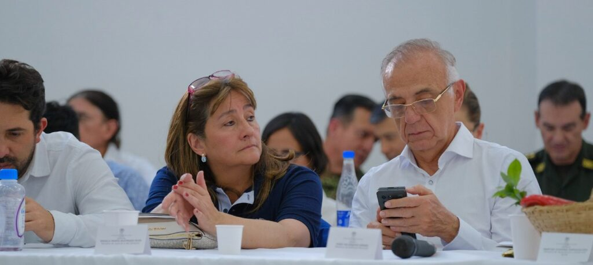
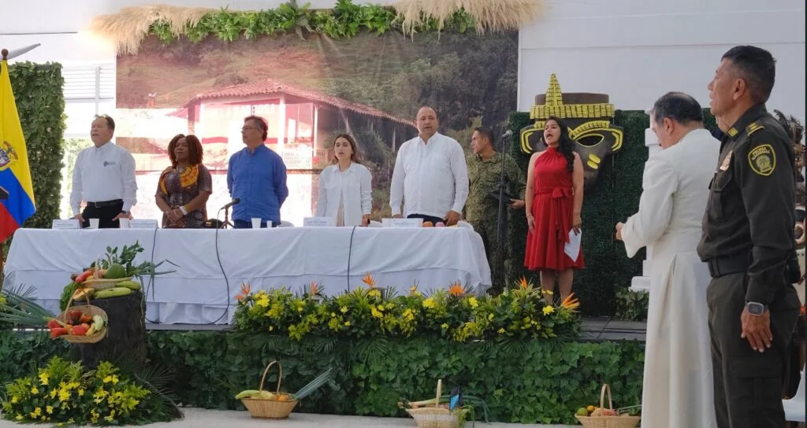
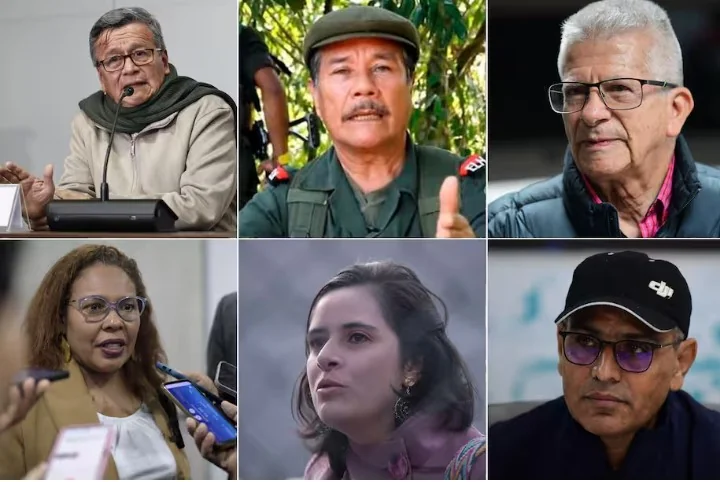
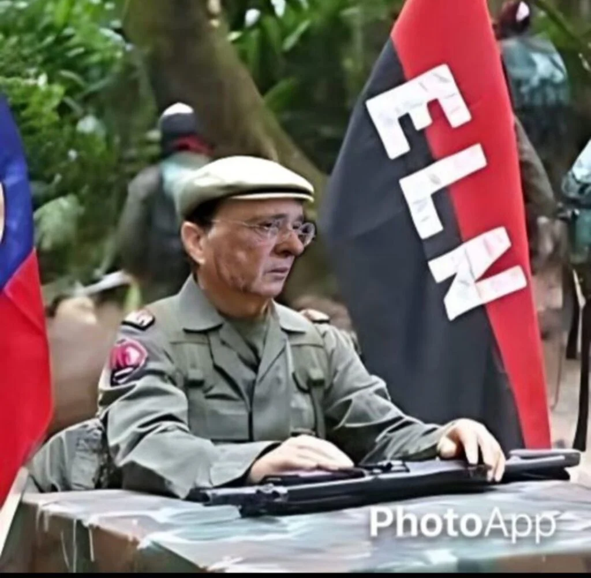
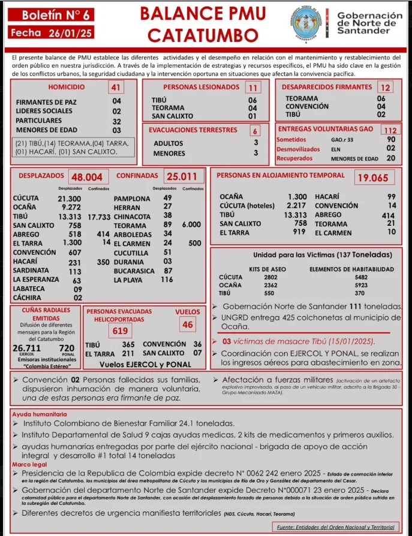

*Catatumbo: Una guerra degradada por la droga. (Prensa presidencial).*

La masacre de la familia **López Durán**, incluyendo su bebé de 9 meses, **pareció un hecho aislado** el pasado 15 de enero de 2025 en la vía que conduce a Tibú, Norte Santander. Las autoridades no entendieron que lo del Catatumbo es consecuencia de una **guerra degradada por el control del tráfico de la coca**. Guerra, que desde esa masacre de los López, se convirtió en **crisis humanitaria**. Según [OCHA](/articulos/report/colombia/colombia-desplazamiento-y-confinamiento-en-la-subregion-del-catatumbo-norte-de-santander-flash-update-no-1-24012025), ―además de los **95 muertos** de la población civil― produjo hasta ahora **41.236 desplazados y 12.520 confinadas**. Y el contador crece velozmente.

Esa crisis humanitaria refleja la debilidad e incapacidad histórica del Estado para resolver el conflicto armado. Pero, también marca la deuda política del gobierno con su propuesta sobredimensionada de **Paz Total**. Sobre todo, indica que ese conflicto armado devino en una **profunda degradación ética y política**. Que está meramente guiada por intereses financieros contrarios a los principios y derechos de los seres humanos.

¿Te interesa? [La guerra del Catatumbo, y la suspensión del diálogo con el ELN](/articulos/la-guerra-del-catatumbo-y-la-suspension-del-dialogo-con-el-eln/) (I)

## Una guerra degradada

*El presidente Gustavo Petro y la Vicepresidente Francia Márquez, lideraron presencia del gobierno en Ocaña donde se anunciaron los decretos de conmoción interior.*

En efecto, la masacre de la familia López Durán, sin duda, estuvo motivada por el tráfico de cocaína. Patentiza el carácter de una guerra degradada que parece no tener fin. Como quedó evidenciado, el carruaje fúnebre fue utilizado para el transporte de alcaloide del ELN. Esta guerrilla, a través de unos de sus voceros, dijo en un video que ese hecho criminal lo dirigió **Leonardo Pérez, alias «Lalo»**, miembro de las milicias del disidente frente 33 de las FARC.

En tanto el Estado Mayor Central (EMC) acusó a **Miguel Ángel López** de transportar coca a los sitios de acopio del ELN. Y por esta razón ordenó su muerte. La orden fue ejecutada por milicianos encapuchados cuando trataba de poner a salvo a su familia.

Lo curioso de este horrendo crimen es que ambas guerrillas **estaban en diálogo de paz con el gobierno del presidente Gustavo Petro** desde octubre de 2023. Mientras su jefes echaban discursos en la Mesa de Diálogo con **Otty Patiño y Vera Grabe**, sus cuerpos armados echaban plomo**.** Cometían masacres y asesinatos selectivos. **Y seguían produciendo y traficando droga.** Extorsionaban y presionaban a la población civil para que se pusieran a su servicio.

En una guerra degradada, la principal víctima es la población civil. La gran mayoría de personas han sido desplazadas hacia los municipios de Cúcuta (15.086), Tibú (12.362) y Ocaña (9.474). Asimismo, al menos 12.520 personas se encuentran confinadas en los municipios de Tibú (10.206), San Calixto (758), Ábrego (656), Convención (500), Teorama (400).

En el Filo San José, jurisdicción de Teorama, se informó hoy, hubo 13 muertos. Si bien hay varios milicianos de las EMC

¿Te interesa? [ELN acordó NO secuestrar más](/articulos/eln-acordo-no-secuestrar-mas/)

## Hoy, el ELN

*Pablo Beltrán, Nicolás Bautista, Aureliano Carbonell, Consuelo Tapias, Violeta Arango y Bernardo Téllez, entre otros, según resolución del gobierno, se les retiró el reconocimiento como parte de la mesa de Diálogo de Paz con el ELN. (Cortesía).*

Se subraya que este conflicto interno enajenó a sus actores y también a una gran parte de la sociedad colombiana. Este fenómeno de **alienación humana** se analizó en mi libro **[¿Adiós a la guerra?](/articulos/cgi-bin/koha/opac-detail.pl?biblionumber=141299)** Un texto indexado por varias universidades de Colombia.

El análisis se hizo en clave de comprensión de la negación de la condición humana de los actores del conflicto. Esa negación de lo humano instrumentaliza a la población civil para los propósitos de la guerra que deviene en dominio económico. El objetivo último de los actores armados en una guerra degradada son las finanzas. Así el medio se convierte en fin.

Lo que sucede hoy en el Catatumbo es lo que defino en el libro las _continuidades_ y _discontinuidades históricas del conflicto_. Al territorializarse la guerra, como en el caso de Urabá (1993), las retaguardias políticas de las guerrillas se enfrentan entre sí. Este hecho, transforma esos enfrentamientos en formas de guerra civil territorializada de los cuerpos armados enfrentados. En otras palabras, hay una guerra civil circunscrita aun territorio determinado por intereses económicos, como son las rentas ilegales.

¿Te interesa? [Suicidio político del Eln y secuestro de Díaz (II)](/articulos/suicidio-politico-del-eln-por-secuestro-de-diaz/)

## Ayer, las FARC

En el pasado inmediato, el escenario de guerra civil territorializada fue Córdoba y Urabá entre el **V frente de las FARC―EP** y las **Milicias Populares** del desmovilizado EPL. Allí el conflicto armado se degradó profundamente. Las dos fuerzas hegemónicas de la región, ejercieron violentamente su poder. Asediaron al poderoso sindicato bananero de **Sintrainagro** con gran influencia política del PC/ML (proclive al EPL) y de la Unión Patriótica y del PC que simpatizaban con las FARC.

Recordemos que, al producirse la desmovilización del EPL, se evidenció la incapacidad del Estado para copar institucionalmente el territorio y cumplir con los compromisos de paz. Los _farianos_, al extenderse militar y políticamente en el territorio, cometieron, entre otras, la **masacre de La Chinita** (1994).

En ese momento, **La Chinita** era un barrio de invasión popular en Apartadó. No vivían los ricos empresarios bananeros de Urabá. Estaba poblado por desempleados, campesinos sin tierra, trabajadores de empresas bananeras y simpatizantes del movimiento Esperanza, Paz y Libertad (EPL). A raíz de estos hechos, muchos líderes pasaron a ser comandantes de escuadra de las Autodefensas Campesinas de Colombia (AUC).

## Autoexaminarse

*La guerrilla de toda pelambre debe auto examinarse a partir de su praxis y no de su teoría política. La práctica de la guerrilla no difiere de las bandas criminales. (Cortesía).*

¿Cómo se entiende que los jefes históricos de la guerrilla sigan hablando de transformación de la sociedad sin detenerse a autoexaminarse? No lo hacen y jamás lo harán mientras sus mentes sigan alienadas.

De hecho, la carta de más de 500 organizaciones civiles que quieren un país en paz y agrupados en en [Comité Nacional de Participación (CNP)](/articulos/2024/09/25/carta-dirigida-a-la-mesa-de-dialogo-de-paz-entre-el-gobierno-nacional-y-el-ejercito-de-liberacion-nacional-eln/), cuando el conflicto amenazaba con escalarse en el Catatumbo, le dice al gobierno del presidente Gustavo Petro y a la dirigencia del ELN:

> Este proceso no solo es una cuestión de voluntad política, sino un compromiso ético con el país y con las generaciones que anhelan un futuro sin guerra y sin pobreza.
> 
> [Carta del CNP](/articulos/2024/09/25/carta-dirigida-a-la-mesa-de-dialogo-de-paz-entre-el-gobierno-nacional-y-el-ejercito-de-liberacion-nacional-eln/). (dele clic).

Pero **Pablo Beltrán, Nicolás Bautista, Aureliano Carbonell, Consuelo Tapias, Violeta Arango y Bernardo Téllez**, los voceros de paz no escucharon esa petición de las organizaciones civiles que luchan por los derechos humanos y la paz en Colombia.

¿Te interesa? [Cese al fuego con el ELN, tres clave para el éxito](/articulos/cese-al-fuego-con-el-eln-tres-clave-para-el-exito/)

## ¿Conmoción interior o Laboratorio de Paz?

/articulos/infopresidencia/status/1883971587361370186

Es loable que el presidente Gustavo Petro haga presencia en el Catatumbo y que trate de aliviar este dolor profundo de la población civil. Es el objetivo del decreto de Conmoción Interior. Pero esta es una respuesta reactiva, igual que la de los demás gobiernos. Solo van a contar los muertos y anunciar pañitos de agua tibia.

Por ende, Catatumbo necesita una mirada más profunda y, por tanto, una intervención estructural. Es la oportunidad para que el presidente Gustavo Petro transforme este escenario de guerra territorializada en un laboratorio de paz territorial.

En consecuencia, el gobierno debe **implementar el acuerdo No. 28 con el ELN:**

> ****«Lalo»**Sobre el desarrollo del proceso de participación de la sociedad en la construcción de la paz”**.

Para ello se debe asegurar las garantías necesarias a la población civil. Por su parte, los líderes sociales se deben declarar autónomos y libres para no ser instrumentalizados por las fuerzas guerrilleras o armadas en contienda. Sin una participación amplia y real de la ciudadanía, la paz que se busca construir estará incompleta y será frágil.

## Una guerra anunciada

Desde septiembre de 2023, la población civil expuso al gobierno el peligro de escalarse la confrontación armada. Una guerra anunciada entre los frentes del ELN ―que históricamente ejercen una hegemonía en las profundidades del Catatumbo― y el frente 33 de las disidencias del EMC.

En el encuentro del Comisionado de Paz y el EMC, la población civil expuso el peligro del escalamiento de la guerra entre esas dos facciones de la guerrilla. La **Mesa de Paz** se instaló en el Catatumbo en octubre de 2023, En ese entonces, uno de los líderes sociales de la región, Wilfredo Cañizares, dijo:

>  **«Lalo»**No es posible que estén dialogando en el Catatumbo y se presenten hechos de violencia. Esto (el diálogo de paz) va a traer un alivio en todas estas situaciones tan duras que estamos viviendo en la región”.

En septiembre de 2024, la plataforma [Comité Nacional de Participación (CNP)](/articulos/2024/09/25/carta-dirigida-a-la-mesa-de-dialogo-de-paz-entre-el-gobierno-nacional-y-el-ejercito-de-liberacion-nacional-eln/) le solicitó al gobierno nacional y al ELN la imperiosa necesidad de apelar al acuerdo No 28 de los diálogos con el fin de no levantarse de la mesa antes de llegar un acuerdo para ponerle fin al conflicto.

La degradación del conflicto armado no solo se refleja por los cambios en el uso de los métodos sino también por los propósitos. El escalamiento de la guerra en el Catatumbo se registra en medio de la ausencia del Estado para administrar y dirimir los conflictos sociales en esta subregión del nororiente colombiano. La intervención debe ser estructural. Las determinaciones que se adopten en el marco del Decreto de Conmoción Interior deben contar con la participación ciudadana, especialmente de las víctimas del conflicto.

Pero, los líderes sociales deben deslindar campo con las organizaciones armadas con el fin de actuar libremente y no se instrumentalizada para esta guerra fratricida.