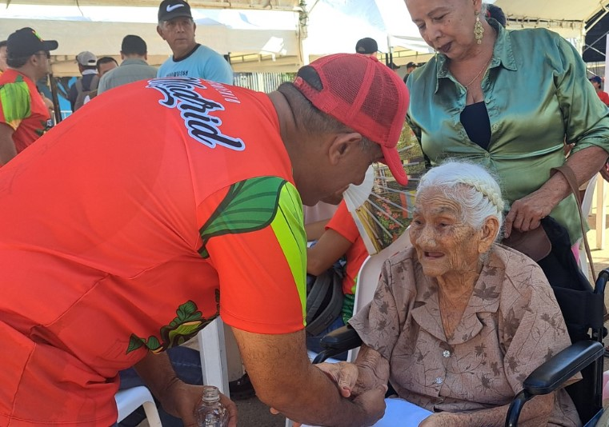
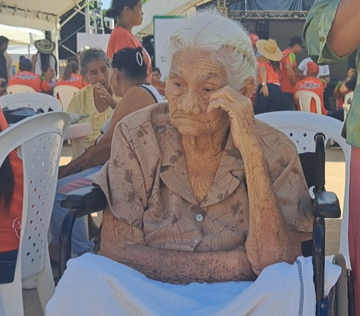
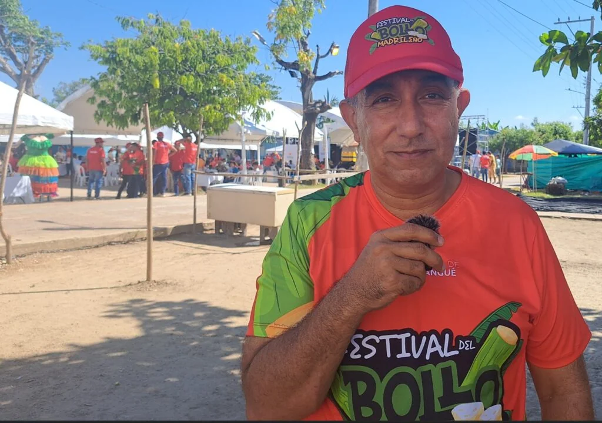
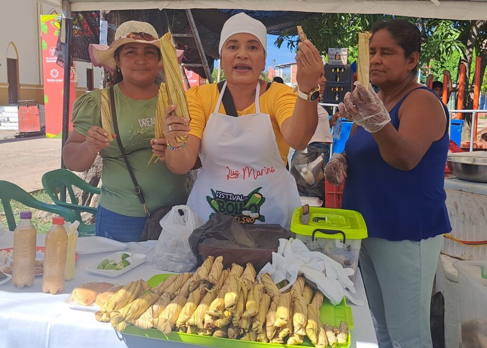
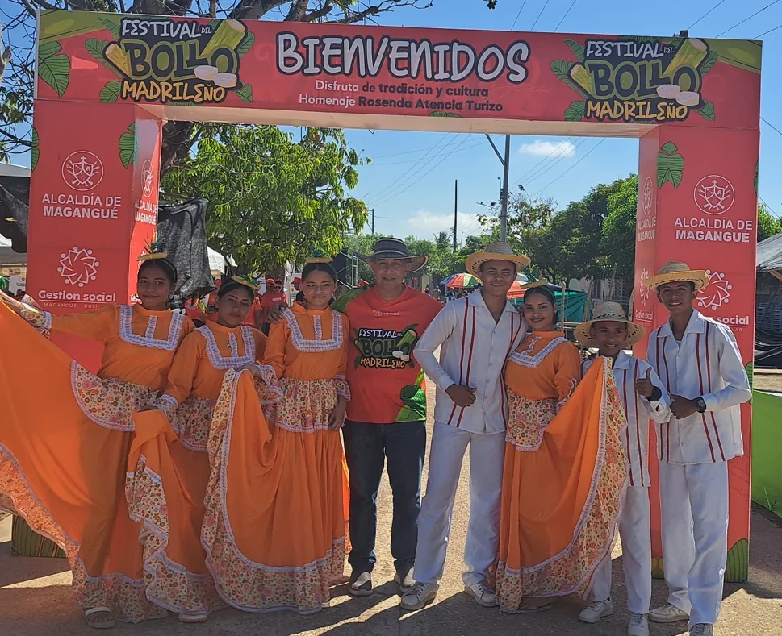
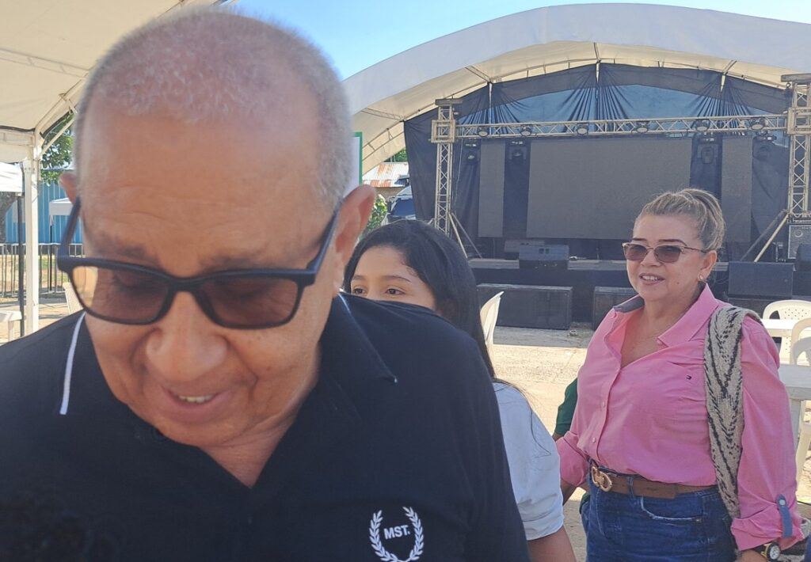

*El alcalde de Magangué, Pedro Alí Alí, felicita a Rosenda Atencio, 90 años, 9 hijos, la bollera madrileña que recibió el homenaje este 19 de enero. Del Bollo Madrileño a la Virgen de la Candelaria.*

La variedad gastronómica, la emoción colectiva y el retorno de los emigrantes, dinamiza la economía de estos pueblos caribeños. Del Bollo Madrileño a la Virgen de la Candelaria son manifestaciones de la riqueza cultural anfibia de la ciudad―región de Magangué. Las fiestas del 2 de febrero fueron precedidas de otras actividades culturales de dos significativos corregimientos, **Madrid y Juan Arias**. Así lo percibimos en el **Festival del Bollo Madrileño** (18 y 19 de enero 2025) que resaltó la riqueza de la cultura local y uno de los productos insignias de la capital de los Tres Ríos.

El evento contó con la organización y apoyo directo del alcalde de Magangué, Pedro Alí Alí. Contó con la participación de la junta de Acción Comunal de este corregimiento que produce el mejor bollo de toda la región. Fue espectacular.

Por estos días Magangué es una fiesta religiosa y cultural. El gobernador de Bolívar, Yamilito Arana Padauí, llegará con su gabinete a gozarse las fiestas de la Virgen de la Candelaria. Este año será espectacular. Vale la pena ir a Magangué.

¿Te interesa? [Magangué revolucionada con Yamilito Arana y Pedro Alí](/articulos/magangue-revolucionada-con-yamilito-arana-y-pedro-ali/)

## Vea la celebración del Bollo Madrileño

https://youtu.be/R\_yhKx5aXvE

## Rosenda y el Bollo Madrileño

*Rosenda Atencio, 90 años, 9 hijos. Es una de las que hace el Bollo Madrileño más sabroso de la comarca. Ella recibió un homenaje significativo de la alcaldía de Magangué.*

La alcaldía de Magangué homenajeó a la madrileña **Rosenda Atencio**. Una señora que crio a sus 9 hijos con la fabrica y venta de bollos. Su esposo murió y se tuvo que valer del bollo para seguir adelante, según nos cuenta una de sus hijas. Los bollos madrileños son peculiares por su forma, sabor y textura. Estos tienen una forma cilíndrica, muy alargados, hechos con una masa fina de maíz. No se le siente granos ni grumos. Pueden acompañar un bistec de hígado, chicharon, bocachico, queso o suero. O te lo puedes comer solo.

Todas las mañanas Rosenda salía con sus burros cargados de bollo hasta el mercado de Baracoa de Magangué. La gente hasta la esperaba para comprar sus bollos para el desayuno. Otros se los encargaban para mandárselos a sus familiares que vivían en otras partes del país. Así financió los estudios de sus hijos. Y aunque hoy tiene dificultades en el habla, su mente se encuentra lúcida. Pero los años se le vinieron encima. Ella recibe el cuidado de sus hijas que se resisten a emigrar a la ciudad.

¿Te interesa? [Girardot: ¿Se conjuró el hundimiento de Magangué? (I)](/articulos/girardot-se-conjuro-el-hundimiento-de-magangue-i/)

## Todos comieron

Todos los que llegaron a Madrid comieron bollo madrileño. Así acompañaron su mojarra o bocachico frito que disfrutaron en los diferentes mesones de las bolleras.