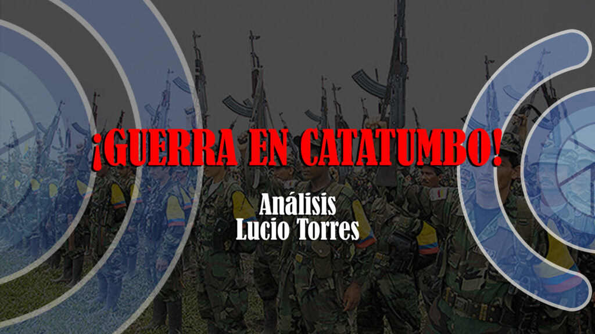
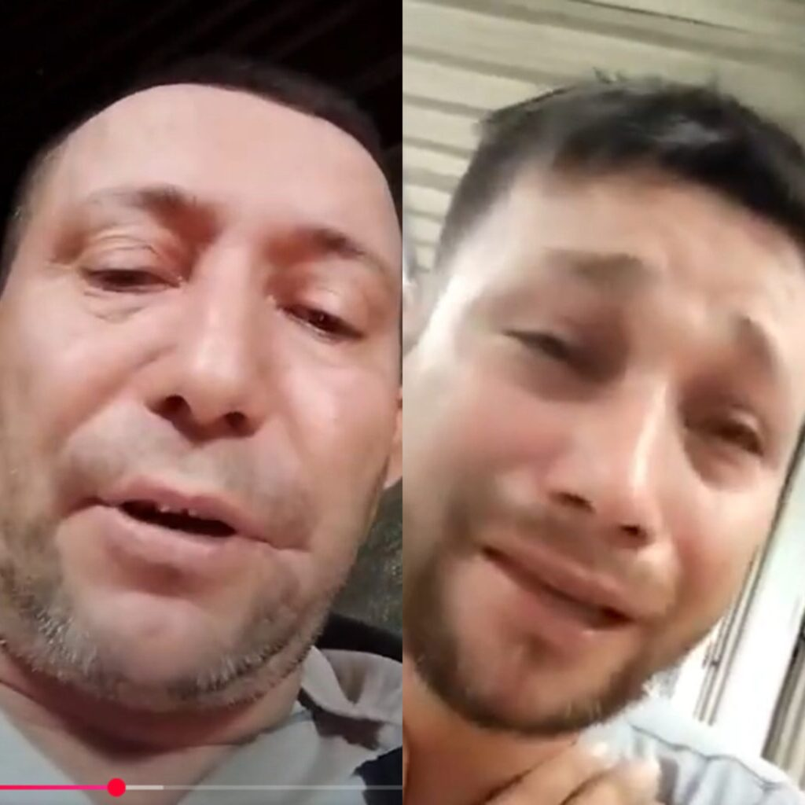

*La guerra del Catatumbo, y la suspensión del diálogo con el ELN*

La guerra del Catatumbo, Norte de Santander, refleja la degradación y fragmentación total del conflicto armado colombiano. Expresa el divorcio del discurso político con la práctica militar de la guerrilla. Un conflicto que se centra en una lucha territorial de los cuatro frentes del ELN contra la escisión del frente 33 perteneciente a las Disidencias de las FARC para alcanzar el objetivo central: **el control de las rentas ilegales de la droga, la extorsión y la minería ilegal.**

En los últimos días ―de acuerdo con versiones de organizaciones de derechos humanos y la Defensoría del Pueblo― la guerra cobró 36 muertos. De estos, 7 son firmantes de paz. Además del desplazamiento forzado, produce poblaciones enteras confinadas.

Mientras tanto el presidente Gustavo Petro suspendió el diálogo de paz con el ELN. También presidió un Consejo de Seguridad en la región. ¿Puede el presidente revaluar el diseño de su Paz Total? Le propongo tomar en cuenta las tesis que presenta mi libro  [**¿Adiós a la guerra? Cinco clave para la paz** .](https://www.facebook.com/adiosalaguerra)

¿Te interesa? [Suicidio político del Eln y secuestro de Díaz (II)](/articulos/suicidio-politico-del-eln-por-secuestro-de-diaz/)

## Vea la guerra del Catatumbo

https://youtu.be/xruf7xaCXkg

Testimonios de Dairo Abril y de su padre, José del Carmen Abril. Análisis de Lucio Torres

## La familia Abril

*José del Carmen Abril y Dairo Abril (hijo) denuncian persecución militar por parte del ELN. (Captura de pantalla).*

El caso de la familia Abril, padre e hijo, líderes sociales del campesinado, es un caso patético de la degradación de la guerra del Catatumbo protagonizada por el ELN y el frente 33 del Estado Mayor Central (EMC), una de las disidencias de Las FARC. ¿Por qué fueron declarados objetivo militar? Tal vez porque los relacionan con esa disidencia de las FARC. De la misma manera como los paramilitares lo hicieron con las bases sociales de esa guerrilla

La población civil, al resistirse al proceso de copamiento geográfico y social de la subregión del Catatumbo por parte de los protagonistas armados de hoy, se transforma en objetivo militar. Muchos de esos espacios dejados por las FARC luego del acuerdo de paz, fueron copados por los cuatro frentes del ELN.

Si se escucha detenidamente los testimonios de **Dairo Abril** (hijo) y de su padre, **José del Carmen Abril**, se puede observar que los dos y sus familias estuvieron involucrados en la lucha política y social de esa subregión. José del Carmen Abril ―dice su hijo― fue uno de los fundadores de la **Asociación Nacional de Usuarios Campesinos de Colombia** (ANUC) en el Catatumbo. Él mismo es uno de los firmantes de paz, y por ese solo hecho, se convirtió en objeto militar del ELN.

¿Te interesa? [ELN acordó NO secuestrar más](/articulos/eln-acordo-no-secuestrar-mas/)

## Un eterno dolor

La población del Catatumbo sufrió y sigue sufriendo en todas las etapas del desarrollo económico y político de la región. Su dirigencia social fue políticamente educada por las organizaciones de izquierda. La primera guerrilla en llegar a la zona fue el ELN en los años 70. Luego el EPL. Allí mismo, aterrizaron el Partido Comunista y el Partido Comunista M/L.

Pero posteriormente, cuando la guerrilla fue financiándose con la producción y el tráfico de la cocaína, la guerrilla de todas las corrientes fueron controlando el territorio y desplazando a los líderes sociales históricos. Solo buscaba administrar la producción y exportación de la droga que iba para el exterior.

Sin embargo, los peores momentos vividos por esa población se remontan en el período 1998 a 2004 cuando el Bloque Catatumbo, de Salvatore Mancuso, incursionaba para castigar a la población civil influenciada por la guerrilla. Persiguieron y asesinaron a esa dirigencia social desarmada como lo hace el ELN y el mismo EMC en el día de hoy.

¿Te interesa? [Cese al fuego con el ELN, tres clave para el éxito](/articulos/cese-al-fuego-con-el-eln-tres-clave-para-el-exito/)

## Las disidencias

El frente guerrillero 33 del EMC está divido en dos. Uno, liderado por el jefe guerrillero **Andrey Avendaño**. Es vocero de la agrupación en el diálogo con el gobierno. Al respecto, dijo en un mensaje de audio:

> «Hasta el momento hay varias novedades por todas partes. **Han matado civiles, gente desarmada,** han querido sacar las familias de la gente nuestra, mujeres, niños, gente que está totalmente indefensa, han tratado de sacarla por la fuerza y asesinarla**»**.

La guerrilla ―cualquiera que sea la corriente ideológica a la que pertenece― realiza su respectivo trabajo político siguiendo una dinámica de guerra. La población influenciada es considerada como retaguardia. Por tanto, la instrumentaliza en su juego de guerra, sin importarle las consecuencias que pesa sobre la población civil.

## La vieja nueva guerra

La existencia de una retaguardia política y social, le dio sustento a la guerrilla. Eso lo entendieron las fuerzas militares en su lucha contrainsurgente clásica. Ellas ―con el apoyo paramilitar― comenzaron a golpear a su retaguardia, tal como explicaron sus comandantes en las declaraciones de Justicia y Paz y en la JEP. Los oficiales de las FF.AA. se hicieron el de la _vista gorda_, mientras los escuadrones de la muerte azotaban a la población en el territorio donde la guerrilla tenía control territorial.

Esa dinámica de la guerra ―ahora más degradada― se registra actualmente en el Catatumbo. Siendo que sus exterminadores fueron antiguos aliados. Como el ELN es dominante en la región, aplicó mano dura contra sus competidores. Empezó con el sobreviviente frente del EPL hasta acabarlo y tomarse su territorio y su gente. Ahora se enfrenta a este frente 33 dividido unos por el diálogo de paz y otros por la guerra.

Las motivaciones subjetivas son más radicales, porque no es lo mismo tratar a un supuesto «traidor**»** que al enemigo tradicional. Como son bandos de orígenes similares que justifican su lucha por la toma del poder para ponerlo al servicio del pueblo, se tratan unos a otros de «traidores**»**.

https://twitter.com/FenalperCo/status/1880298407115517980

## Qué papel ocupa las FFAA

Las fuerzas militares pareciera que fueran observadores de la guerra e incapaces de proteger a la sociedad civil desarmada.