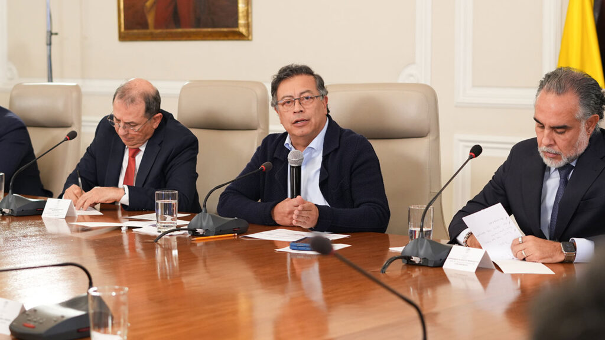
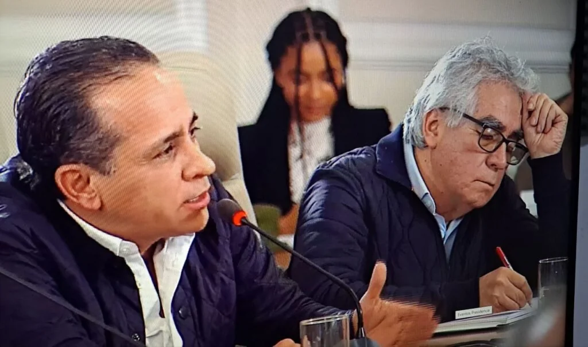
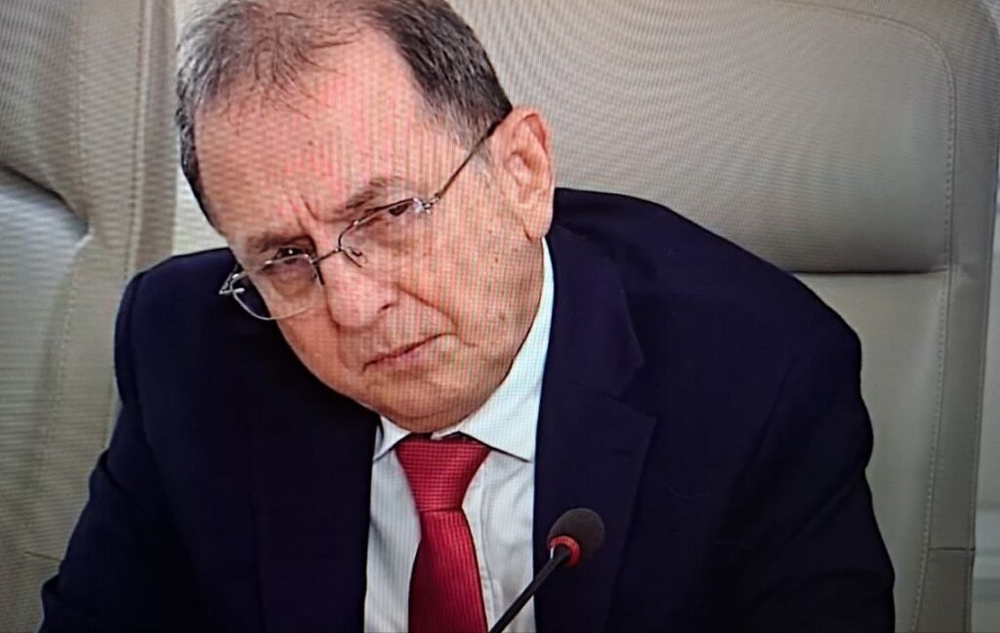
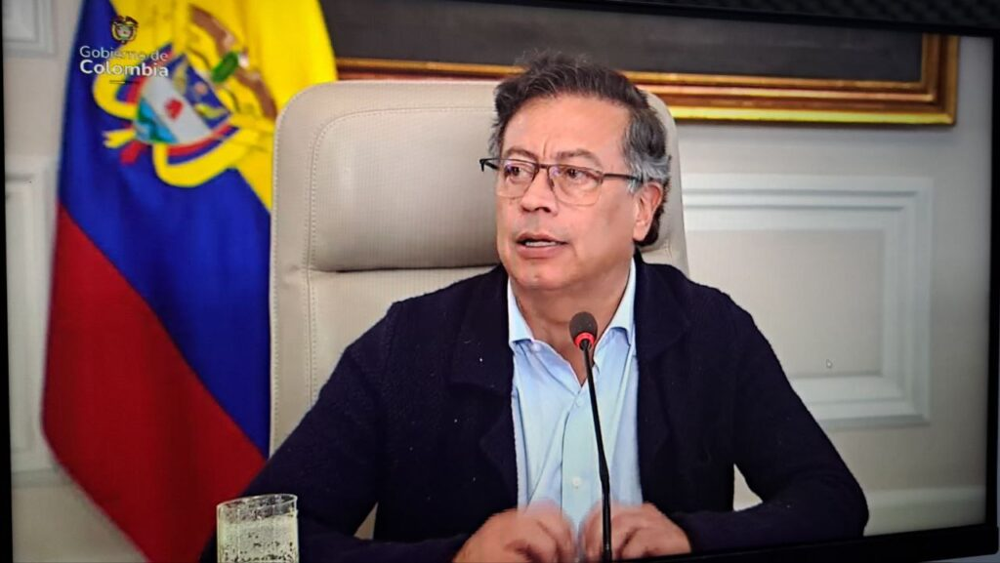
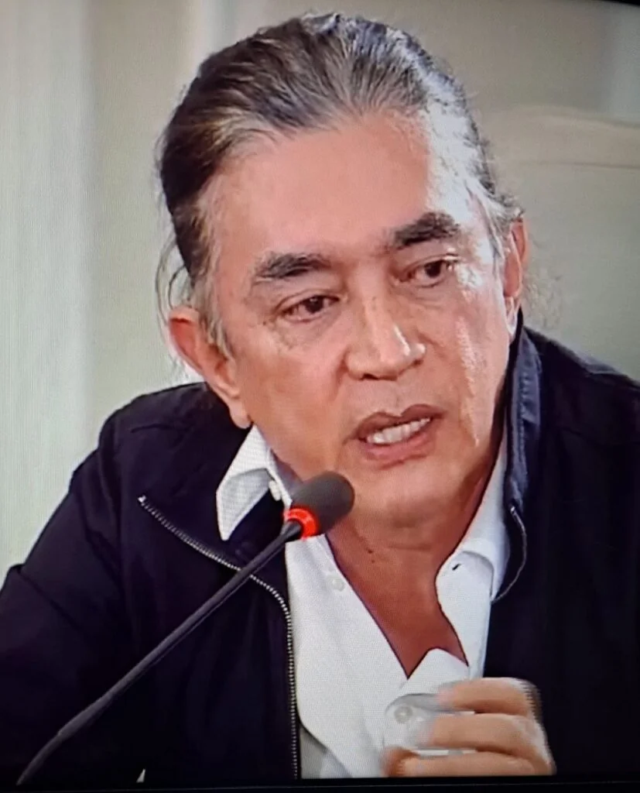

*Conmoción Interior en gobierno de Petro que exige viraje político. En Consejo de Ministros el presidente Petro exigió acelerar el cumplimiento de compromisos. (Prensa Presidencia).*

El Gobierno del Cambio presenta su peor crisis. Ninguno de los ministros del **presidente Gustavo Petro**, al parecer, con excepción de **Laura Camila Sarabia Torres** (Canciller) y **Armando Benedetti Villaneda** (Jefe de Despacho Presidencial), sabía que el Consejo de Ministros (4―01―2025) se transmitiría en vivo y en directo, al mejor estilo del comandante **Hugo Chávez** de Venezuela. Pero, la iniciativa audaz y muy arriesgada de la transmisión, lejos de apaciguar los ánimos, se tornó en una verdadera **«Conmoción Interior**»****. No detuvo la reacción causada por los nombramientos de Sarabia y Benedetti como la columna principal del gobierno.

Por su parte, dado al carácter contestario del desencuentro, el presidente ripostó duramente contra sus ministros, entre los cuales estaban los más leales del idealismo democrático de izquierda. Uno de ellos el ex M―19, **Augusto Rodríguez**, su **«Sancho Panza»** durante 30 años de lucha parlamentaria.

Las intervenciones se rebelaron contra la decisión del presidente de esos cuestionados nombramientos que van a marcar la pauta gubernamental en lo que resta de esta administración. Fueron contundentes la vicepresidenta y ministra de la Igualdad, **Francia Márquez Mina,** el director del **DPS Gustavo Bolívar Moreno,** el director del **DAPRE Jorge Rojas Rodríguez** (renunció)**,** el director del **DNP Alexander López Maya y** la cereza del pastel la puso el director de la **UNP Augusto Rodríguez Ballesteros**.

## **«**Sectarios**»** y **«**robespierristas**»**

*Las dos intervenciones más contundentes y más respetuosas fueron las de Alexander López y Augusto Rodríguez. (Captura de pantalla).*

Sin embargo, Petro quiso zanjar el debate apelando al concepto del sectarismo político. Para esto calificó el ingreso de Armando Benedetti, Jefe de Despacho Presidencial, como una muestra de pluralidad. Justificó su actuación como cuando **Jaime Bateman Cayón** recibió apoyos de políticos conservadores samarios. De hecho, la calificación de Gustavo Petro a sus opositores de gabinete fue de **«**sectarios**»** y **«**robespierristas**»**.

El presidente hizo alusión al uso de la guillotina para decapitar a los aristócratas y a los que se opusieran al **régimen del terror** de la Revolución Francesa. Y los Gulags del régimen totalitario de Stalin en Moscú. Dijo, sin tapujo, que su gobierno no es de izquierda ni de derecha sino **«**democrático**»** donde se incluyen personas de diferentes colores políticos.

El presidente remató diciendo que fue elegido con más de 10 millones y medio de votos que no eran de izquierda. Al finalizar el Consejo de Ministros, se pudo observar que se levantó y se fue sin despedirse de nadie. **Esta conducta indicó que su audacia terminó en un fracaso político**.

## «Conmoción Interior» y renuncia

*Jorge Rojas propuso un viraje político de la administración. Pero el presidente se atrincheró en defender a unos funcionarios que no representan el proyecto que ganó en 2022.*

Una vez terminada la convulsionada reunión, el fantasma de la renuncia invadió la atmósfera de palacio. Era difícil respirar en un ambiente así. Estaba todo contaminado, muy contaminado por la confrontación y la falta de empatía. La audacia de Petro terminó por **desmoronar la poca cohesión del gobierno**. Fue un autogolpe a la gobernanza del Gobierno del Cambio.

Pero, también puso al descubierto la alta tensión que se percibe en la cúpula gubernamental. No hay ninguna posibilidad que, por ejemplo, Rodríguez Ballesteros, obedezca las directrices de Benedetti o de la misma Laura. Ésta última ―en boca de López Maya― se le reclama porque ha sido irrespetuosa con algunos miembros del gabinete.

A juzgar por el ministro del Interior, **Juan Fernando Cristo**, dijo hoy a los medios de prensa que un gabinete así es inviable. Cristo no intervino en el debate de la noche anterior. Pero es uno de los que podría renunciar para aspirar a la presidencia.

Mientras tanto esta **«Conmoción Interior**»**** produjo la primera renuncia. Al parecer, en la misma noche turbulenta del _petrismo_ en el gobierno, el recién nombrado director del Departamento Administrativo de la Presidencia de la República―DAPRE, **Jorge Rojas Rodríguez** presentó su renuncia.

Vale destacar que Rojas caracterizó el Consejo de Ministro de histórico. Pero consideró que se debe modificar su metodología para encontrar una **comunicación asertiva**. Además, hizo un llamado al presidente para realizar un viraje político del gobierno escuchando estas sugerencias.

## El meollo del problema

*Lo que observaremos en la última fase de este gobierno es el proceso de derechización del petrismo. Sus piedras angulares serán políticos dela calaña de Armando Benedetti.*

El malestar de los que están con el proyecto del Gobierno del Cambio es que tendrían que estar bajo la égida de Benedetti y de Sarabia. Si ello es así, el pulso al interior del petrismo, lo ganaría el sector político extraño al proyecto político original. Se quitaría el ropaje de izquierda y se mimetizaría como una fuerza más dentro del _Establishment_ tradicional colombiano.

El sustrato de este accidentado Consejo de Ministros no es un problema menor de mal clima de convivencia. Es más profundo y complejo. El poder económico de los megacontratistas del Estado está representado por Sarabia y Benedetti. Son unos fieles interpretes de este importante sector que se venía imponiendo en la gestión gubernamental.

Hoy, sin duda, el gobierno de Petro está tomado por los megacontratistas. Incluso, casi todos los problemas de corrupción están asociados a este sector dominante del gobierno.

## El tono de la **«Conmoción Interior**»****

En efecto, desde las primeras de cambio de la reunión, se presentó una **alta tensión en la cúpula** por el nombramiento de **Laura Sarabia** como Canciller, y **Armando Benedetti**, Jefe de Despacho Presidencial. Esta tensión se comenzó a desatar con la intervención arriesgada y valiente de la vicepresidente **Francia Márquez Mina**, quien ejerce el cargo de ministra de la Igualdad.

En efecto, la «Conmoción Interior» se manifestó cuando la vicepresidenta de Colombia, **Francia Márquez**, expresó su punto de vista sobre los nombramientos de **Laura Sarabia y Armando Benedetti**. Posición a la que se sumó la ministra de Medio Ambiente, **Susana Muhamad**, **Gustavo Bolívar** (director del DPS), **Jorge Rojas** (vicecanciller), **Alexander López** (director del DNP), y **Augusto Rodríguez**, director de la UNP. Ellos respaldaron a la vicepresidenta cuando hicieron sus respectivas intervenciones.

Al respecto, Francia Márquez, dijo:

> **«**Le digo a usted de frente las cosas que no me parecen y las cosas que comparto en este Gobierno. Y no me parecen las actitudes de Laura Sarabia con nosotros y conmigo porque he tenido que pedirle respeto. Yo soy la vicepresidenta y no me parece ni comparto la decisión de tener acá a Armando Benedetti****»****.

Además, Márquez señaló que gran parte de los problemas que se diagnostican en esta administración, los citados tienen gran parte de responsabilidad:

> ****«**No comparto su decisión de traer a este Gobierno a estas personas (Sarabia y Benedetti) porque sabemos que tienen gran parte de responsabilidad con lo que aquí está pasando****»******.
> 
> Consejo de Ministros, 4 de febrero 2025.

/articulos/infopresidencia/status/1886903600720277749

## **«Conmoción Interior**»**** y fieles petristas

La intervención de Márquez causó esta **«Conmoción Interior**»**** en la administración del presidente Petro. Pero, como se dijo, contó con el apoyo explicito de varios de los miembros del Consejo de Ministros. **¿Cómo se entiende a un gobierno progresista, cuya columna vertebral fue manejada en estos dos años por funcionarios de concepción neoliberal?**

Esa pregunta fue clave en el marco de la reunión. Pero ese ideal diferente (lo neoliberal) no fue cuestionado por los que se rebelaron contra la decisión presidencial. No. Lo que ellos cuestionan a Petro es la calidad de personas que se constituirán en la columna vertebral del Gobierno del Cambio. Consideran que es una falta de coherencia. El mismo Rodríguez Ballesteros lo señaló así .

> **«Pienso que este espacio (Consejo de Ministros) no es del señor Benedetti**. Yo no voy a renunciar, como lo dijo Susana (Muhamad). Esto no es sectarismo. Y no acepto que me digan sectario. Si fuera así, no hubiese aceptado el cargo que tengo de protector de personas de otros partidos****»****.

El presidente Petro advirtió que el jefe de gabinete no existe. Pero, 24 horas antes, ya había firmado el decreto No 0128 del 2025 mediante el cual encargó a Armando Benedetti como **Jefe de Despacho Presidencial**, el mismo papel que desempeñó su aliada **Laura Sarabia Torres**.

https://twitter.com/DanielSamperO/status/1886913661135921176

## Gustavo Bolívar y Petro

*El director del DPS, Gustavo Bolívar, fue una de las voces disidentes.*

El director del DPS, Gustavo Bolívar, fue otra de las voces disidentes que se manifestaron en este Consejo de Ministros. Además de respaldar a la vicepresidenta Francia Márquez, tuvo un rifirrafe con Laura Sarabia a quien trató de mentirosa. Bolívar es uno de los fieles de este proyecto político.

Pero el presidente Gustavo Petro defendió el nombramiento de Benedetti y Sarabia con todo. Toreó a sus contradictores con el discurso de antisectarismo, como se dijo. Aclaró que su gobierno no es de izquierda ni de derecha. Porque si no se hace un sancocho no se gana. Que es necesario acabar con los tribalismos.

Al referirse a la intervención de **Gustavo Bolívar**, director del DPS, y **Alexander López**, director del Departamento Nacional de Planeación (DNP), dio a entender que sus posiciones estaban determinadas por supuestas aspiraciones electorales. A lo cual Gustavo Bolívar, manifestó que no tenía idea de que el Consejo de Ministros iba a ser transmitido.

La alta tensión se produjo con los 4 minutos utilizados por López para respaldar la posición de Francia Márquez. Pero fue más contundente que la vicepresidenta.

Petro, entre tanto, se atrincheró en una defensa ardua de dichos nombramientos. Apeló a todo, incluso, a los discursos de **Jaime Bateman** sobre la necesidad de un gobierno nacional como si fuera un sancocho, dijo:

> **«**Nosotros hemos sido transformadores de este país. No somos sectarios. (...) Lo dejo allí porque veo la reunión tirada a la secta. (...)******»******

## Viraje político

No obstante, el director del DAPRE hasta ese entonces, **Jorge Rojas Rodríguez**, manifestó que el hecho de transmitir en vivo este Consejo de Ministros, es una decisión audaz. Pero, arriesgada. Propuso revisar su metodología para que esta comunicación con el pueblo **sea asertiva y tenga resultados**.

El participar en este gobierno es un gran riesgo. Este gabinete ha sido valiente, dijo. **Rojas Rodríguez** planteo que este mecanismo se haga con **mesas técnicas** y con indicadores claros.

> **«**Esas mesas nos permitiría saber en qué anda el gobierno del cambio, que debe tener coherencia, la coherencia tiene que ver con transparencia.******»******

El presidente le respondió:

> **«**No quiero teatro, quiero la verdad. El sectarismo no sirve. No hay puros. (Olmedo) López era de izquierda, de Colombia Humana. Jaime Bateman actúo diferente a Aureliano Buendía y confió en un parlamentario conservador. Si no tengo esos apoyos, a mi me vuelven _naco_ (puré). Por eso invité a hablar a Uribe. Quería acabar con el sectarismo del uribismo que tiene groserías en el cerebro y matanzas******»******.

En síntesis, el Consejo de Ministros fue un golpe autoinfligido. Denota el estilo del presidente, pero también la incapacidad de responder a un proyecto que prometió grandes realizaciones en estos 4 años. Pero la realidad es diferente al discurso.

La realidad nos dice que, pese a los avances, la administración es incapaz de traducir su plan de desarrollo en acciones económicas, sociales y políticas para el común de la gente. Este gobierno no hizo el anhelado Pacto Histórico con las masas populares. Solo se ve un pacto con los megacontratistas que definirán su destino en los próximos años para elegir a un candidato de continuidad. Mientras tanto, su razón de ser serán los grandes escándalos de corrupción, la esencia de este Establishment.