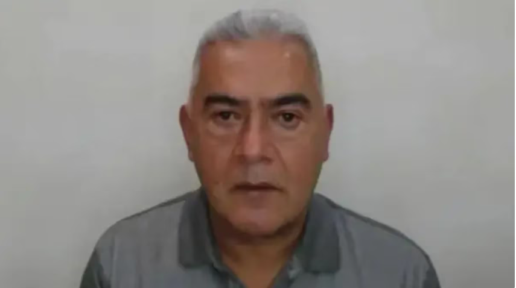
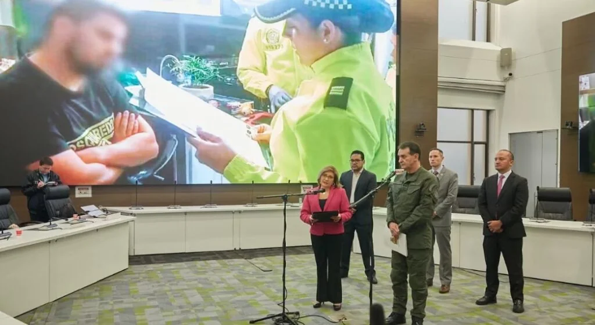
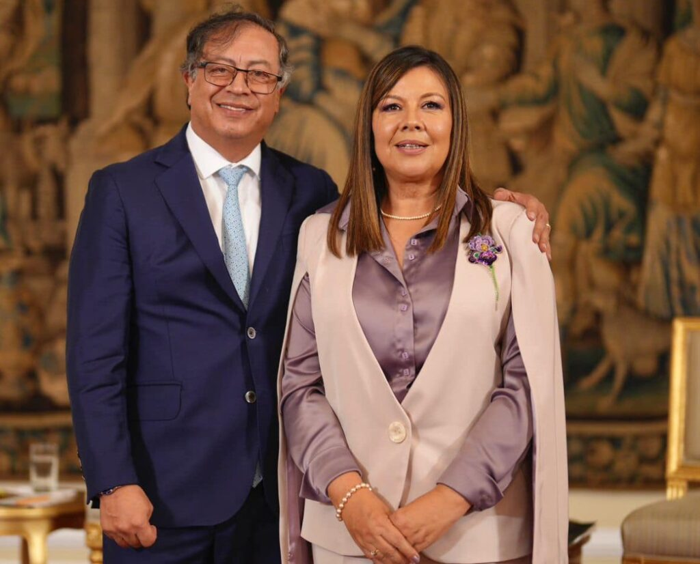

*Este es el enigma de 'Papá Pitufo': ¿Por qué estalló en el 'Gobierno del Cambio'?*

Una pregunta resuena con fuerza para resolver el enigma de 'Papá Pitufo': ¿Por qué la telaraña de corrupción de **Diego Marín Buitrago** floreció impune durante décadas, pero explotó justo en las propias narices del presidente bajo la administración de Gustavo Petro? ¿Acaso es una telaraña tan arraigada en las estructuras del Estado que desafía toda lógica, incluso, la lógica del discurso presidencial?

> **«**La mafia ha penetrado el estado por todos sus poros en medio siglo de su existencia. Por eso la corrupción ya no es simplemente, unas personas podridas, sino que es un régimen, como dijera Álvaro Gómez Hurtado**»**.
> 
> [Presidente Gustavo Petro cuando estalló el caso de **'Papá Pitufo'**](/articulos/petrogustavo/status/1886093100205899974?ref_src=twsrc%5Etfw%7Ctwcamp%5Etweetembed%7Ctwterm%5E1886093100205899974%7Ctwgr%5E70a935edf75b7e6305315e89d9d09358c18ebdd4%7Ctwcon%5Es1_c10&ref_url=https%3A%2F%2Fvoxpopuli.digital%2Fwp-admin%2Fpost.php%3Fpost%3D25072action%3Dedit).

Empero, la percepción del presidente Petro difiere de su actuación como estadista. Por tanto, su percepción es real y objetiva cuando se refiere a la corrupción política en general. Pero subjetiva al no reconocer que su gobierno fue capturado por la misma mafia. Pero, la historia toma un giro dramático en agosto de 2022, cuando el presidente Petro acababa de formar su gabinete. **Álvaro Galvis Acevedo**, un suboficial de policía con la esperanza de un cambio real, logró un encuentro con el ministro de la Defensa, **Iván Velásquez**. Movido por la promesa de transformación, Galvis le presentó un detallado organigrama de la red criminal de 'Papá Pitufo'.

De acuerdo a El Tiempo, en ese organigrama registró meticulosamente los nombres de oficiales, funcionarios de la Dian y altos miembros de los últimos tres gobiernos que estarían vinculados al contrabando en puertos. Pero entonces, **el silencio fue la respuesta**. El ministro, al parecer, sepultó el expediente, cerrando las puertas al suboficial y a la verdad. ¿Qué oscuros hilos impidieron que este escándalo saliera a la luz antes? ¿Y por qué ahora ― cuando la promesa de cambio comenzaba a cojear― ¡explotó!?

## Una falsa esperanza

*El enigma de 'Papá Pitufo', el gran desafío del presidente Gustavo Petro.*

Sin embargo, dicho policía, jamás sospechó que su esperanza ―como la de 11,3 millones de colombianos― estaba mal fincada. Sin duda, era una falsa esperanza. Puesto que a principio de ese mismo año su investigado (**'Papá Pitufo'**) le había donado **$500 millones** ―de $3 mil― a la campaña del presidente **Gustavo Petro** con el propósito de seguir con sus **«pitupillos»** en la Dian, en la Polfa, la Fiscalía y hasta en el mismo mando central.

En otras palabras, sería la paga anticipada de una _**patente de corso**_ para seguir delinquiendo. Una licencia de continuidad del entrampamiento mafioso. Tal y cual como lo hizo en los anteriores gobiernos desde 1991. Pero, más que esto, el **_pitufeo_** de ****'Papá Pitufo'**** representa **la captura del gobierno futuro** por los sectores mafiosos dominantes de las estructuras del Estado.

Es decir, que al aceptar dineros de mala procedencia en la campaña presidencial, se estaba permitiendo que la mafia capturara al próximo gobierno. Entonces, se entiende la posición de los ministros rebeldes de Petro ese día 4 de febrero.

## ¿Un proyecto _lumpen―_burgués

*Alexander López y Augusto Rodríguez, las dos exposiciones que impactaron a la opinión pública. El enigma de 'Papá Pitufo' se comienza a despejar.*

Recordemos que **Alexander López**, director del DNP, le dijo al presidente Petro que el **'proyecto político de Benedetti'** (o Roy, se agregaría) no es el mismo del movimiento social y democrático que ellos defendieron y que la gente votó el 19 de junio de 2022. Y no es sectarismo. Porque no es lo mismo llegar a un acuerdo político con sectores de la derecha que con el _lumpen―_ **burgués** representado en la política por Benedetti y Roy.

Solo comparemos la relación de parlamentarios de todos los colores políticos que presionaban al director de la Dian del momento, **Luis Carlos Reyes**, conocido como _Mr. Taxes_, para entender las razones por las cuales se invierte plata en una campaña electoral. Esa relación de políticos ―especialmente de los que le pidieron las seccionales de Santa Marta, Cali, Buenaventura, Cartagena, Barranquilla y Santa Marta― está en manos de la Fiscalía, al decir de Mr. Taxes.

## ¿Fiscalía y su nula efectividad?

*Rueda de prensa de 15 de marzo de 2024 conjunta de la fiscal Martha Mancera y el general William René Salamanca. Foto Fiscalía.*

Extrañamente la investigación contra bandas de contrabandistas y, especialmente, de la que dirigía **Diego Marín Buitrago**, se remonta desde el **año 2011**, según fuentes de la Fiscalía. Ninguna de ellas dio como resultados la captura de sus capos.

Desde 2021 ―antes de que se posesionara el presidente― la Fiscalía inició una investigación contra los delitos fiscales. Como no daba resultados, en el año 2023 entró la fiscal **Paola Andrea Londoño** a investigar presuntos delitos relacionados con bandas que venían permeando a la Dian, a la Policía Fiscal y Aduanera― Polfa y con incidencia en el ministerio de Defensa.

Cada fiscal, por separado, tenía un agente encubierto con el fin de detectar los movimientos y reunir las pruebas para las imputaciones de los delitos que permitiera eliminar la estructura corrupta detectada.

Es así que el **15 de marzo de 2024**, la Fiscal General de la Nación (e) de ese entonces **Martha Mancera**, en una ronda de prensa, reveló resultados en la nueva investigación desarrollada por la fiscal **Paola Andrea Londoño**. En ese momento existía un _tirajala_ entre el presidente Petro y la **Corte Suprema de Justicia** para elegir nueva fiscal.

En las redadas que hicieron, después de 6 meses de investigación, cayeron varios importantes miembros de la banda dirigida por alias **«Papá Pitufo»**: **Ricardo Orozco Baeza** (alias El bendecido, cásrcel), **Alexander Galeano Ardila** (coronel retirado de la policía, casa por cárcel), **José Elías Álzate** (El Pupilo, mayor retirado de la policía, casa por cárcel), **Mario Andrés Sarmiento**, mayor retirado, casa por cárcel. **La banda domina el contrabando de los puertos de Santa Marta, Cartagena y Buenaventura**.

## El afán de tener Fiscal

*«Yo voy a mandar», dijo la fiscal Luz Adriana Camargo. Es hora de demosrarlo.*

Lo más importante de esa investigación fue la orden de captura con circulación azul, emanada de un juez colombiano contra el jefe de la banda, ****'Papá Pitufo'****. Pero dado a su red de informantes, logró escabullirse a España valiéndose de su doble nacionalidad española. Allí fue puesto en libertad, dado a que como ciudadano español, no podía ser extraditado a Colombia sino juzgado en España. Pero, cuando entró a Portugal, fue capturado en el 2024.

**¿Por qué Petro tenía tanto afán de que hubiese nuevo fiscal en el momento en que se tenía contra las cuerdas a ****'Papá Pitufo'****?**

Hoy se sabe, que además del caso de su hijo Nicolás, estaba ****'Papá Pitufo'**** y 20 más. Solo citemos: UNGRD, las maletas de plata de **Laura Sarabia**, los $15 mil millones que Benedetti dijo haber recolectado, la financiación de la campaña presidencial. ¿Esa era la prisa para que la Corte Suprema de Justicia eligiera nueva fiscal? ¿Por eso instrumentalizaron la protesta popular? ¿Convirtieron el movimiento popular en un mecanismo de presión para un proyecto político distinto al que se votó por Gustavo Petro en las dos vueltas presidenciales de 2022?

## ¿Los **$500 millones y Benedetti?**

El presidente Petro negó que los **$500 millones** entraran a la campaña como un afán de demostrar su inocencia. Pero **Augusto Rodríguez** fue el primer alto funcionario que se refirió a 'Papá Pitufo'. Porque, al parecer, tenía conocimiento que la revista Cambio venía con ese escándalo. Y el escenario fue cuando se opuso al nombramiento de Benedetti como jefe de Despacho Presidencial, porque lo relacionó con ese personaje en el fallido Consejo de Ministros del 4 de febrero 2025.

El mandatario ordenó su devolución cuando fue puesto en alerta por Rodríguez. Hay pruebas de que entraron, pero no de que lo devolvieron. Todo indica que la campaña estaba bien enterada de la naturaleza de esa donación que se hizo en febrero de 2022, y también del donante. Al inicio (2021) de su campaña presidencial usó una avioneta de ****'Papá Pitufo'**** en un vuelo de Cali a Buenaventura. Como él mismo lo admitió en una entrevista publicada por Vida, el medio oficial de su gobierno:

> **«Yo nunca supe que esa avioneta era de él, pero ahora sabemos que sí** y que uno de nuestros propios acompañantes— éramos muy pocos en una avioneta pequeña— había sacado fotos de nosotros subiendo a la avioneta y en el interior, para entregárselas a alias Pitufo, para que tuviera una forma de extorsionarnos**»**.

¿Acaso estos servicios de transporte se dieron por cuenta de la promesa de ****'Papá Pitufo'**** de aportar $3 mil millones a la campaña presidencial? ¿Y es parte de los $15 mil millones que dice Benedetti haber recolectado?

## El enigma de 'Papá Pitufo'

Para entender el enigma de 'Papá Pitufo' se debe partir de un razonamiento lógico. En este punto surge una pregunta orientadora. ¿Por qué el director de la Unidad Nacional de Protección, **Augusto Rodríguez Ballesteros** sugirió la relación directa de **Armando Benedetti** con **Marín Buitrago**? ¿Por qué el Jefe de Despacho de Presidencia denunció penalmente al director de la UNP?

Uno de los hombres mejor informado en materia de seguridad es precisamente **Rodríguez Ballesteros**, quien prendió las alarmas de la llegada de esos dineros en la campaña. Y ahora prendió las alarmas por la nueva posición que asumió Benedetti ―de facto― el jefe de los ministros.

Entonces ¿por qué el catalán **Xavier Vendrell Segura** recibió los **$500 millones** y no Benedetti? La reunión donde se acordó el aporte de más de medio millón de dólares se hizo en España, donde ****'Papá Pitufo'**** tiene varias propiedades y mansiones. Vendrell dijo a los medios de prensa:

> **«**El mencionado señor Marín quiso hacer una donación en nombre de los comerciantes de Bogotá a la campaña, si bien la recibí, cuando se fue a legalizar el ingreso, fui notificado que no se podía verificar el origen de los fondos**»**.

Siguiendo un pensamiento lógico y crítico, Gustavo Petro tenía 30 años en el congreso y en estas lides electorales presidenciales. Lo intentó tres veces. **Primero, 2010. Luego en el 2018. En el 2022** fue la victoria. Toda su vida se la dedicó a la lucha electoral, salvo los tiempos de la lucha armada del M―19. O sea, que no es ningún lelo en materia de financiamiento político. Además, es economista y sabe de dónde sale el dinero.

Sus explicaciones públicas son pasables en un político neófito. Pero, el razonamiento lógico y crítico indica que está mintiendo. No solo fue un contacto. Fueron muchos. Reunión de Petro en Sanandresito liderada por el empresario Víctor Sierra Gutiérrez, condenado por fraude. El viaje de Petro en la avioneta de ****'Papá Pitufo'**** de Cali a Buenaventura. ¿Petro, Vandrell, Benedetti y ****'Papá Pitufo'**** en España? Daniel García reveló a los medios de prensa que participó en dos reuniones. Una en la mansión del Zar del contrabando, en Guaymaral, y otra en la calle de la 93. Después se abrió de esas conversaciones, porque ya las hacía directamente Vendrell, ****'Papá Pitufo'**** y Víctor Hugo Sierra Gutiérrez.

## Las dos campañas

Lo anterior tiene una explicación. La campaña presidencial de Petro fue _suigéneris_. Prácticamente había dos campañas electorales. **Una de derecha**, la dominante y hegemónica donde estaban los **Alcocer, Roy Barrera, Armando Benedetti, Alfonso Prada** y otros. Ellos eran los que decidían. **Una de izquierda**, la subsidiaria, la integrada por los partidos y movimientos de izquierda que coordinaban los apoyos electorales del movimiento social y popular. Estos creían que decidían. Pero, **Petro solo obedecía lo acordado en la de primera línea**: la integrada por Benedetti y Roy.

En la segunda campaña debía estar Vandrell. Pero como empresario de izquierda, se movía en las dos aguas. Ambas campañas debían desembocar en el equipo coordinado por **Ricardo Roa**, gerente oficial de la campaña, y del propio candidato presidencial.

Sin embargo, en la práctica, no siempre fue así. El equipo de **Verónica Alcocer** recogería donaciones procedentes del equipo de **Armando Benedetti**. El más dinámico y productivo fue Benedetti. En sus propias palabras, recolectó más de **$15 mil millones** de peso **«que no son propiamente de emprendedores»**.

/articulos/petrogustavo/status/1886093100205899974?ref\_src=twsrc%5Etfw%7Ctwcamp%5Etweetembed%7Ctwterm%5E1886093100205899974%7Ctwgr%5Ed7b525f10479c472c19678c2943137e30b3ef41e%7Ctwcon%5Es1\_c10&ref\_url=https%3A%2F%2Fwww.france24.com%2Fes%2FamC3A9rica-latina%2F20250212-petro-y-el-zar-del-contrabando-el-dinero-sucio-que-remeciC3B3-al-gobierno-colombiano

## Próxima entrega

En la próxima entrega analizaremos el impacto de las dos campañas presidenciales paralelas que produjo dos gobiernos paralelos con dos agendas: Una para el público y otra oscura.