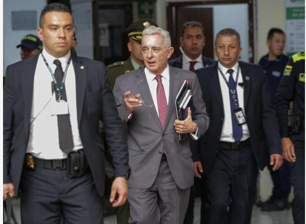

*Senador Iván Cepeda Castro, la víctima y el denunciante de Álvaro Uribe, tiene sobre las cuerdas al expresidente Uribe, Impide avance de su juicio criminal. Cortesía.*

El expresidente **Álvaro Uribe Vélez** ―el presunto capo invisible auspiciador del paramilitarismo― teme que avance su juicio criminal. Su conducta marañera quedó evidenciada en este proceso. Es el principal integrante de **Los Intocables**. Se siente acorralado y sin salida, porque por primera vez ―después de 40 años de presunta vida delincuencial― la justicia lo tiene en el punto de mira. Las pruebas son contundentes. No tuvo más remedio que aplicar la **estrategia _«gato boca arriba»_** para que la Fiscalía no le dé el zarpazo que lo hundiría en la cárcel por fraude procesal y manipulación de testigos.

Como no le funcionó su **estrategia de dilación** el lunes, porque la juez rechazó de plano su solicitud de recusación, el martes se ausentaron sus abogados en la audiencia. El exmandatario recurrió desesperadamente a la tutela para detener el juicio criminal. Un juicio que en abril cumplirá un año desde que fue llamado al estrado junto a su abogado original **Diego Cadena**.

¿Te interesa? [A juicio criminal Álvaro Uribe por 5 delitos](/articulos/a-juicio-alvaro-uribe-por-coparticipacion-criminal/)

## Contexto

*¿Fin de la impunidad de Álvaro Uribe, quien impide continuidad del juicio criminal?*

Se recordará que el expresidente ordenó atacar infundadamente al senador [**Iván Cepeda Castro**](/articulos/comunicados-caso-alvaro-uribe/) en el 2012, porque había recolectado testimonios de exjefes paramilitares que dieron fe de la conducta criminal del expresidente. El debate se realizó en el 2014. Allí lo desnudó sobre los nexos del expresidente con los escuadrones de la muerte. Fue entonces cuando Uribe, instrumentalizando a Cadena, creó pruebas falsas para denunciar a Cepeda ante la Corte Suprema. Ésta, en 2018, emitió la sentencia [SP245-2018](/wp-content/uploads/2018/02/JOSE-L.-BARCELO-C.-SP245-2018.pdf) de la Sala de Instrucción II, donde señaló que no había méritos para abrir una investigación a Cepeda:

> «(La Sala) no encontró fundada la denuncia ni motivos para abrirle proceso penal al senador Cepeda».

Ante esa decisión, en ese año, Cepeda Castro contraatacó y presentó denuncia penal ante la Corte Suprema contra el expresidente Uribe, y en la Fiscalía contra los otros involucrados, entre ellos, su abogado Diego Cadena. El juicio de hoy contra el Intocable mayor es resultado de esta denuncia del senador Cepeda.

¿Te interesa? [Petro/Uribe: ¿Gemelos de la opinión negativa? (II)](/articulos/petro-uribe-gemelos-de-la-opinion-negativa-ii/)

## Al final, la verdad siempre prevalece

https://twitter.com/IvanCepedaCast/status/1889642185697444172

La situación de la clase política colombiana ―cualquiera que sea su ideología de izquierda, de derecha o de centro― expresa **una crisis ética y moral profunda del quehacer político**. Los partidos políticos y la clase empresarial viven inmersos en esta crisis del Ser, porque están centrados en el tener, a la manera como lo explica el psicoanalista **Erich Fromm**.

¿Te interesa? [La triquiñuela jurídica de Uribe aplazó la audiencia de acusación](/articulos/la-triquinuela-juridica-de-uribe-aplazo-la-audiencia-de-acusacion/)

## La estrategia de dilación

*El expresidente Uribe está acorralado. Impide avance de su juicio criminal. Cortesía.*

Lo que se observa de parte de Uribe y sus abogados, evidentemente, es una estrategia de dilación como prolongación de la **estrategia de retractación usada por muchos políticos para evadir el juicio criminal**. Esta verdad jurídica la demostró la Corte Suprema de Justicia en los casos de **Piedad Zuccardi** (exsenadora de la U ) y la difunta **Daira Galvis**, exsenadora de Cambio Radical.

**La dilación** para detener el juicio consiste en retrasar intencionadamente el proceso judicial para ganar tiempo y obtener una ventaja procesal. Esto puede lograrse mediante diversos recursos legales. Entre los cuales, la interposición de apelaciones, la solicitud de suspensión de audiencias, la presentación de recursos de nulidad o usar la acción de tutela.

El propósito de la dilación no es ganar el juicio mediante la argumentación jurídica y la sustentación del material probatorio. Se trata de debilitar la posición de la Fiscalía para evitar una condena rápida o negociar un acuerdo favorable. Aunque legal, este tipo de tácticas es antiético. Puede ser visto como una forma de manipular el sistema judicial en beneficio del expresidente Uribe, quien siempre ha puesto de rodilla a la justicia.

Todos esos recursos y acciones los abogados de Uribe los utilizaron sin éxito varias veces. Pero, sí lograron retrasar el juicio. Buscan la prescripción del delito. Esta conducta de los apoderados, sin duda, cuenta con el beneplácito y la voluntad del expresidente Álvaro Uribe. Así como la tuvo su abogado **Diego Cadena** para torcer los testimonios de los testigos que comprometían al expresidente. Cadena también se encuentra inmerso en este delito y es procesado conjuntamente con el exmandatario.

## Juicio criminal

En efecto, como los abogados de Uribe no se presentaron en el segundo día del juicio criminal, la audiencia fue suspendida provisionalmente hasta este jueves 13 de febrero por la juez 44 Penal de Conocimiento, **Sandra Liliana Heredia**.

En consecuencia, la juez le dio tres días hábiles al **abogado Jaime Granados Peña** y a su suplente para que explique las razones de su ausencia en la diligencia judicial.

> «(...) se oficie a la **Defensoría Pública** para que nos designen un abogado que eventualmente asuma, en caso de que sea continua la determinación de los señores defensores de no hacerse presentes, o si eventualmente el señor procesado, pues, no designa otro abogado».

Esa medida de la togada tiene como finalidad terminar con la estrategia de dilación permanente de la escuadra defensora de Uribe que viene aplicando esa **estrategia _gato boca arriba_**.

## Tutela al juicio criminal

En principio, hoy jueves debe reanudarse el juicio contra el decano de **Los Intocables**. Pero, el **Tribunal Superior de Bogotá** ordenó suspender provisionalmente las audiencias de juicio oral contra el **expresidente Álvaro Uribe**, quien fue llamado a juicio por supuesto soborno a testigos y fraude procesal. La decisión provisional del Tribunal firmada por el magistrado **Ramiro Riaño Riaño**, señala:

> «Al no haberse emitido una decisión de fondo frente a la recusación por parte de la juez accionada; por el contrario, rechazarla de plano al calificar la postulación como una acción dilatoria, pretermitió que otro juez valorara la situación».

Esta medida, que puede tardar hasta que el Tribunal tome una decisión de fondo, podría tomar 10 días hábiles a partir de su admisión. Mientras tanto, ata las manos de la jueza del caso, **Sandra Liliana Heredia**. La acción de tutela la impetraron los abogados del **expresidente Álvaro Uribe**.

En la jornada del martes la **fiscal Marlenne Orjuela** continuaría interrogando al senador **Iván Cepeda Castro** como testigo y víctima del caso contra el expresidente Uribe. Pero no fue posible por la ausencia de los defensores del expresidente.

**La tesis de la Fiscalía demuestra que Uribe habría instruido a Diego Cadena** para que en 2018 consiguiera exparamilitares encarcelados para que declararan a su favor y en contra del senador Cepeda Castro. Frente a esta acusación, ambos se declararon inocentes. Pero quien inició el proceso contra Cepeda Castro fue el expresidente Uribe, quien en 2012, utilizó a Diego Cadena para denunciar al senador ante la **Corte Suprema de Justicia** por un supuesto complot contra él con falsos testigos en cárceles.

## Dilación al juicio criminal

Ante esa determinación de la juez, los juristas y el expresidente manifestaron que no llegaron a la audiencia de juicio porque estaban presentando una acción de tutela contra la togada. El objetivo de esta acción judicial es proteger el derecho fundamental al debido proceso, presuntamente violado por la jueza.

Desde que el fiscal libró resolución de acusación en abril de 2024 contra Uribe, porque obró en **coparticipación criminal** con otras personas para comprar, manipular y **crear ficticiamente una duda razonable** de los testimonios y pruebas de testigos. Fue la estrategia usada por su abogado **Diego Cadena** para lograr la retractación de testigos. Para ello, hizo un periplo por diferentes cárceles con el fin de que los testigos modificaran sus declaraciones.  

Los abogados de Uribe carecen de argumentos para enfrentar la acusación de la Fiscalía. Apelan a la maroma judicial, como la dilación. Ellos están casados con la prescripción. Manifiestan que este proceso tiene motivaciones meramente políticas impulsadas por el senador Iván Cepeda y el exfiscal Eduardo Montealegre.