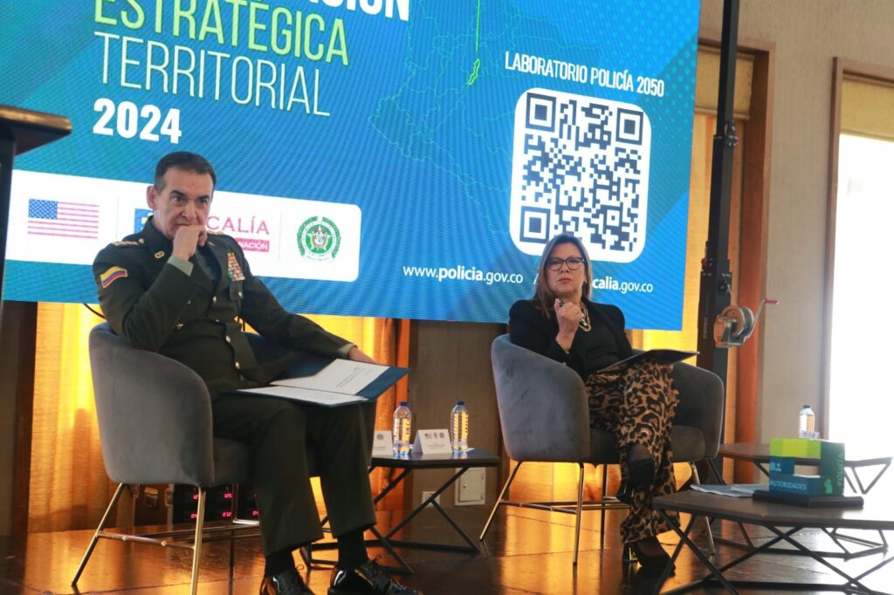
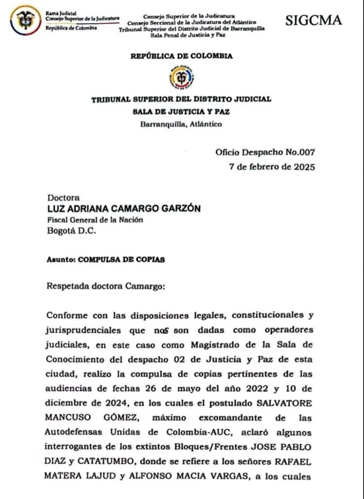

*La fiscal Luz Adriana Camargo debe demostrar que no solo son bonitos discursos. Se necesita acción para someter a los auspiciadores del paramilitarismo y la defensa de los derechos de las víctimas. (Cortesía).*

El Tribunal de Justicia y Paz acaba de emitir el **oficio No 007/2025** mediante el cual le pidió la Fiscal General de la Nación, **Luz Adriana Camargo Garzón**, que investigue los casos de los empresarios **Rafael Matera Lajud y Alfonso Macías Vargas** (fallecido en el 2024) y sus propiedades productos de las actividades delincuenciales. Los citados individuos ―llamados **Los Intocables**― fueron señalados por los exjefes de las autodefensas como auspiciadores del paramilitarismo que siguen sin ser tocados por la justicia. Esta situación de inacción de la Fiscalía es una **flagrante violación de los principios de justicia y reparación**.

_Los Intocables_ son los **auspiciadores del paramilitarismo** que cometieron los grandes horrores del siglo XX y que la fiscal prometió perseguir judicialmente. El mayor sospechoso es el expresidente **Álvaro Uribe Vélez**, quien hoy se ve sometido a un **juicio criminal** por soborno a testigos para evadir su responsabilidad penal.

¿Te interesa? [Señora Fiscal: ¿Terminó la vagancia judicial con Los Intocables? (XVI)](/articulos/senora-fiscal-termino-la-vagancia-judicial-con-los-intocables-xvi/)

*La compulsa de copia firmada por el magistrado José de la Pava Marulanda, de la Sala de Conocimiento de Justicia y Paz del Tribunal Superior de Barranquilla.*

## Los auspiciadores del paramilitarismo

En efecto, José de la Pava Marulanda, magistrado de la **Sala de Conocimiento No 2 de Justicia y Paz del Tribunal Superior de Barranquilla**, compulsó copia de la audiencia del **10 de diciembre de 2024**. En esta vista pública, el jefe de las antiguas **Autodefensas Unidas de Colombia (AUC), Salvatore Mancuso Gómez**, se ratificó en lo que dijo en otras audiencias, que **Matera Lajud y Macías Vargas** fueron auspiciadores del paramilitarismo.

De la misma manera el 26 de mayo de 2022 se realizó la audiencia del frente "José Pablo Díaz" donde varios postulados reconocieron el papel criminal jugado por los empresarios **Matera Lajud y Macías Vargas**. Estos sujetos determinaron la comisión de delitos de lesa humanidad. Está debidamente documentado, por ejemplo, masacres, homicidios en personas protegidas, desplazamiento forzado, desaparición forzada, despojo y hasta se robaron parte del **río Ariguaní** y ninguna autoridad los detuvo.

¿Te interesa? [La sombra de los Cien Días de Luz en la Fiscalía: «Los Intocables» (XII)](/articulos/la-sombra-de-los-cien-dias-de-luz-en-la-fiscalia-los-intocables/)

## Los hermanos Noguera Aarón

En un artículo publicado el 8 de abril de 2023, en **VoxPopuli Digital**, después de hallarse la sentencia condenatoria contra Alfonso Macías por el asesinato de Juan Noguera Aarón, hermano del magistrado Enrique Camilo Noguera Aarón, se preguntó

> **¿El empresario Alfonso Macías determinó el asesinato de Juan Noguera Aarón y dos de sus guardaespaldas?** 
> 
> [¿](/articulos/macias-determino-asesinato-de-noguera-aaron-los-intocables-iv/)[Macías determinó asesinato de Noguera Aarón? «Los intocables»: (IV)](/articulos/macias-determino-asesinato-de-noguera-aaron-los-intocables-iv/)

El clan de **«Los Rojas»** —que estaba bajo el mando de Macías y Matera— asesinó al exmagistrado **Enrique Camilo Noguera Aarón** en Taganga, a las 8 de la mañana de un **22 de octubre del año 2003**. ¿El motivo? Fue la persona que impulsó la investigación por el asesinato de su hermano hasta lograr una condena de primera instancia. Ante justicia y paz admitieron que trabajaban para Alfonso Macías.

El oficio de la compulsa de copias señala los casos particulares de Matera y Macías. Este último se murió el año pasado por algunas complicaciones de salud.

> «En la audiencia se aclaró algunos interrogantes de los extintos bloques/frentes **José Pablo Díaz y Catatumbo** donde se refiere a los señores **Rafael Antonio Matera Lajud y Alfonso Macías Vargas** a los cuales señala como **auspiciadores y financiadores de las AUC**, ratificándose de este señalamiento bajo la gravedad del juramento».

¿Te interesa? [Uribe y «Los intocables» quieren blindarse ante Mancuso (VII)](/articulos/uribe-y-los-intocables-quieren-blindarse-ante-mancuso/)

## Solicitud de medidas cautelares

Para las víctimas es inaceptable la inacción frente a los bienes de los financiadores del paramilitarismo, individuos claramente identificados. Por lo que considera que la ausencia de medidas cautelares sobre sus activos, incluyendo bienes muebles e inmuebles, cuentas bancarias, participaciones accionarias y empresas, **constituye una flagrante violación de los principios de justicia y reparación**.

Resulta alarmante que la Fiscalía General de la Nación no haya iniciado los procesos de extinción de dominio obligatorios, ni ejecutado allanamientos judiciales. Esta omisión alimenta la impunidad y perpetúa el despojo de las víctimas, permitiendo que los perpetradores disfruten de riquezas ilícitas, producto de crímenes de lesa humanidad.

Los abogados en representación de víctimas, exigen acciones inmediatas. La promesa pública de la Fiscal General de la Nación debe traducirse en resultados tangibles, no en palabras vacías. La justicia demanda que estos bienes sean incautados y destinados a la reparación de las víctimas, impidiendo que el legado del terror se transmita a futuras generaciones.

> Los casos de Rafael Matera Lajud y Alfonso Macías Vargas solo son dos de las 700 compulsas de copia que la Fiscalía ha recibido de Justicia y Paz. En ellas se adjuntan declaraciones textuales de jefes paramilitares, que afirmaron quiénes fueron sus grandes auspiciadores y financiadores.

Se espera que la Fiscal Luz Adriana Camargo, responda esta inquietud de las víctimas con acciones. Por ejemplo, extinción de dominio con medidas cautelares de las propiedades de los grandes auspiciadores del paramilitarismo.