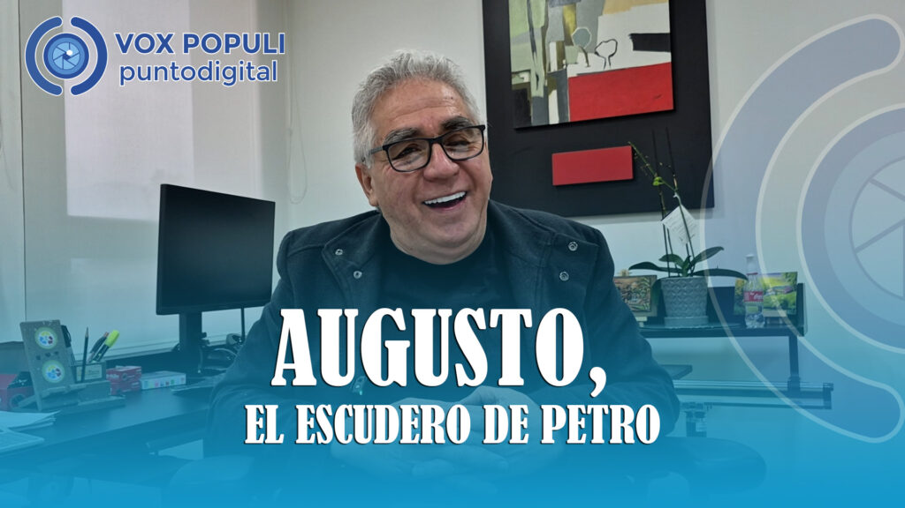
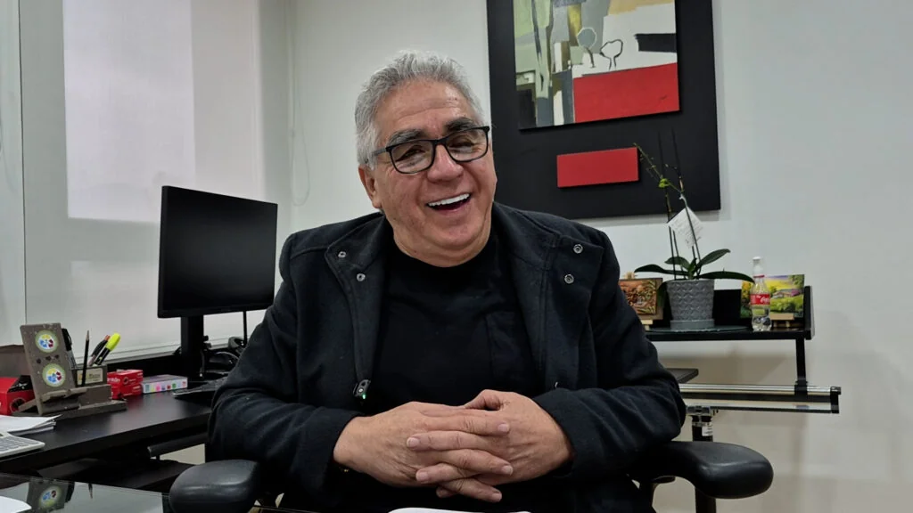

*Augusto, el escudero de Petro contra los molinos de la corrupción.*

La batalla más importante del gobierno actual no es la Consulta Popular ni las reformas sociales. ¡No! La batalla decisiva es contra los molinos de vientos de la corrupción que soplan desde su interior. En medio de este caos, surge _Augusto, el escudero de Petro_. Si bien es uno de los relatos fantásticos de la mitología política criolla, cualquier parecido con el _realismo mágico_, es pura coincidencia.

Y esta es la historia . . .

Erase una vez un caballero andante en un lugar de América Latina, de cuyo nombre quiero recordar: Colombia. Su mente se llenó de tantas historias fantásticas de sus libros para alcanzar el poder que llegó al delirio. Fue, entonces, cuando su espíritu quijotesco se transformaría en un **«**Aureliano Buendía**»** que terminaría autodestruyéndose.

Un día no tan lejano (19―06―2022) se hizo Presidente de la nación con un relato fantástico que llamó **Potencia Mundial de la Vida**. Dos años largos después, su propuesta de redimir, no solo a las viudas empobrecidas, sino a todos los débiles del mundo, está en deuda. Sus cinco banderas programáticas, aunque haya dado pasos importantes, siguen en ciernes: **superación de la pobreza, transición energética, reforma agraria, educación superior y desarrollo de la industria**. Ni qué decir de sus reformas sociales.

¿Te interesa? [La Reforma a la Salud de Petro divide a Colombia](/articulos/revolucion-o-caos-la-reforma-a-la-salud-de-petro-divide-a-colombia/)

## La entrevista con el escudero de Petro

https://youtu.be/SLnhQxMsySQ

La entrevista. Augusto, el escudero de Petro contra los molinos de la corrupción

> Desde su perspectiva, en esa entrevista cuenta la verdadera historia de lo que sucedió con "Papá Pitufo". ¿Fue un estallido controlado de este escándalo desde el alto gobierno? También se refiere al proceso de moralización de la Unidad Nacional de Protección señalando algunas empresas y algunos escoltas capturados por las organizaciones armadas. Se refiere a la relación con Benedetti en el ministerio del Interior. Lo considera un desafío en el proceso de moralización interna de la UNP. Bienvenidos a la entrevista con **Augusto Rodríguez Ballesteros**, el escudero del presidente.

¿Te interesa? [El dueño de la bolsa ¿Petro o Benedetti? (IV)](/articulos/el-dueno-de-la-bolsa-petro-o-benedetti/)

## El escudero de Petro

¡Si! La batalla más decisiva que libra el gobierno es contra los molinos de vientos de la corrupción: los financistas _non sancto_ de su campaña presidencial. Uno de ellos es el escandaloso caso de **‘Papá Pitufo’**. Seguramente lo repatriarán para ser juzgado y podría ser pieza clave en los procesos penales y administrativos por **violación de topes y financiación ilegal**. Pero, ¡tranquilos! aquí está el escudero del presidente: **Augusto Rodríguez Ballesteros**, director de la **Unidad Nacional de Protección―UNP**.

> ****«****Los 500 millones llegaron, pero no entraron a la campaña****»****.
> 
> Augusto Rodríguez, entrevista con VoxPopuli.digital.

El nuevo caballero andante (¡ya lo adivinaste!) es **Gustavo Petro Urrego**, el ****«**Aureliano Buendía**»**** del M/19. Su escudero, **Augusto**. Lo acompaña en esta dura batalla contra los molinos de vientos de la corrupción que ahora estremecen los cimientos de su proyecto político. Es una amenaza interna que se cristalizó durante el **Consejo de Ministros** del pasado 4 de febrero con el ascenso y la rehabilitación política de **Armando Benedetti**. Un viejo socio de **Euclides Torres** y ****«**Yuyo**»**** **Daes Abuchaibe**.

Empero, aunque la gente no lo sepa, ese delirio quijotesco por los desvalidos aprendido de los libros marxistas, se trastocó en el espíritu de la maldición de los _Buendía_. Esta maldición ―como lo mostramos en mi libro **«¿Adiós a la guerra?»**― simboliza el **destino inevitable** de los **«**Buendía**»** a repetir sus errores hasta la autodestrucción. 

> ¿Acaso tener a Benedetti como punta de lanza política no es error y una tendencia hacia la autodestrucción de esos sueños de lucha armada y parlamentaria por la democracia y la prosperidad?

¿Te interesa? [Los 5 rasgos de Benedetti: el «Rasputín criollo» (IV)](/articulos/los-5-rasgos-de-benedetti-el-rasputin-criollo/)

## Augusto, el investigador

*Pocas veces ven a Augusto, el escudero de Petro, expresar una carcajada. La entrevista fue tan divertida que se explayó en sus conceptos y en sus carcajadas.*

Ese delirio quijotesco, que llevó a Petro a enfrentarse en el congreso de la República a gigantes de la corrupción que parecían molinos de vientos, ahora están de regreso. Hoy, esos gigantes ―representados por Benedetti― en un **eterno retorno**, están en la Casa de Nariño para devorar sus ideales políticos que construyeron cerca de 30 años de lucha parlamentaria.

Pero, allí está el escudero de Petro para cantarle la verdad a su oído izquierdo como si fuera un ****«****Pepe Grillo****»****. Guarda las espaldas de su compañero Presidente.

Además de escudero, Augusto fue el principal investigador de la parapolítica que asesoró al entonces senador del Polo Democrático Alternativo (2006) a realizar uno de sus grandes debates que lo llevó al ascenso político y a la fama nacional.

Su papel en las diferentes campañas parlamentarias y presidenciales fue guardarle las espaldas del acecho de sus enemigos. Pero, en especial, de los gigantes de los molinos de vientos soplados por los intereses subterráneos que subyacen en sus aportes electorales. Así capturan los gobiernos para ponerlo a su servicio ilegal. Luego legalizan sus dineros _malhabidos_. Y se repite el ciclo.

**Próxima entrega**: _El Sancho Panza de Petro contra el escándalo de "Papá Pitufo"_