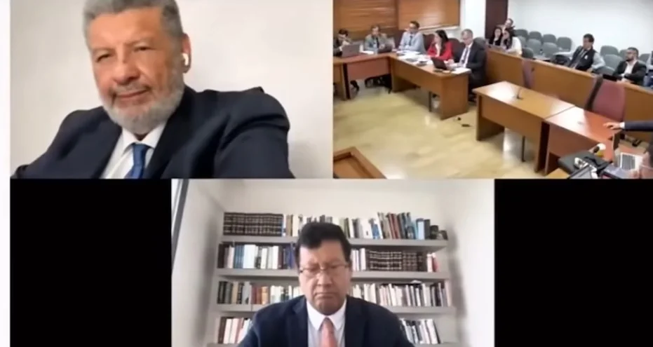
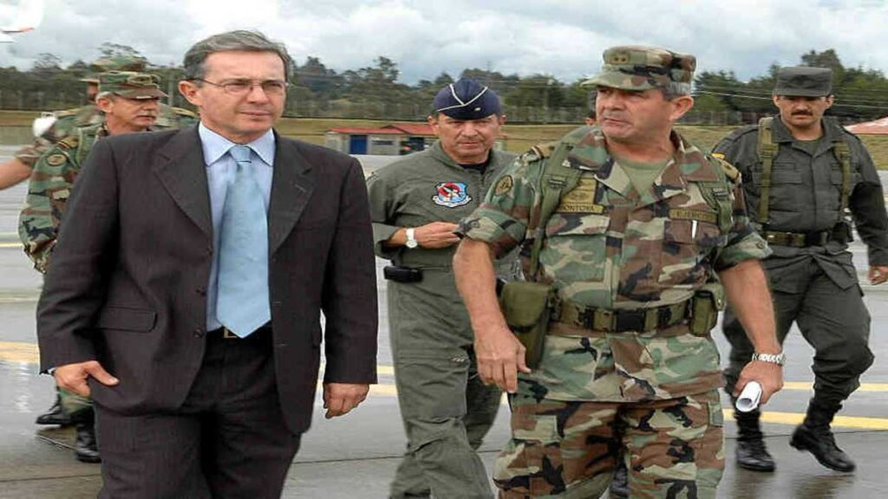

*El saboteado juicio a Uribe ¿la justicia lo absolverá? Los abogados del expresidente se salieron con la suya como hace un año. Lograron que le aplazaran una vez más el juicio.*

La noticia judicial más importante del país de toda la historia del siglo 21 es el juicio al expresidente **Álvaro Uribe Vélez**, cuyo radicado es el No 110016000102-2020-00276-00. **¿La justicia lo absolverá o saldrá libre por prescripción?** Su defensa ―aunque lo niegue― se la juega con la prescripción del proceso, cuya fecha límite sería el **8 de octubre de 2025**.

Si se acogen a la prescripción, sería una decisión controversial. La sociedad colombiana **no tendría la oportunidad** de saber si es cierto o no la **mala conducta** del expresidente. En este caso se tomará en cuenta la [sentencia  AP749-2024](/articulos/co/wp-content/uploads/sites/12/2024/05/AP749-202453260.pdf) de la Sala de Casación Penal de la Corte Suprema de Justicia (CSJ) sobre el término de prescripción en los procesos penales luego de la sentencia de segunda instancia. Independiente de sus resultados, ningún presidente llegó al estrado de los acusados de la justicia ordinaria como en este caso.

¿Te interesa? [El expresidente Uribe está acorralado. Impide avance de su juicio criminal (I)](/articulos/el-expresidente-uribe-esta-acorralado-impide-avance-de-su-juicio-criminal-i/)

## ¿El jueves se reactivará el juicio?

En estos momentos, el proceso se encuentra parado por cuenta de una acción de tutela interpuesta por los abogados de Uribe por **violación al derecho fundamental del debido proceso**. La Sala Penal de la CSJ señaló que la juez 44 de Conocimiento, **Sandra Heredia**, no tramitó la recusación presentada por los mismos juristas que no tienen otro recurso que la dilación judicial.

Por tanto, debía darle curso para que otro juez del circuito conozca la recusación, como en efecto lo hizo. O sea, que el jueves 27 de marzo debería conocerse el resultado de ese recurso de la defensa de Uribe.

¿Te interesa? [A juicio criminal Álvaro Uribe por 5 delitos](/articulos/a-juicio-alvaro-uribe-por-coparticipacion-criminal/)

## La impunidad de **«Los Intocables»**

*Álvaro Uribe, el jefe de ¿la justicia lo absolverá?*

Si el expresidente lo absuelven por prescripción del delito ―vencimiento del tiempo legal para ser juzgado― se mantendría el imperio de la impunidad de **«Los Intocables»** que fueron los financiadores y auspiciadores del paramilitarismo y de sus crímenes de lesa humanidad. O si lo absuelven por duda razonable, la que estaría en duda sería la justicia colombiana.

¿Por qué? Todas las pruebas y testimonios de primera mano dan cuenta de la responsabilidad penal del expresidente Álvaro Uribe. Según las pruebas, él mandó a su abogado **Diego Cadena** a entrevistarse con el exparamilitar **Juan Guillermo Monsalve**, preso en La Picota. Debido a los hallazgos, el 24 de julio la Corte inició investigación formal contra **Álvaro Uribe Vélez** por los delitos de fraude procesal y soborno.

Como su oponente político en el gobierno, Gustavo Petro, concentra la atención de la opinión pública por cuenta de sus escándalos y la anunciada consulta popular, el proceso judicial contra Uribe pasó a un segundo plano.

Pero en los espacios públicos del país existen la anunciada **consulta popular** compite en la atención del país político y de la opinión pública que agita un año preelectoral. Por lo menos, es un logro que no se le puede discutir a Gustavo Petro y evita que los reflectores se concentren con las _pitunoticias_.

¿Te interesa? [Bienvenido 2024. ¿El fin de Los Intocables? Uribe, La Granja y El Aro? (I)](/articulos/bienvenido-2024-uribe-sera-detenido-por-masacres-de-la-granja-y-el-aro-i/)

## La génesis del juicio

La tesis que se introduce en esta entrega se sustenta y se valida en mi próximo libro: **«El príncipe oscuro»**. El proceso judicial contra **Álvaro Uribe Vélez** data desde julio 2018. En ese entonces, el senador Iván Cepeda Castro contraatacó, luego de una arremetida judicial y política en su contra del expresidente Uribe que lo denunció ante la Corte Suprema de Justicia.

Sin embargo. la génesis data desde la década del 90. La intención del exmandatario era que Monsalve se retractara de sus denuncias o crear dudas para invalidar sus testimonios y pruebas que demuestran su responsabilidad en el financiamiento y auspiciamiento del paramilitarismo. En este período, que se prolongó hasta el acuerdo de paz con las Autodefensas (2005), **se produjo el triunfo del proyecto político**.

Si uno analiza bien el relato del principal testigo del juicio contra el expresidente Uribe Vélez, notará que sus nexos con el paramilitarismo está demostrado con la creación del **Bloque Metro en 1997**. Esta organización paramilitar, cuyo jefe era  [Carlos Mauricio García Fernández](https://luciotorres.local/wiki/Carlos_Mauricio_Garc%C3%ADa_Fern%C3%A1ndez), ―dijo Monsalve en el juicio― surgió como una respuesta de los Uribe Vélez y las Autodefensas Campesinas de Córdoba y Urabá contra las FARC.

Es un hecho que el testimonio de Monsalve no queda invalidado porque sea un criminal instrumentalizado por los Uribe Vélez. Vale recordar que fue parido y criado en el ambiente de _Guacharacas_, la hacienda insignia de los Uribe Vélez heredada de su padre **Alberto Uribe Sierra**. Su testimonio es tan válido y fundamental que se sustenta y es coincidente con otras pruebas y declaraciones allegadas al proceso.

## Uribe, el verdadero capo

La llegada a la presidencia de **Álvaro Uribe Vélez** (2002) significó **el triunfo del proyecto paramilitar so pretexto de acabar con las FARC y toda la guerrilla. Está demostrado en las sentencias de Justicia y Paz y Jep, que este proyecto político fue financiado por una clase burguesa emergente** que amasó sus capitales ilegales producto del narcotráfico.

Las pruebas señalan que el mismo padre de Uribe era un lavador nato de capitales. Su muerte ocurrida cuando Álvaro Uribe era gobernador de Antioquia, no está esclarecida. El relato dominante de este hecho procede de la misma familia Uribe Vélez que lo considera una víctima de las FARC.

Desde antes de ser elegido presidente, su trayectoria política estuvo llena de oscuridad. Su paso por la dirección de la Aerocivil, la alcaldía de Medellín y la gobernación de Antioquia deja muchas sombras. La única claridad de su pasado político antes de ser presidente, es que provenía de las entrañas de una familia vinculada, al parecer, al lavado de activos del narcotráfico. No ha habido una persona tan cuestionada moral y éticamente que el expresidente y fundador del Centro Democrático **Álvaro Uribe Vélez**.

Por otra parte, el proyecto político paramilitar se aprovechó del plan contrainsurgente para mimetizarse en las estructuras del Estado. O sea, que el paramilitarismo no es un producto delincuencial común sino la expresión de poder armado de los amos de una economía subterránea y de una política mimetizada en el congreso que precisaban poner el Estado a su servicio. Hoy, realmente son los que detentan el poder estatal y manejan los hilos de la economía que desemboca en una corriente subterránea e invisible.

Por ende, se entiende que la impunidad existe porque sus responsables todavía no los juzgan. Ellos siguen mandando, a pesar de tener un gobierno supuestamente de izquierda.