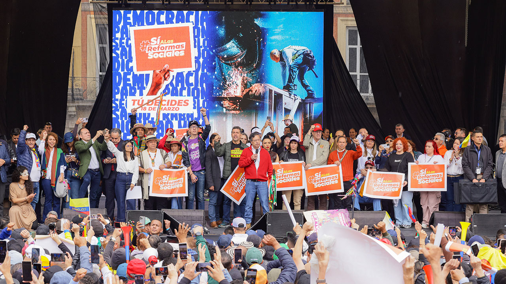

*Palabras del presidente Gustavo Petro Urrego en el evento ‘Movilización: Sí a las reformas sociales’. ¿Una consulta para enfrentar el bloqueo legislativo?*

La tensión entre el congreso y el ejecutivo continúa. El relato presidencial es que **«no lo dejan gobernar»** y por eso pretende convocar una consulta popular para enfrentar el supuesto bloqueo legislativo. Al mismo tiempo que el **presidente Gustavo Petro** decretara día cívico y liderara desde la plaza de Bolívar, de Bogotá, las marchas del 18 de marzo, la reforma laboral la sepultaba un bloque de ocho senadores que respaldó **la ponencia de archivo del senador liberal Miguel Ángel Pinto** en la Comisión Séptima del senado.

Con el maratónico discurso de más de dos horas, desde la Plaza de Bolívar, de Bogotá, Petro le notificó al congreso:

> «Así que quedan convocados: arranca la consulta popular, la movilización es permanente y creciente».

En la pasada entrega decíamos que si el gobierno realmente quiere gobernar y producir los cambios sociales y económicos que el país necesita, una **consulta popular no es la vía**. Mucho menos instrumentalizar la movilización de los sectores populares, porque solo el presidente es quien puede hacer la pregunta de esta consulta popular de origen gubernamental.

## ¿Todo por las Reformas sociales?

Se decía en la primera entrega que si se quiere resultados transformadores, **Petro debió convocar al inicio de su gobierno a una Asamblea Nacional Constituyente―ANC**. Él prefirió el acuerdo por arriba con la élite política dominante del congreso. Esto lo llevó a usar la _**mermelada**_ como vaselina para facilitar el trámite de las reformas. Los resultados son evidentes: **un fracaso total.**

Por tanto, independientemente si se llenó o no la plaza de Bolívar de Bogotá, lo que se debe estimular es la autonomía del movimiento social y popular, y renovar su vieja burocracia para provocar los cambios sustanciales que la sociedad espera. Ninguna de las reformas propuestas de Petro ni su praxis como presidente pretenden esos cambios.

Por ejemplo, la reforma pensional que ya fue aprobada y que está en tránsito en la Corte Constitucional, solo resolvería la pensión a un poco más de dos millones de personas. A corte de octubre de 2024, el sistema tiene **1.732.730 pensionados**, según la Superintendencia Financiera. ¿Qué pasa con los **8 millones de trabajadores** que llegaron a la edad de pensionarse y no lo pueden hacer? La reforma de Petro no resuelve este problema social.

## «El bloqueo legislativo» y los contrapoderes

El presidente Gustavo Petro apela a la movilización social como instrumento de presión contra el congreso para que le aprueben sus reformas. Denuncia la existencia de un «bloqueo legislativo». ¿Por qué no lo hizo en el inicio de su gobierno? Este discurso, al parecer, tiene como finalidad victimizarse para esconder su incapacidad política de construir unas mayorías en el congreso. No lo logró siquiera con _mermelada_ que salía del ministerio de Hacienda y se regaba por todo el sistema, tal como lo demuestran los elementos probatorios allegados al escándalo de la UNGRD.

Por esa razón, Transparencia por Colombia reiteró su preocupación por la gravedad de las denuncias que vinculan al exministro de Hacienda, R**icardo Bonilla**, con presuntas irregularidades relacionadas con la compra de votos de congresistas mediante la asignación de contratos de la Unidad Nacional para la Gestión del Riesgo de Desastres (UNGRD).

Para explicar si el discurso del **«bloqueo legislativo»** es válido o no, debemos hacer un poco de pedagogía periodística.

En Colombia existe una democracia representativa presidencialista. Existen tres poderes públicos que, según la constitución, son independientes, pero coexisten armónicamente. Estos poderes están representados en un **Estado Social y Democrático de Derecho**. El ejecutivo, que lo constituye el presidente y sus ministros, es uno de esos tres poderes. Los otros son el legislativo (congreso) y el jurisdiccional, o sea, los jueces.

Sin embargo, todos ellos beben de una sola fuente: **el poder ciudadano**. Es el único mandante de todos los poderes públicos. Este poder supremo se expresa a través del voto, los mecanismos de participación ciudadana y el control social. Un poder no puede estar supeditado al otro. Pero uno controla al otro a través de un mecanismo llamado **contrapeso**. Así lo definió en su libro _[El espíritu de las leyes](https://luciotorres.local/wiki/El_esp%C3%ADritu_de_las_leyes)_ el gran teórico **Charles Louis de Secondat**, más conocido como el **barón de Montesquieu**.

Dicho lo anterior, surge una pregunta. ¿Cómo funcionan esos poderes en un sistema democrático? Existen tres factores importantes para analizar.

## Los roles de los poderes públicos

**El primero, la autonomía**. Cada uno se plantea su propio reglamento siguiendo el mandato constitucional, cuya fuente es el voto popular.

El **segundo: el rol**. Los poderes públicos tienen roles distintos. Por ejemplo, el ejecutivo ejecuta las leyes fabricadas por el congreso. O atiende las peticiones del constituyente primario a través de los mecanismos de participación y del control social.

**Tercero: el contrapeso**. Este es el más controvertido en la praxis política de una democracia. El congreso controla el poder ejecutivo o presidencial y el judicial. Es su juez natural a través de la Comisión de Acusaciones.

En este régimen presidencialista, **el presidente concentra el mayor poder**: maneja las fuerzas militares, nómina al fiscal, ejecuta el presupuesto, vigila la actividad de la sociedad a través de las superintendencias, controla el orden público, comercial y económica, la seguridad, la salud, los servicios públicos. Y un largo etcétera. ¿Quién lo controla? El congreso, senado y cámara. Y el poder ciudadano, fuente de todos esos poderes públicos.

## El día cívico y el bloqueo legislativo

/articulos/petrogustavo/status/1901758509361844684?ref\_src=twsrc%5Etfw%7Ctwcamp%5Etweetembed%7Ctwterm%5E1901758509361844684%7Ctwgr%5E9f10b38285ce8cc3ad258b999c93b162b6b99060%7Ctwcon%5Es1\_c10&ref\_url=https%3A%2F%2Fwww.elcolombiano.com%2Fcolombia%2Fdecreto-petro-dia-civico-y-marchas-de-presidencia-18-marzo-AL26877711

Ahora bien, analicemos objetivamente lo planteado y actuado por el presidente Petro en su motivación política, independientemente de si es de izquierda o de derecha.

El presidente en su cuenta X, dice sobre la declaratoria de día cívico:

> «Los decretos del gobierno nacional se respetan o se respetan porque son la voz del pueblo».

Por supuesto que los decretos ajustados a la constitución y a la ley deben ser respetados por el conjunto de la sociedad. Nadie debe estar por encima de la ley. Pero si esa medida administrativa se adopta como medio de presión al otro poder público para que deje de cumplir su rol constitucional, aunque sea posición política válida, es contrario a la Carta Magna.

En esos términos, apelando a la teoría de los contrapoderes, la voz del ejecutivo es tan importante como la voz del congreso. Los dos son subsidiarias del poder máximo de una verdadera democracia, el poder ciudadano. Otra cosa es el problema de la legitimidad. Y en este caso el problema es más complejo. ¿Todo el poder del Estado es ilegítimo cuando es permeado por la corrupción?

Dicho de otro modo. La voz del presidente Petro, expresada a través de sus decretos, es la voz del pueblo. Pero, las leyes aprobadas o no por el congreso, también constituyen la voz del pueblo. ¿Hacia donde se inclina la balanza? ¿Quién tiene la verdad del pueblo? ¿Un ministro de la política como **Armando Bendetti**, duramente cuestionado por los mismos ministros de Petro por su inviabilidad moral y ética?

## El poder ciudadano

/articulos/petrogustavo/status/1902091270472003713

En todo momento el discurso de Gustavo Petro estuvo transversalizado con el concepto del poder del pueblo para exigirle al congreso que se ponga de su lado.

> «(...) por eso la propuesta de la consulta popular. Me parece fundamental porque estamos haciendo vivir la Constitución del 91. Ya salieron los oligarcas, los dueños del dinero, los que matan y asesinan a gritar contra la consulta popular, porque le tienen miedo al pueblo de Colombia».

En el mensaje de X hizo un símil de la manifestación de la Plaza de Bolívar como el grito de la independencia del 20 de julio de 1810. Al mismo tiempo, presentó un video con tomas aéreas de dron donde mostraba el lleno total.