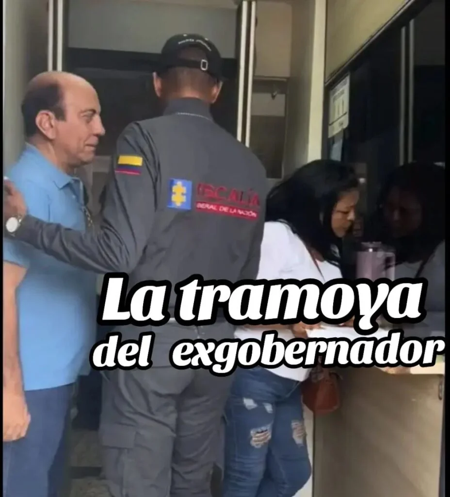
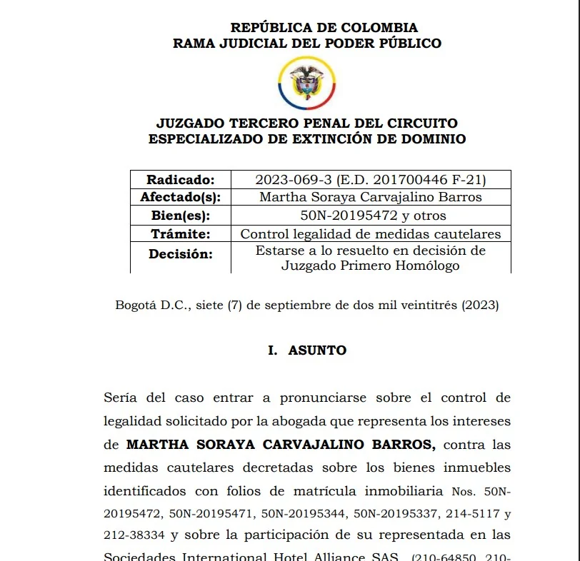
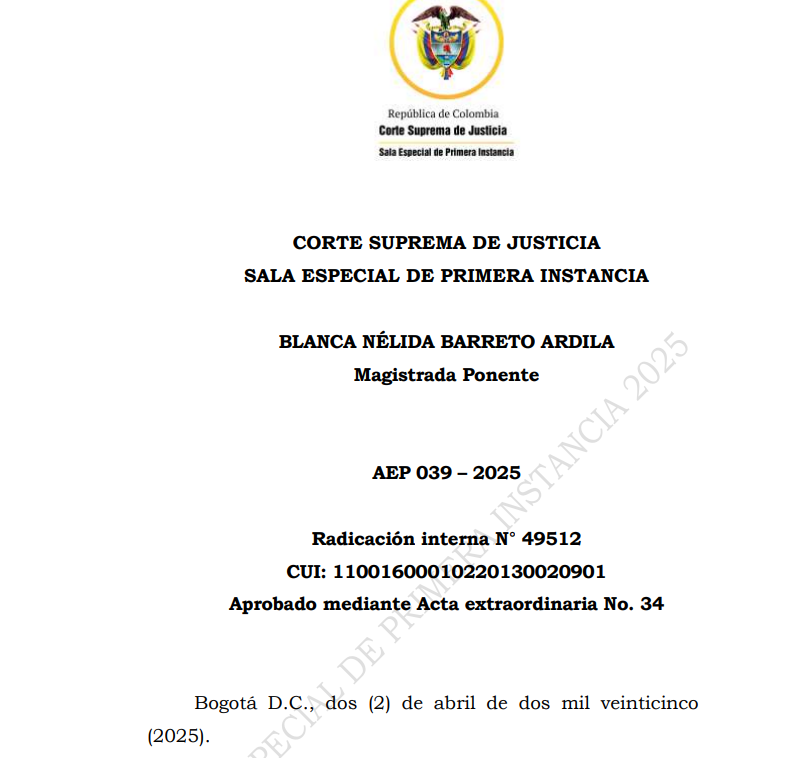

*La tramoya del exgobernador para apropiarse de $24 mil millones. (Foto cortesía).*

¿Cómo descifrar las clave de la **tramoya del exgobernador** Pérez Bernier condenado, en primera instancia, **a 22 años** de cárcel por la **Corte Suprema de Justicia**? Después de casi 15 años de espera, el exgobernador de La Guajira **Jorge Eduardo Pérez Bernier** amaneció hoy detrás de los barrotes de la Fiscalía. Los tres magistrados de la Sala Especial de Primera Instancia lo hallaron culpable. Es el principal responsable de un **desfalco patrimonial de la infraestructura educativa por la suma de $24 mil millones** a precios de 2009.

Los magistrados firmaron la sentencia **AEP 039 del 2025**, cuya acta extraordinaria de aprobación es la (dele clic (documento no disponible)) **No 34 con fecha del 5 de abril de 2025** sin ninguna divergencia. Según la Corte, Pérez Bernier se le condenó a 22 años porque comprobó que es **coautor de los delitos de contrato sin cumplimiento de los requisitos legales** en concurso homogéneo. Este delito concurrió con el de **peculado por apropiación a favor de terceros agravado**.

Como es una condena de primera instancia, en cuyo proceso la Fiscalía como la Procuraduría pidieron sentencia condenatoria, se espera que la defensa del hoy exgobernador del partido Liberal apele el fallo. En segunda instancia, su suerte la definirá la plenaria de la **Sala de Casación Penal de la Corte Suprema de Justicia**. Pero existen todas las evidencias para que el fallo sea confirmado por el alto tribunal.

Llama la atención que este proceso tiene cerca de 15 años debido a la estrategia de dilación de la defensa del exgobernador de La Guajira. Y solo ahora se desató después de que la Corte Suprema de Justicia definiera la responsabilidad penal del principal protagonista, **Jorge Pérez Bernier**.

¿Te puede interesar? [«Uribe, el papá de las Autodefensas»:](/articulos/uribe-el-papa-de-las-autodefensas-alias-victor/)

## Bienes confiscados

*Confiscado el Hotel Aliance SAS de Martha Carvajalino Barros. La tramoya del exgobernador.*

Es importante señalar que los compinches de Pérez Bernier también se encuentran involucrados en estos hechos de corrupción. Por ejemplo, la representante legal de la firma contratista, **Carmenza Ávila Chassaigne** se encuentra en juicio que espera con prisión domiciliaria. Sus bienes como los de Pérez Bernier y de su cadena de testaferros tienen medidas cautelares para extinción de dominio.

Mediante **Informe de Policía Judicial PEED No.9-97802 de fecha 20 de abril de 2017**, se inició el trámite de extinción del derecho de dominio a los bienes muebles y/o inmuebles de **Jorge Eduardo Pérez Bernier**, Enrique Eduardo Ávila Chassaigne, Antonio Ramón Ávila Chassaigne, **Carmenza Lucía Ávila Chassaigne**, Milena Janneth Ávila Chassaigne, Dilia Beatriz Ávila Chassaigne, **Georin de Jesús Blanchar Díaz** y **Martha Soraya Carvajalino Barros**, INTERNATIONAL HOTEL ALLIANCE S.A.S., ÁVILA S.A.S. y ÁVILA DESARROLLOS INMOBILIARIOS S.A.S.

La fiscalía delegada de la FGN, mediante **resolución de 22 de julio de 2019**, decretó medidas cautelares de suspensión del poder dispositivo, embargo y secuestro, toma de posesión de bienes, haberes y negocios de sociedades, establecimientos sobre distintos bienes. Esta medida tiene el propósito de evitar que esos negocios puedan ser ocultados, negociados, gravados, distraídos, transferidos o puedan sufrir deterioro, extravío o destrucción.

¿Te puede interesar? [Libertad de Dasuki, ¿tráfico de la jefa del CTI?](/articulos/libertad-de-dasuki-trafico-de-la-jefa-del-cti/)

## Una historia de corrupción

En el último cuarto de siglo 7 gobernadores de La Guajira probaron la cárcel. Este solo hecho expresa el nivel de corrupción de ese departamento empobrecido por la política tradicional y la **política de nuevo cuño** que se reflejó con los jugosos contratos entregados por la UNGRD.

Algunos de estos gobernadores son **Álvaro Cuello Blanchar, Oneida Pinto, Hernando Deluque, ‘Kiko Gómez’, Jorge Pérez Bernier**, **Alejandro Magno Builes Suárez y Raúl Nicolás Fragozo Daza**. Todos estos personajes forman un mosaico de corrupción de altos kilates.

Lo curioso, la línea política de los condenados siguen mandando en la empobrecida Guajira. ¿Por qué? La primera hipótesis para el investigador social sería que **la corrupción pasó a ser una subcultura** de este departamento donde lo ilegal es una costumbre. Los financistas electorales capturan en los procesos electorales al nuevo gobierno y los convierten en máquinas de producir plata mediante la corrupción y el lavado de activos.

## Vigencia futuras, el comienzo

Se recuerda que el plan para defraudar a la gobernación comenzó con un proyecto de ordenanza de vigencia futuras que Pérez Bernier puso a consideración de la Asamblea de La Guajira. El 20 de febrero de 2009 se le aprobó la **ordenanza 261**. Además la asamblea le aprobó la ordenanza 224 del 12 de marzo. Con estas herramientas, se fijaron los precios para las obras de infraestructura educativa del departamento.

Para ejecutar el contrato, el entonces gobernador de La Guajira, Pérez Bernier, firmó el **contrato No 770 de 27 de noviembre de 2009** con la **Unión Temporal del Norte** (UTN). Esta entidad es representada por **Carmenza Ávila Chassaigne**, quien tiene arresto domiciliario y sus bienes fueron confiscados cautelarmente.

El contrato contemplaba ejecutar un plan de infraestructura educativa departamental. Este comprendía realizar estudios técnicos, diseños, construcciones nuevas, ampliaciones y mejoramientos de las instituciones educativas del departamento en un plazo de 26 meses. El caso se conoció como la **«Corrupción de los Megacolegios»**.

El proceso se originó porque hubo múltiples incumplimientos del contratista. Se demostró que el mandatario firmó el contrato sin llenar los principios rectores de la contratación pública.

Por tanto, se comprobó que Pérez Bernier **no cumplió con los requisitos legales del contrato No 770 de 27 de noviembre de 2009** siendo gobernador de La Guajira con la **Unión Temporal del Norte** (UTN). El objetivo era la ejecución de un plan de obras educativas en el departamento.

## La tramoya del exgobernador

El proceso penal fue radicado con CUI 11001600010220130020901. En él la Fiscalía presentó las evidencias de que el contrato fue modificado y adicionado en 8 oportunidades. Siete de las cuales fueron tramitadas y suscritas por el procesado. Varió la ubicación, inversión y extensión de las obras. Aumentó el plazo de ejecución, así como el monto final, el cual **ascendió a $134.963 millones**.

Desde el trámite precontractual —según la Fiscalía— se infringieron los requisitos legales, ya que los estudios previos fueron exiguos en cuanto al presupuesto de obra, costos y diseños. Además, careció de soportes que explicaran la proyección del tiempo y el análisis de impacto a la población. El pliego de condiciones evidenció direccionamiento en la escogencia del contratista, amén de carecer de sustento técnico y jurídico.

Luego, con las distintas suspensiones, ampliaciones, prórrogas, modificaciones y adiciones, el plazo aumentó casi al doble del pactado, que eran 26 meses. Hasta ahora no se ha podido liquidar. Con el fin de enmascarar la **tramoya del exgobernador**, se registraron **operaciones ficticias** para distraer el destino de los recursos y lograr su **apropiación por terceros en cuantía** **$24.154 millones**.

Se verificó las transacciones de la Unión Temporal con sus proveedores. Esta verificación llegó a la conclusión de que, _'en su totalidad, el monto de los anticipos resultaron ser operaciones ficticias de compraventa de bienes y servicios'_.

​La trama de la tramoya del gobernador se valió de transacciones con **Metaltech Comercial S.A**., por $1.299 millones; **Proimetal S.A**., $905 millones; **Central de Hierro Ltda**., $906 millones; **Félix Contreras Mercado y/o Distrimateriales**, $1.001 millones 142; **UV Constructores Ltda**., $210 millones; **Jorge Eliécer Vera**, $300 millones; **José Antonio Vera**, $25 millones; **Francisco Torres**, $400 millones; **GO Construcciones S.A**., $502 millones, y **Alfredo Peralta Carrillo**, $1.370 millones. Para un total de **$6.918 millones**.

¿Te puede interesar? [Condenada la fiscal del paramilitarismo y la crisis moral de la Fiscalía (XIV)](/articulos/la-fiscal-del-paramilitarismo-y-la-crisis-moral-de-la-fiscalia-xiv/)

## Los delitos de la tramoya del exgobernador

La Corte acogió la tesis de la Fiscalía que le atribuyó a **JORGE EDUARDO PÉREZ BERNIER** la responsabilidad en la comisión de los delitos de **contrato sin cumplimiento de los requisitos legales** en concurso homogéneo. En consecuencia, concurrió el de peculado por apropiación a favor de terceros agravado.

Con esta conducta, Pérez Bernier defraudó los principios de planeación y transparencia en materia contractual y el desfalco patrimonial del ente territorial propiciado por el trámite y ejecución del **contrato No 770 de 2009**.

Con el fin de apropiarse indebidamente los recursos citados, Pérez Bernier y sus compinches debieron realizar múltiples adiciones al citado contrato, hasta llegar a la cifra de este escándalo que se conoce como **«el caso de los mega colegios»**.

La acusación proviene de la Fiscalía delegada ante la Corte, órgano competente para investigar y acusar a los gobernadores, calidad que ostentó Jorge Eduardo Pérez Bernier en el departamento de La Guajira para el periodo constitucional 2008—2011. Los hechos acaecieron en su período gubernamental, por lo cual se verificó su condición foral.

La Sala Especial de Primera Instancia de la Corte Suprema de Justicia al anunciar el sentido de fallo en la actuación que se sigue en contra del otrora gobernador del Departamento de **La Guajira Jorge Pérez Bernier** confirmó la acusación de la Fiscalía General de la Nación. Como se dijo, se le halló responsable de coautoría de los _delitos de contrato sin cumplimiento de los requisitos legales en concurso homogéneo, concurriendo con el de peculado por apropiación a favor de terceros agravado_.

En la próxima entrega: _La trama de testaferros de un exgobernador_