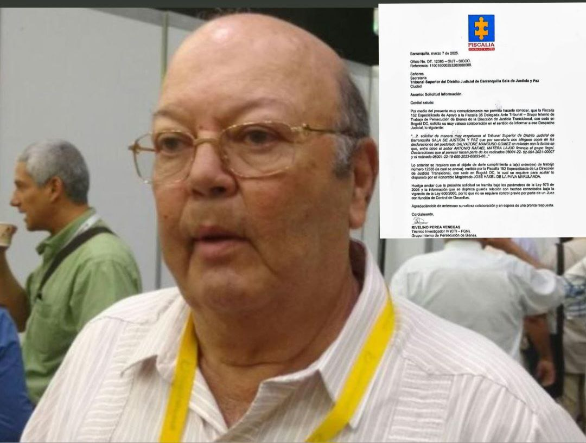

*¿Perseguirán a «Los Intocables»? Esta vez hay una orden de trabajo para perseguir los bienes de «Los Intocables».*

¿Perseguirán a «Los Intocables», que fueron auspiciadores, financiadores y beneficiarios del paramilitarismo durante dos décadas de empresa criminal? Un mes después de que el magistrado de la Sala de Justicia y Paz del Tribunal Superior de Barranquilla, **José Haxel de la Pava Maralunda**, les compulsara copia, la **Fiscalía Especializada No 152** de apoyo al Tribunal de Justicia Transicional de Bogotá emitió la **orden de trabajo No 12385**. Se espera que con esta decisión se persiga los bienes de terceros responsables señalados por los comandantes de las Autodefensas unidas de Colombia-AUC.

De acuerdo a la investigación de la **Comisión de la Verdad**, el 7 de octubre de 2004, los paramilitares reiteraron su voluntad de dejar las armas. Emitieron una una declaración denominada **«Acto de fe por la paz»**. Los paramilitares de las Autodefensas Unidas de Colombia (AUC) se desmovilizaron colectivamente hasta el **11 de abril de 2006**. Ellos cometieron miles de crímenes de lesa humanidad.

¿Te interesa? [Señora Fiscal: ¿Terminó la vagancia judicial con Los Intocables? (XVI)](/articulos/senora-fiscal-termino-la-vagancia-judicial-con-los-intocables-xvi/)

## VoxPopuli Digital y **«Los Intocables»**

Desde la primera macrosentencia de la Sala de Justicia y Paz del Tribunal Judicial Superior de Barranquilla, **VoxPopuli Digital** viene publicando un **seriado que le denominó «Los Intocables» del paramilitarismo**. Luego de iniciar el seriado, la Fiscalía le abrió el proceso **radicado 218263 a Rafael Matera Lajud** por un homicidio en Valledupar. Pero hasta ahora se desconoce cómo va el proceso. \[Ver: [Reabren proceso por homicidio a **«Los intocables»**… Los del matadero (I)](/articulos/reabren-proceso-por-homicidio-a-los-intocables-los-del-matadero/)\]

De igual manera, hubo un aliento de esperanza cuando la Sala Penal de la Corte Suprema de Justicia abrió proceso contra el expresidente **Álvaro Uribe Vélez** en agosto de 2020. En esa oportunidad nos preguntamos: [¿Fin de la impunidad de Uribe y la legión de intocables?](/articulos/fin-de-la-impunidad-de-uribe-y-la-legion-de-intocables/) Han pasado cerca de 5 años, y el juicio contra Uribe se mantiene. Se espera que no prescriba en octubre de 2025.

El año pasado VoxPopuli Digital lo inició así: [Bienvenido 2024. ¿El fin de Los Intocables? Uribe, La Granja y El Aro? (I)](/articulos/bienvenido-2024-uribe-sera-detenido-por-masacres-de-la-granja-y-el-aro-i/). Para nuestro medio periodístico la lucha contra la impunidad en la justicia es fundamental. Si no se investiga, jamás se podrá acceder a la verdad judicial de los hechos que conmueven a la sociedad colombiana.

El año pasado, la fiscal **Luz Adriana Camargo Garzón**, al cumplirse los 19 años de Justicia y Paz se comprometió a perseguir a los terceros responsables. Lanzó una estrategia compuesta de tres elemento: **(i)** Judicializar a los terceros financiadores de paramilitares con mayor poder económico. **(ii)** Implementar inteligencia artificial para perseguir bienes en paraísos fiscales de testaferros. **(iii)** Priorizar la búsqueda de personas desaparecidas en el marco del conflicto. Sin embargo, 5 meses después, se desconocen sus resultados.

## Así Mancuso se ratificó

Sin titubear, Salvatore Mancuso se ratificó en sus declaraciones que comprometían a Rafael Matera Lajud y Alfonso Macías. **"Si me ratifico, su señoría"**, dijo Mancuso.

En la audiencia del 2022, Mancuso dijo:

> ****«****En el expediente que lleva la Fiscalía aparece el socio mayoritario de la empresa Camagüey, Rafael Antonio Matera Lajud, señalado de ser alias ‘300′; su sobrino Enrique Pérez Matera, alias ‘400′ y a Alfonso Macías Vargas, alias ‘M1′**»**

https://youtu.be/SBI9zgIcEew

¿Perseguirán a «Los Intocables»? Sin titubear, Salvatore Mancuso se ratificó en sus declaraciones que comprometían a Rafael Matera Lajud y Alfonso Macías. "Si me ratifico, su señoría", dijo Mancuso.

## ¿Perseguirán a «Los Intocables»?

Se insiste en la pregunta ¿perseguirán a «Los Intocables»? La orden de trabajo investigativo tiene como finalidad rastrear y perseguir los bienes de los empresarios **Rafael Matera Lajud y Alfonso Macías** (fallecido), sus familiares y testaferros, entre otros. Ellos fueron señalados por **Salvatore Mancuso** en la audiencia de ratificación de sus declaraciones ante **Justicia y Paz**.

La falta de justicia, el desconocimiento de los derechos de **10 millones de víctimas del conflicto armado** y la impunidad, reflejan la complejidad de la confrontación armada colombiana. Además, profundizan las heridas dejadas en lo más profundo de una sociedad que vive una desgracia patológica. 

## Matera, Macías y otros

[FISCALIA\_RAFAEL MATERA](/pdfs/FISCALIA_RAFAEL-MATERA-1.pdf)[Descargar](/pdfs/FISCALIA_RAFAEL-MATERA-1.pdf)

Son dos radicados de los procesos de Justicia y Paz que compulsaron copia a la Fiscalía general de la Nación para que acometiera las acciones de su pertinencia. Estos son: los 08001-22-52-0004-2021-00007 y el 08001-22-19-00053-00.

**El 26 de mayo de 2022** se realizó la audiencia del frente **“José Pablo Díaz”** donde varios postulados reconocieron el papel criminal jugado por los empresarios **Matera Lajud y Macías Vargas**. Estos sujetos determinaron la comisión de delitos de lesa humanidad. Está debidamente documentado, por ejemplo, masacres, homicidios en personas protegidas, desplazamiento forzado, desaparición forzada, despojo y hasta se robaron parte del **río Ariguaní** y ninguna autoridad los detuvo. Justicia y Paz compulsó copia a la Fiscalía en ese mismo año.

Dos años y 7 meses después (**16 de diciembre de 2024**), la Sala de Justicia y Paz del Tribunal Judicial Superior de Barranquilla llamó a **Salvatore Mancuso**. En la compulsa de copia a la fiscalía del 7 de febrero de 2025, dice:

> «En la audiencia se aclaró algunos interrogantes de los extintos bloques/frentes **José Pablo Díaz y Catatumbo** donde se refiere a los señores **Rafael Antonio Matera Lajud y Alfonso Macías Vargas** a los cuales señala como **auspiciadores y financiadores de las AUC**, ratificándose de este señalamiento bajo la gravedad del juramento».

En esa audiencia, presidida por el magistrado **José Hansel de la Pava Marulanda**, Mancuso se ratificó en sus declaraciones sobre **Rafael Matera Lajud y Alfonso Macías** de ser financiadores y auspiciadores de sus actividades criminales. Además, confirmó que la **finca Potosí**, ubicada en el Cesar, fue un centro del horror paramilitar que ofende la condición humana. 

## ¿Perseguirán a «Los Intocables»?

Lo primero que tiene que hacer la Fiscalía es lo que indica la ruta de esa investigación, respaldada por el abundante material probatorio. Se trata de solicitar medidas cautelares contra los bienes producto de esas empresas criminales.

En su momento, se dijo en este medio que para las víctimas es inaceptable la inacción frente a los bienes de los financiadores del paramilitarismo. Estos individuos están claramente identificados. Por lo que se considera que la ausencia de medidas cautelares sobre sus activos, incluyendo bienes muebles e inmuebles, cuentas bancarias, participaciones accionarias y empresas, **constituye una flagrante violación de los principios de justicia y reparación**.

Es de público conocimiento que parte de estos bienes adquiridos con derramamiento de sangre y dolor de campesinos, sindicalistas, profesores, soldados, policías, periodistas, niños y mujeres, sus empresas están representadas por ellos.

## Los herederos de Macías Vargas

Se debe mencionar que también **Alfonso Macías Vargas** (ya fallecido) sigue teniendo una gran participación accionaria en la **Empresa Palmeras de la Costa S.A**, en cabeza hoy de sus herederos y empresas familiares (testaferros). Por esta razón no se justifica que al día hoy no tengan dichos bienes y empresas siquiera una medida cautelar de la justicia. Esto permite que estos bienes sean ocultados, traspasados y/o desaparecidos para evadir la acción de las autoridades y no reparar a sus miles de víctimas.

También se debe recordemos que la sindicación contra estos personajes oscuros no solo fue realizada por varios militantes de las AUC sino también por su ex máximo comandante **Salvatore Mancuso Gómez**, quien cumplió su compromiso con la **justicia transicional de verdad, justicia, reparación y garantía de no repetición**. Es el motivo por el cual, con dicho testimonio, revestido de verdad y legalidad, es suficiente para que ya se hubiese decretado las medidas cautelares pertinentes en contra de todos los bienes muebles e inmuebles, participaciones accionarias, cuentas en bancos nacionales y extranjeras de Matera Lajud y Macias Vargas. Se debe incluir a sus herederos y empresas familiares.

## No hay excusas

La Fiscalía General de la Nación no tiene excusa alguna para su negligencia, como así lo reconoció públicamente la fiscal **Luz Adriana Camargo Garzón**:

> “… la fiscalía está en mora de dar resultados contra los financiadores del paramilitarismo en Colombia...”

Para las víctimas resulta alarmante que la Fiscalía General de la Nación no haya iniciado los procesos de extinción de dominio obligatorios, ni ejecutado allanamientos judiciales. Se dijo que **esa omisión alimenta la impunidad y perpetúa el despojo de las víctimas,** permitiendo que los perpetradores disfruten de riquezas ilícitas, producto de crímenes de lesa humanidad.

## Acciones inmediatas

Los abogados en representación de víctimas, exigen acciones inmediatas. La promesa pública de la Fiscal General de la Nación de perseguir a los terceros civiles responsables de los crímenes de lesa humanidad, debe traducirse en resultados tangibles, no en palabras vacías.

De hecho, la justicia demanda que estos bienes sean incautados y destinados a la reparación de las víctimas. De esta manera se impide que el legado del terror se transmita a futuras generaciones.

¿Perseguirán a «Los Intocables»? Se espera que esta nueva orden de trabajo emitida por la **Fiscalía 155 Especializada** se cumpla a cabalidad. Esperamos medidas cautelares y otras iniciativas que correspondan a los anuncios oficiales de la Fiscalía.