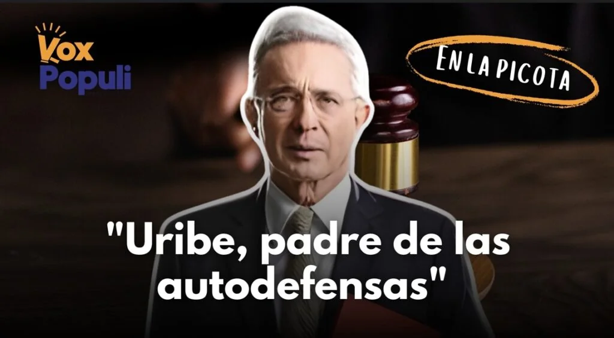
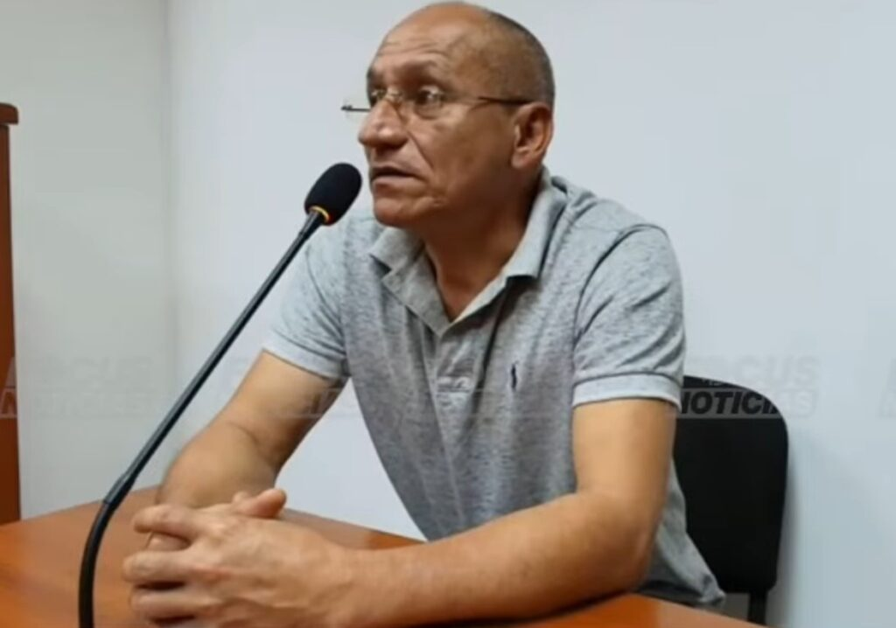

*«Uribe, el papá de las Autodefensas»: alias «Víctor»*

En las sabanas del Bolívar Grande se decía que los burros se juntan para rascarse. Asimismo hacen los bandidos que se juntan para cometer sus fechorías. **Carlos Enrique Vélez, alias «Víctor»**, fue **condenado por la masacre de La Herradura**, ocurrida el 8 de junio de 2003 en Riosucio (Caldas). Con su declaración en el juicio, la Fiscalía puso contra la pared al expresidente **Álvaro Uribe.** Aunque la defensa en el contrainterrogatorio intentó desacreditar su intervención para tratar de confundirlo, no lo consiguió. Se mantuvo en confirmar que su abogado **Diego Cadena** lo sobornó para cambiar el sentido de su testimonio.

De esa manera **volvió añicos la credibilidad de los exparamilitares que quisieron desprestigiar el testimonio del testigo estrella, Juan Guillermo Monsalve**.

Efectivamente, en la jornada 23 del juicio contra Uribe por presunta manipulación de testigos y fraude procesal, desde la cárcel de Palmira, se escuchó el siguiente testimonio del exintegrante del bloque Metro de las Autodefensas:

> «Yo soy un bandido. Entre bandidos nos entendemos. Deme la plata y no vuelva por acá».

En ese acto del juicio (7 de abril), la Fiscalía presentó la prueba que respaldó el testimonio del exjefe paramilitar: una agenda del bandido. **El exmandatario es considerado como uno de los terceros civiles que ahora se les denomina «Los Intocables»**, porque han evadido la justicia en dos décadas de impunidad.

En esa sesión, la Fiscalía blandió apartes de la agenda del exjefe paramilitar donde se apreció un escrito de su puño y letra. **Allí constaba que recibió $200 millones de Diego Cadena** para cambiar o modificar su declaración que perjudicaba al exmandatario. Además, con esta declaración se buscaba desmentir el testimonio de **Pablo Hernán Sierra, alias _Alberto_**, quien atestiguó contra Uribe.

## El contrainterrogatorio: «Entre bandidos nos damos la palabra»

La defensa, en el contrainterrogatorio del 8 de abril, quiso hacer caer en contradicción a alias «Víctor» luego de que en el juicio declarara que Diego Cadena le **ofreció $200 millones** en la visita que le hizo el 18 de julio de 2017 en la cárcel de Palmira.

– ¿Ese 18 de julio de 2017 le entregaron dinero? **―**Preguntó el abogado de Uribe.

– No. **―**Respondió alias «Víctor»

– ¿Firmaron un pagaré?

– No.  
– ¿Establecieron algún plazo?

– No.  
– ¿Entonces usted solo confió en la palabra?

– Sí, claro. Entre bandidos nos damos la palabra.

¿Te interesa? [El expresidente Uribe está acorralado. Impide avance de su juicio criminal (I)](/articulos/el-expresidente-uribe-esta-acorralado-impide-avance-de-su-juicio-criminal-i/)

## El perfil de alias «Víctor»

*Alias «Víctor» frente al abogado Jaime Granados en el contrainterrogatorio del 8 de abril.*

Según su propio testimonio y registros judiciales, este es el perfil de alias «Víctor»:

Carlos Enrique Vélez militó en diferentes estructuras paramilitares a lo largo de su trayectoria. **Bloque Metro:** Fue su primer bloque, al que perteneció hasta 1998, actuando como combatiente. Se unió al bloque Kalima en 1999. Luego, hizo parte del Bloque Caldas (V), donde fue capturado.

Dentro de estas estructuras, Vélez ascendió hasta convertirse en **comandante de contraguerrilla** y posteriormente **comandante de zona** en el occidente de Caldas para el Bloque Cacique Pipintá.

Su pertenencia a estos grupos paramilitares incluyó **concierto para delinquir con fines paramilitares y múltiples delitos de lesa humanidad**.

Como se dijo, Carlos Enrique Vélez fue **condenado por la masacre de La Herradura** del 8 de junio de 2003 en Riosucio (Caldas). Allí, un gobernador indígena y tres personas más fueron asesinadas.

¿Te interesa? [El saboteado juicio a Uribe ¿la justicia lo absolverá? (II)](/articulos/juicio-a-uribe-la-justicia-lo-absolvera-ii/)

## Un testigo clave contra Uribe

*La declaración de alias «Víctor» fue contundente: «Uribe, el papá de las Autodefensas»*

Se debe indicar que alias «Víctor» corroboró el testimonio del testigo estrella de la Fiscalía contra Uribe, **Juan Guillermo Monsalve**. Por ende, su testimonio es fundamental para descifrar las clave del juicio junto al contexto de las **retractaciones masivas** que puso al descubierto la Corte Suprema de Justicia en diferentes procesos. Vale decir, los casos de las exsenadoras **Piedad Zuccardi y Dayra Galvis**. Esta última fallecida.

El señalado excomandante de contraguerrilla del bloque Cacique Pimpiná se transformó en la jornada 23 en un **testigo clave en el juicio contra el expresidente Álvaro Uribe Vélez**. En su testimonio, declaró que recibió ofrecimientos de dinero a través del abogado Diego Cadena para favorecer a Uribe.

Una parte de su declaración fue tan contundente que el expresidente Uribe quedó frío, congelado en su silla de acusado. Alias «Víctor» manifestó con mucha claridad que Álvaro Uribe es un referente para las autodefensas.

> «(Álvaro) Uribe es como el papá de nosotros, es el papá de las Autodefensas».

La Fiscalía aportó como prueba la agenda de alias «Víctor» donde él anotó con su puño y letra, los ofrecimientos del abogado de Uribe, Dieho Cadena. Allí está consignado unos supuestos giros de los $200 millones que recibió de Cadena.

¿Te interesa? [Juicio a Uribe: La testigo 18, una pieza clave (III)](/articulos/juicio-a-uribe-la-testigo-18-una-pieza-clave/)

## No conocía a Cepeda

De igual forma, alias «Víctor» aseguró nunca haber conocido ni haberse comunicado con el **senador Iván Cepeda**. Según su declaración, la única persona que le habría ofrecido prebendas fue el abogado Diego Cadena.

El testigo señaló, al responder las preguntas de la Fiscalía, que sí conoció al abogado Diego Cadena. Dijo que el abogado lo buscó para tratar temas con el expresidente Uribe Vélez.

https://twitter.com/IvanCepedaCast/status/1909396804841652587

El senador del Pacto Histórico, **Iván Cepeda Castro** dijo que en 2012 varios ex paramilitares, entre los cuales estaba Elmo José Mármol, Giovanny Cadavid y Máximo Cuesta, le solicitaron ayuda para entregar información sobre “**fosas comunes”.** Ellos no esperaban beneficios judiciales, pero sí deseaban entregar información valiosa. Pero solo el exparamilitar Robert Muñoz cumplió con su promesa de informar sobre ese hecho.

## Además de alias «Víctor»

Es importante recordar que hasta la jornada 23 han desfilado por el estrado de los **testigos 26 personas**, hombres y mujeres, políticos, abogados, y exparamilitares, muchos seguidores del expresidente Uribe.

Entre esos testigos que comparecieron en el juicio, está el mismo senador Iván Cepeda, quien fue aceptado como víctima y la persona que denunció al expresidente Uribe. Citemos, además, al exparamilitar Salvatore Mancuso, el testigo clave Juan Guillermo Monsalve, su esposa Deyanira Gómez, Enrique Pardo Hasche, Carlos Enrique Vélez, Carlos Eduardo López Callejas, el exministro Iván Velásquez y la exfiscal Hilda Niño Farfán. Ellos se refirieron sobre las visitas a prisión que realizaron abogados del exmandatario y otros políticos.

El ataque de la Fiscalía es contundente. Cada declaración de testigo lo acompaña con pruebas contundentes que corrobora lo dicho en el testimonio. Ella busca probar que Uribe envió emisarios a diferentes prisiones del país con el fin de recolectar testimonios a su favor. De esta manera pretendía desembarazarse de su íntima relación con grupos paramilitares de Antioquia.

El padre del Centro Democrático, y ahora reconocido padre de las Autodefensas, según alias «Víctor», niega estos señalamientos y asegura ser víctimas de una persecución política.

**El senador Cepeda castro, contradictor principal de Uribe en este juicio, también detalló que en una entrevista con [Juan Guillermo Monsalve](/articulos/colombia/video-evidenciaria-imprecisiones-y-contradicciones-de-juan-guillermo-monsalve-CA24243818)**, exintegrante del grupo paramilitar, **le relató los detalles del regreso de su regreso a la hacienda Las Guacharacas**, **después de haber** **tenido una reunión con Santiago Uribe**, hermano del expresidente.