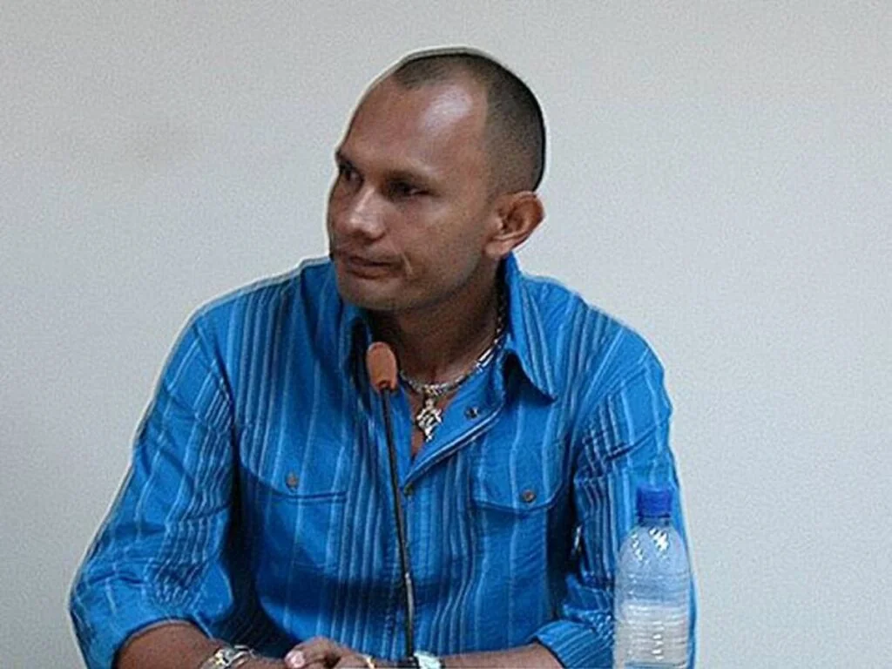
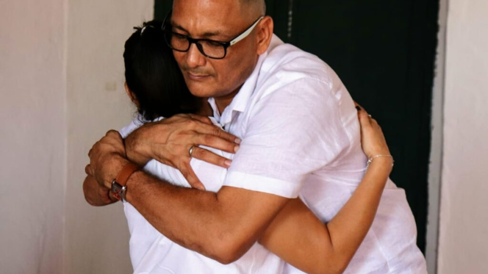

*«Juancho Dique», retornará a la cárcel y perderá sus beneficios. Aquí con Diego Vecino, quien también mintió.*

«Juancho Dique» ¡a la cárcel! En las próximas horas, por decisión de la Corte Suprema de Justicia, capturarán a **Uber Enrique Banquez**. El tristemente célebre criminal de guerra comprometido con centenares de asesinatos en Sucre y Bolívar. Igualmente, perderá sus beneficios jurídicos y pone al descubierto el **fracaso de Justicia y Paz** denunciado en su oportunidad por las organizaciones de derechos humanos.

Aunque la sentencia fue apelada y aún no está en firme, la Corte Suprema de Justicia le negó la libertad. Argumentó que basta con la existencia de la imputación para negar la sustitución de la medida. Con esta decisión judicial, Banquez no ha dejado de ser **«Juancho Dique»**. Sigue cometiendo crímenes.

¿Es difícil hacer la paz? ¿Es fácil hacer la guerra? Bánquez por su parte, alega que sus retractaciones **fueron producto de la coacción que sufría durante su reclusión**.

> **«**En 2007 comenzó mi calvario, cuando **me visitaban en la cárcel para que no hablara de políticos, empresarios o miembros de la fuerza pública»**.

¿Calvario? Pero «Juancho Dique» no ha recibido el castigo que merece sus crímenes. Aún no reconoce lo que la Corte Suprema de Justicia demostró. Recibió plata, mucha plata, de sus ricos compinches que los sobornaron. Por intermedio de su abogada Betty Castro, recibió desde concesiones mineras hasta privilegios en la cárcel con la complicidad de algunos empresarios también comprometidos con esos crímenes.

Para Banquez es fácil hacer la guerra. En la guerra mientes. En la paz estás obligado a decir la verdad.

Por esta razón, para Dique es fácil hacer la guerra, como se lo dijo a los medios de comunicación, una vez lo entrevistaron.

¿Te interesa? [Revelaciones de la condena contra «Juancho Dique» (I)](/articulos/revelaciones-de-la-condena-contra-juancho-dique-i/)

## «Juancho Dique» ¡a la cárcel!

Sí, «Juancho Dique» ¡a la cárcel! Es fácil mentir. Pero mentir descaradamente ante la Corte Suprema de Justicia en proceso judicial, como lo hizo Banquez, es confiar demasiado en la impunidad. O en sus protectores que le prometieron impunidad. Y no fue falta de conocimiento, porque se hizo abogado en la cárcel. Lo que quiere decir, que lo hizo con alevosía. ¿Por qué no delata a sus protectores?

En efecto, además de ser condenado en primera instancia por la justicia ordinaria, acusado de falso testimonio y fraude procesal por encubrir a sus auspiciadores, ahora deberá responder ante la JEP, si lo admiten. Pero debe confesar sus crímenes de lesa humanidad y más de **600 homicidios confesados ya en Justicia y Paz**. Pero tiene que decir la verdad, o le esperan 40 años de prisión.

Como **«Juancho Dique»** le mintió a la Corte Suprema de Justicia en el juicio contra **Javier Cáceres**, el tribunal compulsó copia a la Fiscalía para que lo investigara. Luego de que fuera condenado a **10 años y 3 meses de prisión por mentir bajo juramento en 2008**, en octubre del 2024, ahora se espera que se replique esta medida con todos los _paramilitares_ que se postularon para mentir y salir libres.

El caso subió a la Sala de Casación Penal para determinar si debía ir a la cárcel o fuese reemplazada por una medida sustitutiva, ya que había apelado la condena de primera instancia. Por supuesto, la decisión de la Corte fue negativa: «Juancho Dique» ¡a la cárcel!

¿Te interesa? [«Juancho Dique», ¿«hizo conejo» a Justicia y Paz? (III)](/articulos/juancho-dique-conejo-a-justicia-y-paz-iii/)

## Los que mintieron

*Según la Corte, estos exjefespara mintieron: Eugenio José Reyes Regino, (alias «Geño»), Edwar Cobo Téllez (alias «Diego Vecino»), Manuel Antonio Castellanos Morales (alias «El Chino») Aleider García Soto (alias «El Primo»), Gabino José Mora Fernández, Oscar David Villadiego Tordecillas (alias «Never»).*

La retractación fue instrumentalizada como una estratagema jurídica que descubrió la Corte Suprema de Justicia en los procesos de Javier Cáceres Leal, Piedad Zuccardi y Daira Galvis, que en paz descanse. También el expresidente **Álvaro Uribe Vélez**. La Corte en 2018 abrió formalmente una investigación en su contra a raíz de una denuncia del senador **Iván Cepeda Castro**.

Los abogados de Uribe, como Diego Cadena, pretendieron buscar la retractación de Juan Guillermo Monsalve, principal testigo que comprometía al expresidente en la creación del **frente Metro de la AUC**, en 1999.

La Corte Suprema de Justicia desestimó las retractaciones masivas (radicado IUS-2013-324529) presentadas ante **Alejandro Ordoñez**, Procurador General de la Nación (2009–2013 y 2013–2016) por varios _parapolíticos_. O sea, parlamentarios investigados por concierto para delinquir agravado.

Los principales _exparas_ que correrían la misma suerte de **«Juancho Dique»** serían: **Edwar Cobo Téllez** (alias **«**Diego Vecino**»**), **Eugenio José Reyes Regino**, (alias **«**Geño**»**) **Manuel Antonio Castellanos** Morales (alias **«**El Chino**»**) **Aleider García Soto** (alias **«**El Primo**»**), **Gabino José Mora Fernández**, **Oscar David Villadiego Tordecillas** (alias **«**Never**»**), e **Iván Roberto Duque Gaviria**, alias **«**Ernesto Báez**»**. Este último murió en 2019.

## El abrazo de la muerte

*«Juancho Dique» y su abrazo de la muerte. La hipocresía de un criminal incorregible. Mintió descaradamente y se burló de Justicia y Paz. Cortesía.*

Pero, **Banquez** no solo le mintió a la **Corte Suprema de Justicia** en el proceso contra el senador de Cambio Radical, **Javier Cáceres Leal**, sino también en los procesos contra las senadoras Piedad Zuccardi, la difunta Daira Galvis Mendez y de varios empresarios que les financiaron. Ellos ordenaron crímenes en Cartagena y Bolívar, Sincelejo y Sucre

**«Juancho Dique»** recibió dádivas de los senadores. Por ejemplo, en el proceso está comprobado que la familia García Zuccardi le entregó una concesión minera a cambio de que le beneficiara en sus declaraciones.

> **«**\[…\] se pudo establecer que la procesada y sus abogados utilizan las RETRACTACIONES del testigo (Juancho Dique) \[…\]**»** 
> 
> Corte Suprema de Justicia. Resolución **SDSJ N°2982**.

Banquez se retractó, y, con la complicidad de su abogada al servicio del paramilitarismo, **Betty Castro Espinoza**, armaron un concierto para mentirle a la misma Corte Suprema de Justicia mediante declaraciones ante la Procuraduría General de la Nación. Estas declaraciones se convirtieron en retractaciones de sus confesiones en Justicia y Paz.

Esa conducta criminal de Banquez no fue gratis. Recibió grandes beneficios producto de los sobornos y del fraude procesal en muchos casos del fenómeno conocido como la _parapolítica_. Asimismo, encubrieron a grandes empresarios que determinaron graves crímenes durante el período paramilitar. Estos empresarios, llamados Los Intocables, que fueron financiadores y auspiciadores de sus crímenes, también pagaron por los sobornos.

## Los sobornos

En el caso concreto de **«Juancho Dique»**, se encontró que los políticos como Javier Cáceres, pudieron negociar con cargos y contratos. Piedad Zuccardi y su difunto marido, _Juancho_ García, debieron ceder el 50% de su concesión minera a **Betty Castro**, la abogada del exjefe paramilitar para que modificara su declaración. Esto está probado. Y la Corte lo sabe.

Como lo revelamos en la entrega anterior, se encontró que su apoderada, **Betty Castro Espinoza**, fue contratada por **«Diego Vecino»** para que le asistiera en los procesos de Justicia y Paz. Posteriormente, las autoridades constataron, además, que ella en el 2012, de testaferro de los paramilitares, pasó a ser una de las cabecillas de la banda criminal de **Los Paisas**.

En ese sentido Mancuso ―en declaraciones rendidas el 21 de noviembre de 2011 en el marco del juicio contra el exsenador **Javier Cáceres Leal**― ratificó las declaraciones iniciales en Justicia y Paz de **Edwar Cobo Téllez** (alias **«**Diego Vecino**»**) y de los otros jefes. Allí Mancuso develó que también la exsenadora **Piedad Zuccardi de García** estuvo en múltiples reuniones con el jefe de los escuadrones de la muerte de la AUC, **Carlos Castaño**. En una de ellas (2000), se comprometió impedir **«el despeje del Sur de Bolívar»**.

Como prueba de ello, la Corte señaló el caso de **Eugenio José Reyes Regino** (alias **«**Geño**»**) en Justicia y Paz. El 16 de septiembre de 2009, en su declaración original mencionó que el jefe paramilitar (**«Juancho Dique»**) tiene **«**afuera algunas personas que todavía le colaboran**»** no reportadas por él en sus versiones libres, **que estarían vinculadas a la muerte del hijo de un desmovilizado, ordenada por él**. Este caso es relevante, porque también vincula a varios empresarios de Bolívar.

## El fracaso de justicia transicional

Como lo señalamos en anteriores entregas, este caso refleja una impunidad total. Ahora el guante de la justicia debe caer sobre sus patrocinadores, auspiciadores y financiadores. Y sin embargo, es una conclusión real sobre la impunidad de la Fiscalía para perseguir a ricos empresarios y políticos que determinaron esos crímenes. Estos son Los Intocables, **los _hombres de atrás_** de la conducta criminal del fenómeno paramilitar al cual pertenece el caso de **«Juancho Dique»**.

Los exjefes _paramilitares_, como se puede apreciar en el juicio contra **Álvaro Uribe Vélez**, fueron sobornados para que modificaran sus declaraciones con el fin de crear una duda razonable. Esto le permitiría encubrir a sus antiguos auspiciadores.

**Aleider García Soto**, conocido con el alias de **«**El Primo**»**, un desmovilizado del frente Héroes de los Montes de María, hizo parte del grupo de **12 sicarios**, junto con alias **«**el flaco**»**, que asesinaron a decenas de personas en Cartagena. Las órdenes las impartían ganaderos, terratenientes y empresarios que les financiaron y se enriquecieron con sus actividades.

La conclusión de este hecho es que la justicia transicional se transformó en una payasada. Por dos razones. La primera, los criminales confiesan selectivamente. Dicen media verdad, la que le conviene. Lo segundo, no existe justicia transicional, sino una burla del sistema jurídico democrático del país, porque no hay transición. ¿Transición de qué?

De acuerdo con Rodrigo Uprimny (documento no disponible):

> "Esta percepción podría derivarse con facilidad del hecho de que, mientras que los paramilitares desmovilizados que han cometido incontables atrocidades reciben un castigo benévolo, la criminalidad de pequeña escala está siendo sometida a todo el rigor de la ley penal. Ciertamente, este contraste puede acentuar los problemas de inequidad y el sentimiento de impunidad que por lo general caracterizan los procesos ordinarios de justicia transicional"

## Revictimización

En su momento, cuando se estaban desarrollando las declaraciones de los postulados, el Colectivo de Abogados ****«**José Alvear Restrepo**»****, denunció que **«Diego Vecino»** y **«Juancho Dique»** negaron u ocultaron verdades. No tenían un ánimo real de reparar a las víctimas y por si fuera poco, ni ellos, ni el gobierno nacional daban garantías de no repetición. Estos tres requisitos necesarios para garantizar los derechos de las víctimas y para que los paramilitares sean beneficiados de las penas alternativas, fueron violentados.

Hoy, la situación de las 10 millones de víctimas es peor. Su esperanza de que el gobierno del Cambio de Gustavo Petro les devolviera la tranquilidad, solo fue un sueño, a 18 meses de su terminación. **Esperan la verdad, la reparación y garantía de no repetición**.