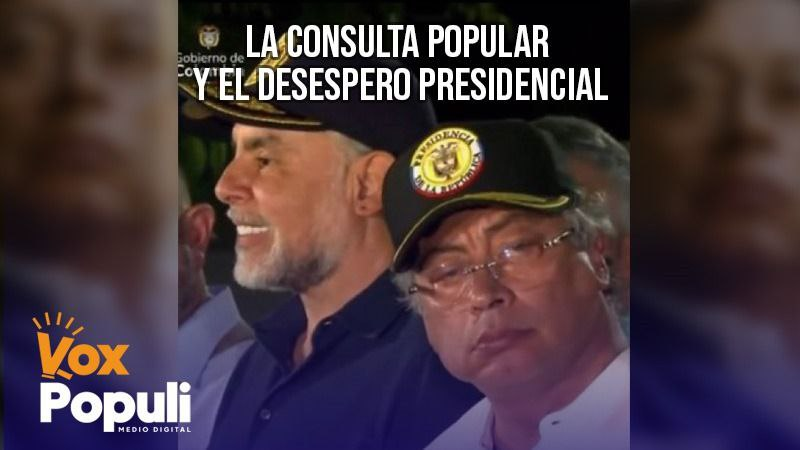

*La consulta popular un camino a la derrota del presidente Gustavo Petro. embriagado por el poder./Captura de pantalla.*

De la consulta popular a la huelga general, fue un **giro desesperado de Gustavo Petro** y de su principal ariete, **Armando Benedetti** que denota improvisación. Porque el tiempo presidencial se les agota inexorablemente y no han hecho nada esencial.

Mientras tanto, todo indica que **el ego presidencial tomó las riendas del discurso y de las decisiones presidenciales**. El acto del 20 de mayo de 2025 en Barranquilla representó un grito desesperado y doloroso de un gobierno frustrado y frustrante para cumplir con lo prometido: el cambio.

Para un hombre que toda la vida de su lucha parlamentaria y extraparlamentaria nos habló de cambio, paz, vida y esperanza, debe ser doblemente frustrante que termine su período presidencial sin cumplir con su promesa electoral. Le queda muy mal justificarse con la consabida frase de la mediocridad política: ****«**no me dejaron gobernar****»******. Él sabe que la democracia es así: control de poderes, contrapeso y articulación institucional. El autoritarismo es distinto: los demás poderes se pliegan al jefe.

Y tal parece que eso es lo que quiere el presidente o el triunvirato (**Petro―Benedetti―Sarabia**) sobre el cual descansa el verdadero poder del Cambio. Los demás son añadidos, como ocurrió en la campaña electoral. Habían dos campañas. Las que mueven las masas populares, la de los sectores progresistas. La que pone y recibe la plata, la de los advenedizos liderados por **Armando Benedetti y Rois Barrera**.

¿Te interesa? **[Benedetti evitó la cárcel con trampa](/articulos/benedetti-evito-la-carcel-con-trampa/)** [(I)](/articulos/benedetti-evito-la-carcel-con-trampa/)

## Vea el análisis si la consulta conduce a un nuevo fracaso

https://youtu.be/H3kJqZfjqiY

## Frustración y desespero: Los huevos en una sola canasta

El discurso de Gustavo Petro reflejó frustración y desesperación. Nada fundamental le ha salido bien: nada de reformas, baja gestión presupuestal, la Paz Total embolatada y un intento de **consulta popular** que se atolló en el congreso guiado por un experto, Armando Benedetti.

La angustia cunde en el alto gobierno, determinado por su incapacidad de gestión pública. _Mucho tilí-tilín y poco de paletas_. Sus dos primeros años se caracterizaron por su baja gestión presupuestal. Esto quedó evidente en el mentado consejo de ministros televisado en _prime time_ del 4 de febrero de 2025.

Al gobierno del Cambio le hace falta creatividad e inteligencia para actuar. Es como el caballo cochero. Tiene tapado los laterales de sus ojos para impedirle que vea otras señales tan poderosas para gobernar. No fue capaz de deconstruir la praxis de la gestión pública para que se centrara en el ser humano. Si el gobierno se hubiese centrado en gobernar, seguramente hoy tendría las condiciones subjetivas (la voluntad popular) a su favor. Pero el Pacto Histórico recibió una dura derrota en las elecciones para alcaldes y gobernadores.

Petro colocó todos los huevos en una sola canasta: **las reformas**. Están vueltos añicos. Solo una de estas reformas transita quejumbrosamente por la Corte Constitucional para su revisión.

## Sin luces exploradoras

¿Por qué el presidente Gustavo Petro careció de visión para explorar otras soluciones distintas a las reformas? O si quería las reformas, ¿por qué desde el comienzo no construyó un **gran acuerdo político con participación ciudadana** sin necesidad de recurrir a la compra de votos de los congresistas?

Al inicio, Petro prefirió las componendas. Así ferió el poder gubernamental con los partidos tradicionales sin consultar con el pueblo. Privilegió las componendas con las élites del congreso en detrimento de un acuerdo popular con los de abajo y por fuera de los **aparatos sindicales anquilosados**.

Sin embargo, esa es una conducta atípica en un gobierno progresista donde los dineros públicos son sagrados. ¿Pagar por unos votos en el congreso para una reforma o la elección de un magistrado amigo? ¿Pagar con dineros de la gente del pueblo más necesitado? ¿Utilizar las mismas herramientas sucias de los que están incrustados en el poder? Quizás la desesperación del gobierno de Petro lo llevó a violar la norma ética de no comprar votos. ¿Carlos Ramón González, director del DAPRE del momento, actúo por sí solo o por instrucción del presidente?

## Discurso maniqueo

Lo más doloroso del gobierno del Cambio es que ni siquiera violando las normas éticas y legales pudo sacar adelante sus reformas. Mucho menos su consulta popular que solo de nombre tiene el carácter de popular. Su existencia se origina desde el poder presidencialista.

Por esa razón, el presidente Gustavo Petro parece un tigre acorralado. Su caballito de batalla: **el discurso maniqueo y polarizante**.

Han pasado varios días del discurso presidencial de la noche del 20 de mayo en el Paseo Bolívar de Barranquilla sin que la oposición y los petristas sepan lo que está sucediendo. Lo que los analistas tampoco han visto es que ese discurso es un grito de desesperación. Esa polarización que encierra su relato, está impulsado por el desespero y por un falso dilema maniqueísta entre buenos y malos, corruptos y honestos.

Pero tal radicalización refleja la debilidad manifiesta del gobierno del Cambio que le faltan menos de 15 meses para decirle **adiós a una falsa esperanza**. Un gobierno que nació muerto porque ganó la presidencia con lo más cuestionado de las élites políticas dominantes. Predominó el principio de que **«el fin justifica los medios»**.

Esa premisa determinó materialmente que traicionara la esperanza de una masa electoral que confío en su brillante discurso de justicia social. ¿Cómo el presidente Petro va a decir que lo traicionó el conservador **Efraín José Cepeda Sarabia**, conocido como **«**Fincho**»**? ¿Quién traicionó a quién?

Cepeda fue fiel a lo que es. Petro no fue fiel a su discurso de campaña. Pero ya en el gobierno armó su primer gabinete con la mayoría de sus nuevos aliados. Por ejemplo, el ministerio del Transporte y otras dependencias se las entregó al partido conservador. Que entregó gran parte de la infraestructura, como la del Canal del Dique, a la voracidad del _capitalismo sanguijuela_. Ahora sufre las consecuencias. ¿Quién es el responsable?

El mismo presidente Petro en el fatídico Consejo de Ministros del 4 de febrero de 2025 reconoció que si no fuera por sus alianzas _non sancta_, nunca hubiera ganado. A partir de esa fecha, el gobierno del Cambio entregó sus banderas de esperanza a la voracidad de un saltimbanqui profesional de la política: **Armando Benedetti**, el **«Rasputín criollo**»****.

https://youtu.be/H3kJqZfjqiY

El presidente Gustavo Petro en el Paseo Bolívar de Barranquilla, siempre al lado de Armando Benedetti. La mirada ida de Petro, como si levitara, refleja tristeza.

## La consulta popular, un mete presión

Nadie, ni el petrista más dogmático puede negar que desde el mismo comienzo de su gobierno privilegió las componendas y los acuerdos con los diferentes sectores de una derecha anquilosada como sanguijuela en el poder estatal. Por esta razón ―y no hay otra― el gobierno del Cambio fracasó para sacar adelante las reformas sociales soñadas. Ni siquiera su refuerzo pudo con la iniciativa más importante de la coyuntura: **la consulta popular**.

Por ende, hoy cunde la desesperación en el gobierno del Cambio que instrumentaliza el movimiento popular en frío como furgón de cola de sus pretensiones mesiánicas de salvar el país con las mentadas reformas.

Solo le faltan 15 meses y las grandes reformas se alejan cada día más. Su ministro estrella, **Armando Benedetti**, llegó al gobierno supuestamente para trazar un puente viable con esos congresistas que ahora son llamados **«**compradores de votos****»****.

Antes, en el supuesto **gobierno compartido**, eran consentidos con contratos y plata en efectiva procedentes de los contratistas del Estado que la ciudadanía debe pagar. Pero también fracasaron estrepitosamente.

Con todo el poder presidencialista, con todo el presupuesto nacional y con toda la experiencia de Benedetti para voltear a los **«**buñuelos****»**** del senado, la victoria se le diluyó por tres votos: **47** a favor y **49** en contra. Dos de ellos, **Martha Peralta y Richard Fuelantala**, representan la cuota indígena de sus partidos Mais y AICO, respectivamente. Se ausentaron por diversas razones. Pero en el fondo, tal ausencia encierra una sola razón: **las promesas incumplidas**. Así lo reconoció Fuelantala.

Allí reside la esencia del fracaso político del presidente Petro. No pudo sacar sus reformas, dizque porque el congreso no representa al pueblo sino a las élites malvadas. **Pero también fracasará con la consulta popular** y con la tal anunciada huelga general. Porque su discurso es incongruente, no se corresponde con su praxis de gobierno. Petro debe hablar menos y hacer más. Él debe ser un estadista y no un político de la oposición de izquierda.

## Adiós a la aplanadora

Atrás quedó la aplanadora electoral en las primeras de cambio del gobierno. Hasta el primer semestre de 2023, el gobierno había sacado casi todo, hasta cuando llegaron las propuestas de reformas. Venció con **57** votos contra **16**, el 22 de marzo de 2025, la moción de censura contra su ministra de Minas y Energía, **Irene Vélez**. Petro en el congreso fue una aplanadora. Y todavía hablaba de **«golpe blando»**.

Cuando el presidente Petro andaba de **«**pipí cogido**»** con los conservadores, liberales, de la U, de Cambio Radical, ellos no eran políticos malvados. ¡No! Estaban unidos  ―como se une la uña al mugre ― a una causa que justifica todo: el cambio. Pero el mugre corroyó la uña, como el barro oxida la espada. ¿Acaso, Petro no sabe que la corrosión de su gobierno es el resultado de estas alianzas? No tiene otra explicación.

Se insiste: ¿Quién es el responsable de esta debacle política? ¿Por qué buscó los votos de los corruptos y compartió el poder? ¿Quería solo ganar la presidencia o provocar una revolución vía reformas? Él sabía que con su caudal electoral no alcanzaba. Por eso recibió los votos de los caciques electorales en la Costa Caribe, en el Valle del cauca y en otras regiones del país.

La desesperación cunde en el gobierno del Cambio. En su interior se produjo una gran división. Se impuso un triunvirato (Petro―Benedetti―Sarabia) sobre los sectores progresistas del Pacto Histórico. Lo mismo que sucedió en la campaña electoral. Habían dos campañas. La de los sectores progresistas y la de los advenedizos liderados por **Armando Benedetti y Rois Barrera**, quienes se quedaron con el gobierno. Allí están las consecuencias.