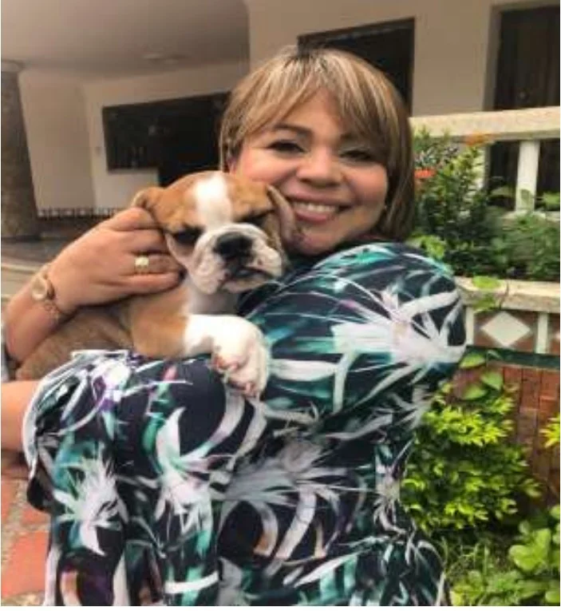

*Narly Patiño Pascuas y el abogado de la mafia Luis Alfredo Berrío. ¿Fiscal infiel con la justicia?*

**Narly Tatiana Patiño Pascuas**, es la temida Fiscal 15 Especializada de Cartagena. Temida porque se ensaña con el inocente y con el mafioso es indulgente. **Es infiel con la justicia**, a juzgar por dos historias que **VoxPopuli Digital** tiene bien documentadas. Entre el 2018 y 2022, teniendo marido, vivió un idilio pasional intenso con su amante, el abogado de la mafia, **Luis Alfredo Berrío Martínez**. Hasta aquí no hay nada raro, porque hace parte de la intimidad de la casada infiel y de su engañado marido.

Empero, las cosas son distintas, si les digo que su **«amante bandido»** era uno de los abogados de **Eder Pedraza Peña**, alias **«**Ramón Mojana**»**, excomandante del **bloque Mojana de las Autodefensas Unidas** que dirigía el extinto **Carlos Castaño**. Se le vinculó por el asesinato de una colega suya, la Fiscal Especializada de Sincelejo (eternamente incorruptible) que investigó la masacre de Macayepo, **Yolanda del Carmen Peternina Negrete**. Tampoco la fiscal Patiño infringiría norma legal o, incluso, disciplinaria alguna con su conducta inapropiada.

## Aclaración

En febrero publiqué la primera entrega de: [¿**Fiscalía entregó el puerto a la mafia? (**I)](/articulos/fiscalia-entrego-el-puerto-a-la-mafia-i/). Muchos estaban esperando la segunda. La juez 05 Administrativo de Cartagena, **María Magdalena García Bustos**, por acción de tutela, ordenó que suspendiera cualquier publicación sobre la **Fiscal 15 Especializada**.

Inexplicablemente, la juez le amparó el derecho al buen nombre y le prohibió al periodista y a **VoxPopuli Digital** seguir publicando sobre esa historia. La historia está soportada con un material probatorio irrefutable. ¿Acaso es un favor que le hizo a la fiscal? De acuerdo con la ley y con la jurisprudencia, la solicitud de aclaración al medio y al periodista es _sine qua non_ para continuar con la acción. **Lo demás es una medida de hecho, prevaricadora** de la juez.

La fiscal no solicitó retractación, aclaración o rectificación, como dice la ley. Aunque le mintió a la juez que sí lo había hecho. La juez constató que no era cierto, y sin embargo, le concedió la tutela. **¿Un favor de la juez a la conducta mañosa de la fiscal?** Miente con facilidad en los procesos judiciales y uno no se explica por qué sigue en ese importante cargo, el cual lo hace en forma indigna. La solicitud es una condición para que el proceso de tutela continúe, porque es un **requisito de procedibilidad** para demandar a los periodistas y medios de comunicación.

## Sin censura

Como esta es una historia diferente a la anterior, no tengo censura para informar como debe ser. Porque eso fue lo que hizo la **juez 05 Administrativo**, censurar, por vía judicial mi escrito. **María Magdalena García Bustos** viola la constitución nacional porque el artículo 20 señala:

> **«**No habrá censura**»**.

Además, la intimidad de los administradores de justicia está más expuestos al escrutinio público que cualquier otra persona. Cuando acciones íntimas del servidor público obstruye la justicia, la prensa puede escudriñar su conducta. La **Corte Constitucional**, en varias sentencias, ha reiterado que la transparencia en la administración de justicia es un **pilar fundamental** de la democracia. Esto implica que los jueces y fiscales deben estar sujetos a un mayor nivel de vigilancia por parte de la sociedad. No son intocables. La prensa representa a la sociedad, porque su función es de una responsabilidad social.

## Análisis: Esta es la infidelidad de la fiscal

https://youtu.be/ntoSHNms\_Qo

¿La fiscal **Narly Tatiana Patiño Pascuas** es infiel con la justicia? No vamos a relatar las intimidades de la infidelidad de la fiscal con su marido sino con la justicia. Porque _la mujer del César no solo debe serlo, sino parecerlo_. Porque no solo es importante la **integridad personal**, sino también la percepción que la sociedad tiene de un administrador de justicia. Sea hombre o sea mujer, su conducta debe centrarse en el **ser y no en el tener**. ¡Debe ser intachable!

## La casada infiel y el abogado de la mafia

*La fiscal infiel y el abogado de la mafia. Narly Patiño Pascuas con su "amante bandido" (canción de Miguel Bosé), Luis Alfredo Berrío, el abogado de alias ´Ramón Mojana´. En una de sus tantas salidas a Sincelejo, San Antero, Santa Marta, financiado con dineros del mafioso, en el 2019.*

¿Puede una persona con precaria integridad personal ser una buena administradora de justicia? La praxis de la fiscal Narly Patiño indica que no. ¿Está mentalmente preparada para continuar impartiendo justicia? Por supuesto que no. ¿Y por qué no ha salido de su cargo? Sus cómplices se cuentan a montón: jueces, colegas y quienes la disciplinan. Refleja hasta dónde llega la corrupción judicial.

No tendría importancia la intimidad de Narly Patiño si ella no mezclara el amor romántico con su función de fiscal. Es más, si no volviera una mixtura desagradable el papel de fiscal con el amor al abogado de un mafioso que, aunque está preso, sentenció a su propia hermana (**Yamile Pedraza Peña**) a sufrir lo insufrible. Y si se trata de derecho de géneros, la fiscal los pisotea con facilidad.

El abogado Berrío, protagonista de esta historia de infidelidad, instrumentalizó la mente frágil y de poca inteligencia emocional de la fiscal. Emotiva. Maleable. De una conducta deleznable. Se descompone en las audiencias, como la audiencia preparatoria de juicio contra la abogada Yamile Pedraza, realizada en febrero de 2025.

Cuando la fiscal se ensaña contra un detenido/a que la enfrenta, se vuelve un ocho. Alega, discute, habla como si fuera una _verdulera champetúa_ de Bazurto. ¿Soy duro con ella? Como pueden ver, el periodista no juzga ni acusa. Relata hechos y conducta de la administradora de justicia. Porque, los hechos de un ser humano hablan de su carácter y de su verdadera catadura. Los hechos hablan por sí solos. Lo demás, son comentarios. **VoxPopuli Digital** analiza hechos.

Por eso, va para ella este verso de **Federico García Lorca**:

> **«**Y que yo me la llevé al río  
> creyendo que era mozuela,  
> pero tenía marido**»**.
> 
> La casada infiel, Federico García Lorca.

Sin embargo, ¿por qué esta infidelidad trasciende el ámbito privado de la intimidad de la servidora pública? Aún hay algo más grave que no hemos dicho. Sin declararse impedida, la fiscal continuó conociendo el caso que tenía a su cargo por **contrabando de hidrocarburos de la bomba de gasolina EDS El Viso** (municipio de Mahates, Bolívar) propiedad del mismo excomandante _paramilitar_ y narco condenado, que su **«**amante bandido**»** lo representaba.

## Preguntas metodológicas

*Para que no haya duda de la actuación indecorosa de la fiscal. El oficial mayor certifica del caso No 13001600-0000-2018-00077 que Luis Alfredo Berrío Martínez sustituye a Juan Fernando Jaramillo Lozada, también abogado de "Mojana", que se bajaba /alojaba en el apartamento de la fiscal, según información privada que posee VoxPopuli Digital. Esto dentro del proceso de contrabando de hidrocarburo de la EDS El Viso, Mahates perteneciente al mafioso.*

Entonces, en este punto, surgen tres preguntas metodológicas: Si la bomba de gasolina materialmente pertenecía al mafioso Eder Pedraza Peña, **¿por qué Narly Patiño, la fiscal no se apartó del caso?** Si el abogado de la mafia, su contraparte, enamoró a la fiscal y esta cayó en sus brazos, **¿por qué incidió e influyó en la funcionaria para conseguir resultados favorables a sus poderdantes?**

Ahora bien. Si la fiscal fue recusada con todas las pruebas ¿por qué su superior (la directora de Fiscalía de Bolívar) la confirmó en el caso? ¿Tráfico de influencia? ¿Falsedad? Si hubo falsedad de la fiscal, ¿por qué su superior no denunció como era su deber? Si, **ella dijo en su alegato que Luis Alfredo Berrío no era contraparte** en ninguno de los procesos que se originaron de la investigación matriz **No **130016000000201700151****, lo cual es falso, como lo demostramos en la prueba que adjuntamos.

En efecto, Narly Patiño para justificar su continuidad en el proceso alega que formalmente el abogado de la mafia **Luis Alfredo Berrío Martínez** no se encontraba vinculado. Hasta cierto punto esto es verdad.

En el litigio existen dos tipos de defensa. La material y la técnica. En este caso, la defensa material y no técnica la estaba haciendo el abogado de la mafia. Era el hombre de confianza del mafioso y criminal Eder Pedraza. Él recomendó a sus amigos abogados para que los representara en el proceso, ya que estaba impedido por estar condenado en un proceso disciplinario. Pero también los sustituyó cuando terminó de pagar la sanción disciplinaria.

## Asesoría ilegal

Existen pruebas de que la fiscal hizo una asesoría ilegal al mismo abogado de la  
mafia. En las próximas entregas detallaremos esta hipótesis periodística, porque consideramos grave.

Si la fiscal cometió esa falta, estaría incurso de un delito que tiene una pena de **prisión de 16 a 54 meses** e **inhabilitación para el ejercicio de derechos y funciones públicas por 80 meses**. Al respecto, la Corte Suprema de Justicia señaló que esta conducta también puede incluir la **negociación de decisiones judiciales a cambio de dinero**, lo que agrava la situación. ¿Recibió dinero la fiscal?

Pero también hay evidencias de que Berrío, mientras su proceso disciplinario estaba en apelación, apoderó a procesados de esa EDS El Viso. Sustituyó, cuando la sanción fue confirmada en segunda instancia en el año 2018. Pero, una vez terminó de pagar la sanción disciplinaria, de nuevo se vinculó técnicamente en el caso.

¿Te interesa? [¿Fiscalía entregó el puerto a la mafia? (I)](/articulos/fiscalia-entrego-el-puerto-a-la-mafia-i/)

## Lo grave

Lo más grave ―como es evidente en esta historia que les relato― usó el poder punitivo del Estado como venganza pasional contra la mujer que delató accidentalmente su idilio prohibido al marido engañado. Incluso, presuntamente, la fiscal se benefició o benefició a terceros con su actuación prevaricadora dentro del proceso.

Usó el principio de oportunidad para dejar libre a la esposa, la suegra y un socio de **«**Ramón Mojana**»**. Las dos primeras dueñas de la EDS El Viso. El segundo, propietario del combustible de contrabando. De igual manera, se alineó a favor del reconocido narcotraficante en una disputa de sangre que el narco y asesino tuvo con su hermana, la abogada **Yamile Pedraza Peña**.

**Las pruebas inducen a un razonamiento lógico de que la funcionaria obedeció a una orden del mafioso.** Y esto no fue gratis, por supuesto. Ella no persiguió a los responsables, pero se ensañó con los inocentes. **Hizo capturar a Yamile Pedraza** y a su esposo en Planeta Rica, Córdoba. Esto fue el 20 de septiembre de 2023, a escasos 6 días de que la prospera abogada Pedraza celebraría sus **50 años**. Y para lo cual tenía preparada un gran fiestón, como bien lo sabía su hermano alias **«**Ramón Mojana**»** y en especial, su otrora amigo y subalterno de su bufete, Luis Alfredo Berrío. Esto no fue coincidencia. No. Fue una maldad premeditada, como la misma víctima lo percibe.

## La saña de la fiscal

Para mostrar la fragilidad mental, la saña y la carga de odio con que la fiscal manejó el proceso, solo le relato un pequeño caso.

Cuando debieron ser presentados ante el juez de garantías en audiencia virtual desde el lugar de captura (Planeta Rica) o su domicilio que es la ciudad de Montería, la fiscal los hizo trasladar a la URI de Cartagena en condiciones de inseguridad. Hasta se tuvieron que bajar del vehículo para empujarlo, ya que se averió dos veces.

Estando en la URI, la sorpresa fue que la audiencia se hizo en forma virtual y los detenidos la siguieron desde un celular que le prestó el investigador del CTI, el marido oficial de la fiscal. Todo indica que la fiscal los quería tener allí para verlos doblegados y solazarse con el sufrimiento de la mujer que delató su idilio amoroso con el abogado de la mafia. Los derechos humanos de los capturados fueron pisoteados.

Se debe advertir que quien fuera pareja sentimental de la fiscal es investigador del CTI, cuyo nombre no delataré para no revictimizarlo. Así se evitará revivir las ardorosas heridas que un cacho produce en el alma de un marido fiel. Pero la víctima puede ser testigo de esta verdad que les narro. Seguramente lo llamarán como testigo en el juicio donde la fiscal actuará contra quien la puso al descubierto de su engaño pasional.

## **Un perro buldog** y el abogado de la mafia

*El regalo que el abogado de la mafia, Luis Alfredo Berrío, le hizo a la fiscal, un perro buldog.*

Los elementos probatorios materiales que posee **VoxPopuli Digital** (chats, audios, videos, facturas, fotos, documentos judiciales) indican que el furtivo amor de la fiscal quedó al descubierto por **un perro buldog**. La mascota fue un regalo, prueba de amor de su **«**amante bandido**»**. El animal lo adoptó el marido de la fiscal ―él no sabía del engaño de su mujer― como si fuera un hijo.

¿Por qué la directora de fiscalía de Bolívar **Elizabeth Gómez Mejía** desestimó la solicitud de recusación que la abogada **Yamile Pedraza Peña** le presentó con un arsenal de pruebas? ¿Cómo los jueces avalaron la actuación dolosa e interesada de la fiscal en este proceso judicial que les relato? ¿Acaso hubo tráfico de influencia que incluye a todos los funcionarios judiciales que acompañaron esta persecución punitiva?

La persona que visite a la fiscal en su apartamento, se dará cuenta del perro buldog. Muy mimado por ella, porque la última información que se tiene, es que su marido no se aguantó el cacho y debió terminar esa accidentada relación.

**Yamile Pedraza Peña** ―hermana del narco y dueña del bufete de abogados que atendía el caso― a pedido del abogado Berrío, **compró el perro en agosto de 2019**. Costó $5 millones. Todo ese dinero venía de lo que la bomba producía muy a pesar de ser objeto de extinción de dominio.

## Contrabando de hidrocarburos

Desde el 2017, la fiscal Narly Patiño estaba al frente de los procesos penales originados de la operación del Batallón de Infantería de Marina I. En esta operación fueron capturados los empleados de la EDS El Viso por contrabando de hidrocarburos con radicados No**130016000000201700151, 130016008779201700170, 13001600000020180078**. También estaban involucrados los testaferros de «alias Ramón Mojana»: su esposa **Amparo Sofia Jiménez Diaz** y su suegra **Mayda Sofia Jiménez Diaz**. Ellas no solo aparecían como propietarias, sino que eran las administradoras, empleadoras y quienes ejercían la explotación económica de esta EDS.

Además eran las dueñas del restaurante y del hotel **Cruz del Viso** que tenían en arrendamiento. Estas noticias criminales bajo los mismos hechos fueron reactivadas casi 6 años después (2022) con el radicado **No 13001600000020220020700** para capturar a la abogada Pedraza Peña y a su esposo. Así se materializó la sentencia que hizo en su contra su pariente **paramilitar** el 10 de marzo del año 2022 en la cárcel de Combita.

Incluso, se identificó a otros testaferros y posibles socios de negocios, al parecer, ilegales de **Eder Pedraza Peña**, tal es el caso del empresario **Luis Gamboa**, el proveedor de gasolina. Por orden de Mojana, Berrío debió solicitarle a la fiscal que no tocara al empresario y mucho menos a su esposa y suegra, propietarias de la gasolinera.

**Luis Alfredo Berrío**, para esa época de 2017, lo destinaron atender el caso de la EDS de El Viso. Su tarjeta profesional estaba suspendida desde el 17 de julio de 2017 hasta septiembre de 2018 por la Comisión Disciplinaria al haber tramitado un **habeas corpus** en forma irregular en 2007. Buscó a otros abogados para que le firmara los oficios. Entre ellos, **Efraín Tamayo** y **Juan Fernando Jaramillo**.

La familiaridad del abogado de la mafia con la fiscal era tal que su socio, **Juan Fernando Jaramillo**, amante de su propio sexo, cuando llegaba a Cartagena se alojaba en el apartamento de Narly Patiño. Esto, gracias a la relación furtiva que su jefe, Berrío, tenía con la fiscal. La idea era estrechar más la relación con la funcionaria para asegurar su favorabilidad, como en efecto lo consiguieron.

**Próxima entrega**: El furtivo idilio de la fiscal