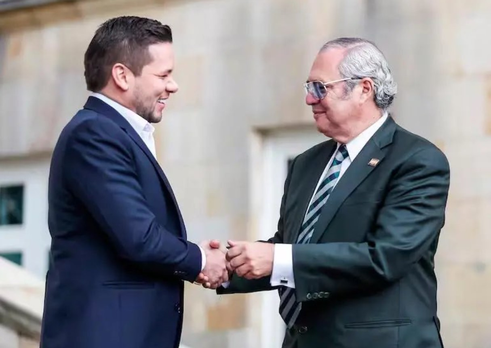

*Ahora Iván Name y Andrés Calle amanecieron tras las rejas./Cortesía.*

**Name y Calle** amanecieron tras las rejas. Recibieron en forma ilegal **$4 mil millones**. **[Olmedo López](/articulos/post/qui%C3%A9n-est%C3%A1-detr%C3%A1s-del-misterioso-olmedo-l%C3%B3pez)**, y **Sneyder Pinilla**, director y subdirector, respectivamente de la **UNGRD** para la época de los hechos pagaron las coimas. Con esta conducta **Iván Name y Andrés Calle**, expresidente del senado y de la cámara, correlativamente, incurrieron en un posible **delito de cohecho propio y enriquecimiento ilícito**. La pregunta clave: **¿Qué compró el gobierno nacional con ese dinero?**

Ese es el principal interrogante que debe resolver la investigación de la **Sala Especial de Primera Instancia de la Corte Suprema de Justicia**. De esta manera, el escándalo de la UNGRD, a raíz de los señalamientos de López y Pinilla, toca a los primeros aforados.

¿Te interesa? [La carta de Leyva sacude la Casa de Nariño](/articulos/petro-esta-enfermo-o-colombia-enferma-de-poder-la-carta-de-leyva-sacude-la-casa-de-narino/)

## La decisión

La decisión de la Sala Especial de Instrucción de la Corte Suprema de Justicia tuvo en cuenta un acerbo de pruebas. Sopesó las declaraciones de varios altos exfuncionarios del presidente Gustavo Petro.

Esas denuncias las contrastaron con las declaraciones de la llamada **«**mensajera**»** del delito, **Sandra Ortiz**, la otrora Consejera para las Regiones, muy cercana al presidente de la República.

De igual manera, la Corte escuchó al exministro del Interior, **Luis Fernando Velasco**, y al director de la UNGRD, **Carlos Alberto Carrillo**.

Una de las piezas clave de este rompe cabeza de la corrupción es el papel desempeñado por **Carlos Ramón González**. Como director del Departamento Administrativo de la Presidencia-**Dapre** de la época y codirector de Alianza Verde jugó un papel determinante en la comisión de los posibles delitos. Recordemos que a su partido de centro izquierda pertenecen **Iván Name y Sandra Ortiz**. ¿Llegar a González es llegar al mismo presidente o él actúo por su propia iniciativa?

## ¿Qué pasa?

¿Qué pasa con tantos procesos de corrupción que uno eclipsa al otro? Mientras el expresidente de la República, **Álvaro Uribe Vélez**, está enjuiciado por torcer testimonios y fraude procesal para **impedir que lo procesaran por auspiciador y financiador del paramilitarismo**, el gobierno del Cambio vive prematuramente sus días de **decadencia moral** con tantos escándalos.

La promesa incumplida de cambiar el estado de cosa, está llevando a una nueva frustración de la sociedad colombiana. La clase política dominante de viejo y nuevo cuño pareciera que no tuviera otro camino que la corrupción. Cuando están en el poder. no hay ninguna distinción entre la derecha y la izquierda. **Los sujetos actúan guiados bajo el principio de _que el fin justifica los medios_**.

Ese principio, arraigado en los políticos de derecha o de izquierda, condiciona la actuación de los seres humanos cuando están en el poder o luchan por él. Es un proceso de a**lienación social** de ese sujeto atrapado en una determinada ideología progresista o retrógrada.

**La alienación es la negación de sí mismo.** El ser humano se enajena, ya sea por el ansia de poder o de dinero. Esta teoría se aplicó en mi libro **«¿Adiós a la guerra?»** para explicar que la violencia transforma a ese humano en un monstruo. Un monstruo que mata al otro guiado por un deseo extraño de exterminio, dominado por cierta ideología que deshumaniza a los que ejercen el poder. Este poder lo ponen a su servicio particular o a una causa política. O a las dos cosas, como sucede hoy día en Colombia.

## Los delitos de Name y Calle

Los delitos por los que hoy se encuentran atrapados los expresidentes de senado y cámara, respectivamente, serían cohecho propio y posiblemente enriquecimiento ilícito. **Name recibió $3 mil millones** y **Calle $1 mil millones** en efectivo de manos de Sandra Ortiz y Pinilla.

Es decir, ellos fueron comprados, al parecer, por el gobierno nacional en septiembre de 2023 para facilitar el trámite de los proyectos de reformas sociales y la elección de **Vladimir Fernández** como magistrado de la Corte Constitucional.

El delito de **cohecho propio**, según el artículo 405 del Código Penal colombiano, se configura cuando un servidor público recibe dinero u otra utilidad o promesa remuneratoria para retardar, omitir o ejecutar un acto propio de su cargo que sea contrario a sus deberes oficiales. 

Por otro lado, el **enriquecimiento ilícito** se configura cuando un servidor público incrementa su patrimonio de manera injustificada, sin que haya una fuente legítima que explique dicho aumento.

## El desayuno de Fernández

El 13 de octubre, según Sandra Ortiz y los chats que publicó la revista Semana, se realizó un desayuno preparatorio para la elección del hoy magistrado **Vladimir Fernández**.

En esa reunión participaron **Sandra Ortiz, Vladimir Fernández y Carlos Ramón González,** para la época director del **Dapre**. González, igualmente es investigado por la Fiscalía. El Tribunal Superior de Bogotá autorizó a la Fiscalía General de la Nación realizar un rastreo de los movimientos financieros, migratorios y de comunicaciones del alto exfuncionario del presidente Gustavo Petro. La autorización incluye la revisión de registros desde 2019.

Por tanto, si los servidores públicos recibieron dinero o beneficios indebidos por actos de corrupción y estos generan un incremento patrimonial sin justificación, serían procesados por **ambos delitos**. En este caso, la Corte podría imputar **cohecho propio** como el acto de recibir la dádiva y **enriquecimiento ilícito** como la consecuencia patrimonial derivada de dicho acto.

## ¿Una unidad traicionada?

Recordemos que cuando se inició el gobierno del Cambio, el presidente Gustavo Petro propuso un acuerdo nacional con el fin de adelantar las reformas sociales que, según su parecer, necesitaba el país. Para ello su gobierno lo compartió con los partidos y organizaciones políticas tradicionales que aceptaron dicha propuesta.

Allí estuvieron los partidos tradicionales, como el Liberal y el Conservador. De la misma manera, participaron las diferentes vertientes de la Alianza Verde. El gobierno no reflejó al país sino a la misma clase política que venía gobernando. Su propuesta de unidad con los partidos tradicionales se estrelló con la realidad de la cosa política dominante: los intereses particulares de los sujetos políticos.

https://twitter.com/german\_ricaurte/status/1920210448613322918?ref\_src=twsrc%5Etfw%7Ctwcamp%5Etweetembed%7Ctwterm%5E1920210448613322918%7Ctwgr%5Eae42d36accfac4ddc82f870c12749f1942d0ed26%7Ctwcon%5Es1\_c10&ref\_url=https%3A%2F%2Fvoxpopuli.digital%2Fwp-admin%2Fpost-new.php