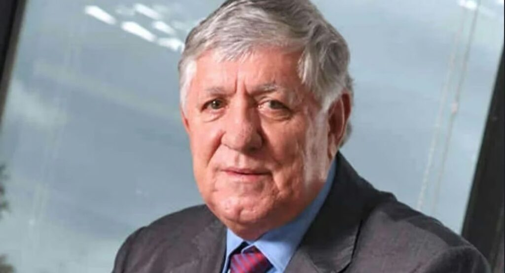

*El intocable William Vélez murió en un accidente doméstico, se cayó en el baño.*

¿Quién llorará por el intocable **William Vélez Sierra**, señalado testaferro de **Vicente Castaño**? ¿Lo lloraran los **tres millones de víctimas del paramilitarismo** y de los grupos armados en el Caribe colombiano que esperan desde hace 20 años **verdad, reparación y garantía de no repetición**? Probablemente Vélez Sierra no disparó un solo tiro, contrario a su paisano Pablo Escobar, pero tuvo que ver con con muchas masacres. Hoy murió sin que el guante de la justicia lo tocara. Son **700 compulsas de copias** para que investiguen a Los Intocables que se las comen el comején en los anaqueles de Justicia y Paz, y en la Fiscalía.

Mientras tanto, **Los Intocables** mueren de viejo, de enfermedad o de un accidente, como le sucedió a este gran contratista del Estado auspiciador y financiador del paramilitarismo en Antioquia y el Caribe colombiano.

¿Te interesa? **[Uribe y «Los intocables» quieren blindarse ante Mancuso](/articulos/uribe-y-los-intocables-quieren-blindarse-ante-mancuso/)** [(VII)](/articulos/uribe-y-los-intocables-quieren-blindarse-ante-mancuso/)

## Los que lloran a Vélez

¿Quién llorará por el intocable William Vélez? Sin duda, las víctimas del paramilitarismo no lo llorarán. Pero sí el expresidente **Álvaro Uribe Vélez, su socio**. Los Vélez y los Uribe amasaron una fortuna con orígenes turbios en la mejor época del narcotráfico, los años 80. Los padres de **William Vélez y de Álvaro Uribe Vélez** fueron socios. **Alberto Uribe**, padre del expresidente, se le consideró testaferro del narcotráfico en los viejos tiempos de los Ochoa.

Este fue el mensaje de Uribe Vélez al conocer la muerte de William Vélez:

> **«**_Murió William Vélez Sierra, ingeniero de la Universidad Pontificia Bolivariana. Empresario de la mayor laboriosidad. Sus empresas suman 25 mil empleados en 6 países. Amigo del universo político. Tuve con él una amistad personal que viene de su padre con el mío. Nuestro pésame a toda la familia, a sus hijas Sandra y Lina y a todos sus allegados_****»****.

La riqueza de Vélez fue exponencialmente estimulada por la relación contractual con el Estado. La típica riqueza del capitalismo sanguijuela que corroe los cimientos de la moralidad pública y la ética individual. Se hizo rico en la época en que el proyecto político del paramilitarismo llegó a ser dominante con el presidente **Uribe Vélez**. Todo esto está documentado en **Justicia y Paz** y por las declaraciones de _exjefes paramilitares_ que presentaron pruebas de recibir apoyo financiero y de ser partícipe de su proyecto económico.

## ¿Extinción de dominio?

El año pasado murió en Barranquilla **Alfonso Macías Vargas**, uno de Los Intocables que se vinieron a respetados empresarios, después de que financiaron y auspiciaron crímenes de lesa humanidad de las autodefensas. Se tomaron Palmeras de la Costa y otras empresas con la complicidad del gobierno.

¿Qué debe hacer el Estado con los bienes del intocable William Vélez? ¡Perseguirlos! Aplicarle la extinción del derecho de dominio y destinarlos al fondo para la reparación de las 3 millones de víctimas que tiene la región Caribe.

Señora Fiscal, estas serían las empresas y sus bienes que se le debería aplicar la extinción de dominio:

Edemsa (Eléctricas de Medellín Ingeniería y Servicios), HB Estructuras Metálicas, Unidad de Infraestructura y Construcciones Asociadas (Unica), Sadelec (Sadelec), Termotécnica Coindustrial. El **Grupo Ethuss** agrupa diferentes compañías bajo una estructura de holding, con una sociedad matriz que controla las acciones del resto de las empresas. 

El holding [Grupo Ethuss](/articulos/esg/) es un conglomerado empresarial con sede en Bogotá, D.C., específicamente en la calle 100 # 9 A - 45 TO 2 OF 501. Opera en diversos sectores, incluyendo energía, infraestructura y construcción. Su historia se remonta a 1965 con la adquisición de Eléctricas de Manizales Ltda. 

¿Te interesa? [¿Jesús o Barrabás? Hambre y sed de justicia (I)](/articulos/jesus-o-barrabas-hambre-y-sed-de-justicia/)

## Los paisas

En 2016, los postulados de las Auc comprometieron a muchos empresarios, entre ellos un centenar de paisas que llegaron de Antioquia colonizando el Caribe. En los años 80, los hermanos Castaño adquirieron propiedades en Córdoba. Citemos algunos famosos: el intocable William Vélez, el ganadero Santiago Uribe (hermano del exsenador y expresidente Álvaro Uribe). El esmeraldero Víctor Carranza (boyacense) también murió sin ser procesado.

Algunas empresas como Drummond, Chiquita Brands, Postobón, Ecopetrol, Argos y la Federación Nacional de Ganaderos fueron mencionadas. La Chiquita fue condenada en Estados Unidos a pagar una indemnización a las víctimas. **Cementos Argos** tiene varias sentencias en su contra para devolverle las tierras a los despojados.

En Barranquilla, Santa Marta, Cartagena, Montería, Sincelejo, Riohacha, Maicao y Valledupar se asentaron los nuevos empresarios. Estos se enriquecieron con el producto de los crímenes de lesa humanidad de sus patrocinados, los paramilitares.

El finado Vélez Sierra fue socio de los paramilitares de _Jorge 40_, de acuerdo al computador que le decomisaron a **Edgar Ignacio Fierro**, alias ‘Don Antonio´. Esto quedó ratificado en la sentencia macro donde fueron condenados los cabecillas del frente norte. Socio en contratos de concesión de aseo, energía eléctrica, agua, entre otros.

Esos contratos se hicieron a través de empresas pertenecientes a su holding **Ethuss**. Por ejemplo, está documentado las componendas con _Jorge 40_ para quedarse con los contratos de concesión de la Empresa de Servicios Públicos de Santa Marta (ESPA). Esta entidad, en su momento, era presidida por el alcalde **José Francisco Zúñiga** **Riascos**.

En el 2009, el juzgado Penal del Circuito Especializado de Santa Marta condenó al exalcalde cuatro años y dos meses de prisión por sus nexos con el paramilitarismo. Y a Vélez no le pasó nada. Zúñiga Riascos, aceptó haber recibido apoyo de Hernán Giraldo, ex cabecilla del frente Resistencia Tayrona, en 2004, durante las elecciones para la alcaldía.

¿Te interesa? [Mancuso, los crímenes de «Los intocables» y la JEP (III)](/articulos/mancuso-los-crimenes-de-los-intocables-y-la-jep-iii/)

## Mancuso delató a Vélez

El jefe maximo vivo del paramilitarismo, Salvatore Mancuso Gómez, en el tribunal de Justicia Especial de Paz -JEP-, se ratificó en que **William Vélez Sierra hizo parte de un grupo de empresarios paisas** que fueron adquiriendo tierras, contratos y otros bienes e inmuebles en la medida que los paramilitares desplazaban forzosamente a los campesinos y propietarios legítimos. Esto sucedió en el Urabá antioqueño, Córdoba, Sucre y Bolívar.

> “_**Aprovechó el ingreso de las Autodefensas a diferentes regiones para hacerse tierras**. Él enviaba a su administrador directamente a Vicente Castaño para que le recibiera unos aportes mensuales que este señor hacía. No me acuerdo del administrador de él, pero fue una persona que ayudó y se benefició mucho de las Autodefensas_” 

El caso de Vélez Sierra se lo entregaron a un fiscal de terrorismo de la Unidad de Parapolítica. Pero el proceso **se lo comió el comején**. En el computador de Jorge 40 se referían a una alianza con **‘WV’** para manejar el negocio de las basuras en  Santa Marta, Barranquilla y Soledad.

Por supuesto, Vélez negó que hubiera tenido negocios con paramilitares en la Costa Caribe. Por ejemplo, los documentos del Bloque Norte de las Auc coincidían con el momento de renovación del contrato de recolección de basuras en Santa Marta.

En Justicia y Paz declararon en contra de Vélez, **Fredy Rendón Herrera**, alias ‘El Alemán’; **Salvatore Mancuso**; y Jesús Ignacio Roldán Pérez, alias **‘Monoleche’**. Ellos hablaron de de las relaciones del empresario Vélez Sierra con las Auc. Dijeron que era un testaferro de Vicente Castaño Gil, alias ‘El Profe’.

En paz descanse, William Vélez, tus pecados están perdonados.