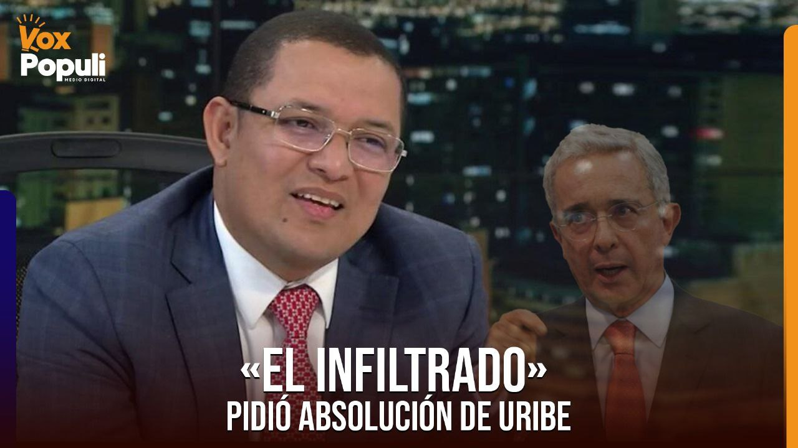
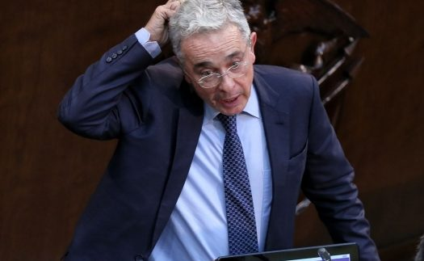
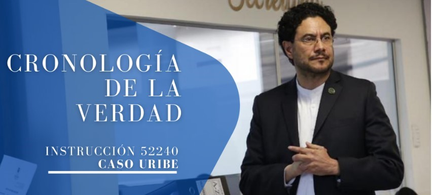

*«El infiltrado» de la Procuraduría pidió absolver al expresidente Uribe*

Lo dicho, **Bladimir Cuadro Crespo**, como procurador delegado, era «el infiltrado» de la defensa del expresidente **Álvaro Uribe Vélez**. Este viernes 27 de junio, **la defensa dio el zarpazo final por intermedio del Procurador Delegado que pidió** ―sin recato alguno― **su absolución** en el juicio que llegó a su etapa de alegatos finales.

En efecto, la predicción la hizo en Semana Santa **VoxPopuli Digital** con la publicación de la IV entrega de esta serie sobre el proceso contra Uribe titulada [«](/articulos/el-juicio-del-siglo-ojo-con-judas-el-infiltrado-vi/)**[El Juicio del Siglo»: Ojo con Judas ¡«el infiltrado»!](/articulos/el-juicio-del-siglo-ojo-con-judas-el-infiltrado-vi/)** Lo que no atinamos fue la desfachatez con la cual pidió la absolución del expresidente.

¿Te interesa? [El expresidente Uribe está acorralado. Impide avance de su juicio criminal (I)](/articulos/el-expresidente-uribe-esta-acorralado-impide-avance-de-su-juicio-criminal-i/)

## ¿El comienzo del fin?

*El «el infiltrado» pidió absolución para darle un respiro a Uribe en su suplicio.*

Es el comienzo del fin del juicio. Pero ¿será el comienzo del fin de la Era Uribe y de todos Los Intocables del paramilitarismo? Salvo que haya algo torcido, siguiendo de cerca el juicio, terminará seguramente con una condena contra el expresidente Uribe. Esta predicción parte de un análisis riguroso de las pruebas y argumentación de la Fiscalía y de los abogados de las víctimas.

El jueves 26 de junio, se escuchó en la audiencia el alegato final del abogado **Miguel Ángel Río Malo**, representantes de víctimas. Ese mismo día la juez suspendió la audiencia tomando en cuenta que le llamó la atención al abogado **Juan David León**, representante de **Eduardo Montealegre y Jorge Perdomo**, considerados víctimas. Señaló que el alegato del abogado **se alejaba del hecho jurídico en discusión**.

Fueron 50 días del juicio, presidido por la  **juez Sandra Liliana Heredia**. En este período, la fiscal **Marlene Orjuela** acusó con su arsenal de pruebas, la defensa presentó las suyas y sus testigos, y las víctimas hicieron lo propio con sus alegatos. **Así terminó la etapa probatoria del juicio**. El juicio está en la parte concluyente con los alegatos finales. Mucha expectativa de lo que se puede denominar el **«Juicio del Siglo»**.

Sin caer en parcialismo, la defensa fue pobre en su argumentación, elemento que descuidó por aplicar una estrategia de dilación y fabricación de pruebas con testigos dotados de guiones, seguramente creados por sus abogados. ¿Le funcionará? No hay la menor duda que la respuesta será negativa. De los 77 testigos que quiso presentar, desistió de 20, 4 ejercieron su derecho a guardar silencio. Pero ninguno de ellos fue contundente para rebatir los testimonios y pruebas presentados por la Fiscalía y las víctimas.

¿Te interesa? [A juicio criminal Álvaro Uribe por 5 delitos](/articulos/a-juicio-alvaro-uribe-por-coparticipacion-criminal/)

## La hipótesis

En la citada entrega sobre este serial del **«Juicio del Siglo»** lanzamos esta hipótesis periodística:

> «Hay suficiente material probatorio para inferir que el abogado del charismo sea _punta de lanza_ de la defensa del expresidente **Álvaro Uribe Vélez**?

Efectivamente, esa hipótesis se materializó con la actuación del Procurador Delegado que fue la _carta debajo de la manga_ de la defensa del acusado. Una defensa que no fue capaz de desvirtuar el material probatorio presentado por la Fiscalía. Tampoco el citado funcionario lo hizo.

¿Te interesa? [Del Ubérrimo al banquillo: Fiscalía pide condena contra Uribe](/articulos/condena-alvaro-uribe-soborno-testigos/)

## La desfachatez del «infiltrado»

Recordemos que **Cuadro Crespo** ―como lo señalamos en ese escrito― es un abogado instrumentalizado por la Casa Char para ponerse a su servicio en todos los procesos penales donde tienen intereses. Su ascenso en los canales del poder, se debe fundamentalmente a los intereses de esa matriz política.

Lejos de imprimirle seriedad a su alegato, la desfachatez del abogado de los Char ―que ahora funge de representante del Ministerio Público en «el Juicio del Siglo»― lo debilitó y vulneró. Al mismo tiempo, hizo la defensa técnica de Uribe más deleznable.

¿Qué dijo «el infiltrado» Cuadro Crespo para pedir la absolución del expresidente Uribe?

> «Por ende **la conclusión a la que se debe llegar es que no hay prueba que permita configurar los presuntos punibles de soborno a testigos en actuación penal y fraude procesal.** La postura que ha dejado de manifiesta este delegado ha sido consistente con la postura de los procuradores que me antecedieron en el cargo y es el resultado de una valoración conjunta y objetiva de los medios de prueba propias de un derecho penal».

Atentos a lo que señala el Procurador: **«... no hay prueba que permita configurar los presuntos punibles de soborno a testigos en actuación penal y fraude procesal».** ¿No hay prueba?

Esta aseveración debió ser la conclusión de su intervención después que controvirtiera cada una de las pruebas fundamentales que la Fiscalía y las víctimas presentaron en el juicio.

Pero, el descarado defensor de Uribe no lo hizo. Sin más allá y sin más acá, solo sacó de la manga de su chaqueta azul el as con el cual pretendía darle fuerza a la defensa del procesado.

¿Te interesa? [¿Por qué Uribe es el papá de las autodefensas? (V)](/articulos/por-que-uribe-es-el-papa-de-las-autodefensas/)

## Cinco hechos del juicio

Los alegatos de conclusión que ni la defensa de Uribe ni el Procurador Delegado **Cuadro Crespo** desacreditaron, porque no fueron capaces de contrargumentar ni presentar pruebas que excluyeran las de la Fiscalía.

El ente acusador presentó pruebas y argumento para sostener los delitos cometidos por Uribe Vélez para que los paramilitares no lo incriminaran en la creación del bloque Metro, grupo paramilitar que se asentó en la hacienda _Las Guacharacas_ de los hermanos Uribe Vélez.

En ese sentido, estos son los 5 hechos probatorios que el Procurador Delegado no contradijo en su alegato.

1.  **Soborno en actuación penal** a Juan Guillermo Monsalve, testigo estrella. El abogado de Uribe, **Diego Cadena Ramírez**, estuvo en la cárcel buscando cambiar o modificar el sentido de su declaración. Para demostrar esto, le grabó.
2.  **Soborno en actuación penal**. En el juicio quedó evidenciado que Cadena le ofreció **$200 millones** a **Carlos Enrique Vélez** alias **«Víctor»**. También que alias **«**Diana**»**, excompañera sentimental de **«Víctor»** recibió de Cadena dinero efectivo.
3.  **Soborno** a la exfiscal **Hilda Jeannette Niño Farfán**, condenada por _sobornos_. Hilda Niño fue capturada en junio de 2017 por recibir sobornos de exnarcotraficantes, a quienes habría ayudado a manipular procesos judiciales y facilitar su ingreso al sistema de Justicia y Paz.
4.  **Fraude procesal** por las cartas enviadas a la Corte Suprema por el recluso **Enrique Pardo Hasche**, **Hilda Niño** y varios exparamilitares, como alias **«**el Tuso**»** Sierra, alias **«**Sinaí**»**, alias **«**Poli**»**, alias **«**Cadavid**»**, alias **«**Víctor**»**, alias **«**Fosforito**»** y alias **«**Racumín**»**.
5.  **Fraude procesal** por el video enviado a la Corte Suprema de Justicia por alias **«**Diana**»**.

## El rol del Ministerio Público

El Ministerio Público actúa como garante de la legalidad. Representa a la sociedad. Interviene en diversas etapas del proceso penal para asegurar que **se respeten los derechos de las víctimas**, el imputado y la sociedad en general. 

¿Este papel lo cumplió Cuadro Crespo en el juicio contra Uribe? Para una de las víctimas, el senador del **Pacto Histórico Iván Cepeda**, señaló que se limitó a recitar los argumentos de la defensa:

> **«**En su alegación no contrastó ni cotejó, en su conjunto, las pruebas incorporadas en el juicio, ni tampoco se refirió a todos los hechos jurídicamente relevantes. (...) No contrastó su versión de los hechos con los argumentos de la Fiscalía, no analizó la prueba documental, pasó por alto las extensas conversaciones en las que el acusado Uribe se entera al detalle de las actuaciones de su determinado Cadena, no se molestó en contrastar los testimonios, no analizó los más relevantes, desconoció la línea del tiempo de los hechos, su nula comprensión de la lógica de los eventos**, y el desconocimiento de situaciones innegables y palmarias como los sobornos a Carlos Enrique Vélez**»**.**

## El argumento de las víctimas

*Uribe quiso impedir avance de su juicio criminal. Pero su estrategia no le funcionó.*

Para **Iván Cepeda Castro** fue probado en el juicio oral tres importantes conclusiones:

1.  Las actuaciones ilegales desplegadas por **Cadena Ramírez**, tuvieron a Uribe Vélez como único beneficiario.
2.  Uribe Vélez actúo como instigador en cadena, y tuvo dominio de la operación criminal, desde su génesis, durante su desarrollo (...) y en su resultado final que consistió en presentar evidencia espuria ante la Corte Suprema de Justicia, con el propósito de hacerla incurrir en error.
3.  Uribe Vélez tuvo conocimiento del carácter ilícito de las maniobras fraudulentas y los sobornos entregados por Cadena Ramírez, incluso, **autorizó las prebendas jurídicas ofrecidas a los testigos Juan Guillermo Monsalve Pineda y Carlos Enrique Vélez Ramírez, alias ‘Víctor’**, y no hizo nada para evitar el riesgo antijurídico creado, y permitió que siguiera operando.