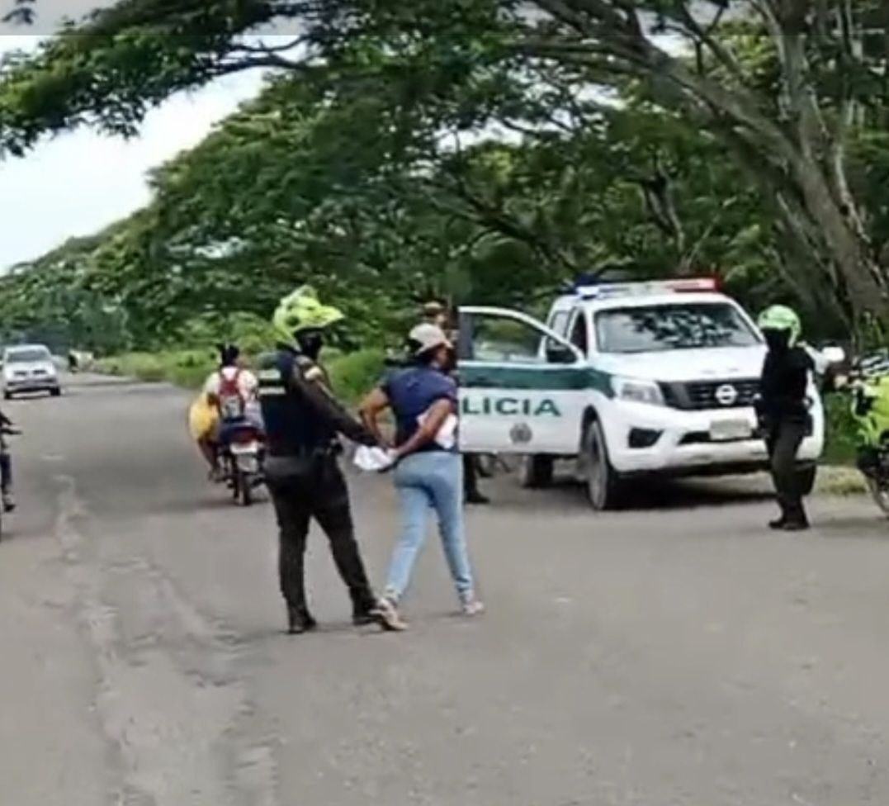
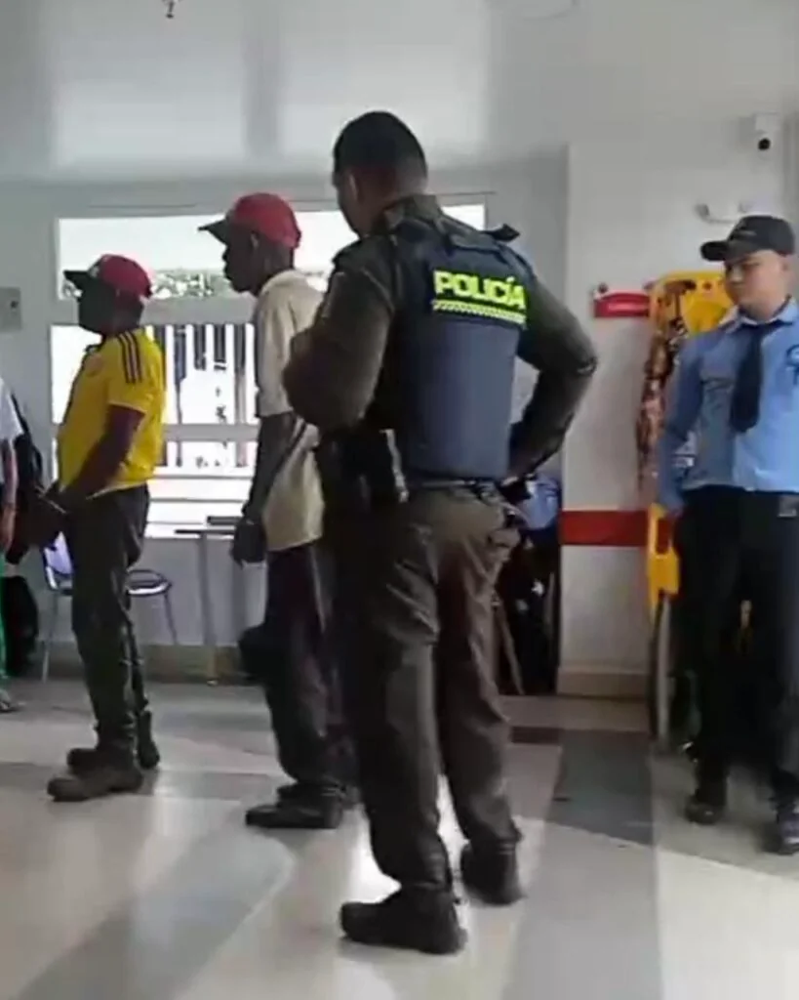

*Así sacaron esposadas con manos atrás a María Cristina Pérez Rodríguez, una de las campesinas. Hoy, los campesinos detenidos arbitrariamente por la Policía Nacional, están en libertad.*

¿Se privatizó el acto policivo? Esto es lo que pudiese estar pasando con los campesinos detenidos en forma arbitrarias. Actos policivos financiadas supuestamente por un directivo de Camacol que tiene intereses particulares. Hoy pusieron en libertad a 5 campesinos del corregimiento de Pontezuela (Cartagena) detenidos por agentes de la **Policía Nacional** el pasado miércoles.

Libres están los campesinos de la **familia Rodríguez** que poseen una franja de terrenos al lado del **Gimnasio Altair**. Con esta detención, las autoridades policivas no solo contravinieron la **Resolución No. _202532000735346_ del ―04―04―2025** **de la Agencia Nacional de Tierra―ANT** sino también el **acto legislativo** que considera al campesinado un sujeto de **protección especial del Estado**.

## Campesinos detenidos

*La policía custodia a los campesinos detenidos. Algunos son adultos mayores.*

En un operativo policivo **―**donde participaron agentes de policía beneficiados con giros financieros hechos por **Álvaro Montes Cubas**, directivo de Camacol Bolívar**―** fueron detenidos los campesinos que hacen posesión de sus tierras heredadas.

Los hechos sucedieron en la **finca La Ingeniosa** con matrícula inmobiliaria **No 0600035062**. Los ingenieros **José Faustino España Moratho y Álvaro Luis Cubas Montes**, directivo de Camacol en Bolívar, mediante compra de posesiones, pretenden quedarse con la finca La Ingeniosa.

En consecuencia, son ellos los que financian dichos operativos, a juzgar por los dichos de los mismos campesinos después que **VoxPopuli Digital** publicara algunos giros hechos por Cubas al subintendente Cogollo en el mes marzo y abril de 2024 cuando realizaron los operativos en Semana Santa.

¿Te interesa? [Las extrañas consignaciones de un directivo de Camacol a un subintendente de la policía (I)](/articulos/las-extranas-consignaciones-de-un-directivo-de-camacol-a-un-subintendente-de-la-policia-i/)

## La denuncia

/articulos/luciotorres/status/1930419027861516512

Los campesinos herederos del finado **Nicasio Rodríguez**, denunciarán penal y disciplinariamente a los oficiales, suboficiales y agentes que participaron en dicho operativo. Consideran que la detención fue arbitraria, porque ellos son los verdaderos poseedores de esas tierras. 

**María Cristina Ortega**, una de sus voceras de los reclamantes, dijo que ya los abogados de los campesinos están preparando la denuncia para presentarla en las primeras horas del 6 de junio.  

Le manifestó a **VoxPopuli Digital** que fue una detención arbitraria como la que le hicieron en Semana Santa del año pasado cuando también fueron detenidos. Denunciaron que Cubas Montes le transfiere dinero por nequi al subintendente Cogollo, quien se encuentra al mando del operativo.

Es hora de que el comandante de la MECAR, **Brigadier General Gelver Yecid Peña Araque**, aclara públicamente las circunstancias de los hechos denunciados y si está ceñido a la ley y a la disciplina recibir dineros para supuestamente desarrollar operativos donde los donantes son los beneficiados del procedimiento policivo.

¿Se privatizó el acto policivo? Es la principal pregunta que debe responder el alto oficial que se encuentra al frente de la MECAR desde que fue ascendido al rango de General en diciembre de 2024. 

## La resolución

La ANT emitió la **Resolución No. _202532000735346_ del ―04―04―2025** mediante la cual se ordena el **inicio del procedimiento único** del que trata el Decreto Ley 902 De 2017. El proceso está bajo el asunto agrario de **Clarificación de la Propiedad** sobre el predio rural identificado con Folio de Matrícula Inmobiliaria (FMI) **No. 060-35062**, ubicado en el distrito de Cartagena de Indias, departamento de Bolívar.

Como se observa, señala la resolución, en la cadena de tradiciones registradas en el Folio de Matrícula Inmobiliaria objeto de estudio, describe en su primera anotación, un acto de posesión. Esto consta en la **Escritura Publica No. 729** del 08 de agosto de 1946, proferida por la Notaria Segunda de Cartagena en favor del señor **Estefanor Rodríguez Manrique**. El acto fue debidamente registrado en la respectiva Oficina de Registro de Instrumentos Públicos el **14 de agosto de 1946**.

La mentada resolución señala que en cuanto al contenido de las anotaciones registrales para el FMI No. 060-35062, no se puede establecer con certeza la naturaleza jurídica del predio objeto de estudio. Esto, conforme a las fórmulas de acreditación de la propiedad, pues a pesar de que sobre el predio se encuentre inscrita una escritura pública desde el año 1946, **no existe certeza de que se tratare de un predio de plena propiedad privada que pudiere ser adquirido por el paso del tiempo**.

Por el contrario, dice la citada resolución, la información que existe en el registro público, se pudiere tratar de **un bien baldío que no ha salido del dominio de la Nación.** Premisa que, en todo caso, deberá ser objeto de confirmación o descarte a través del agotamiento de cada una de las etapas procesales del presente asunto agrario.