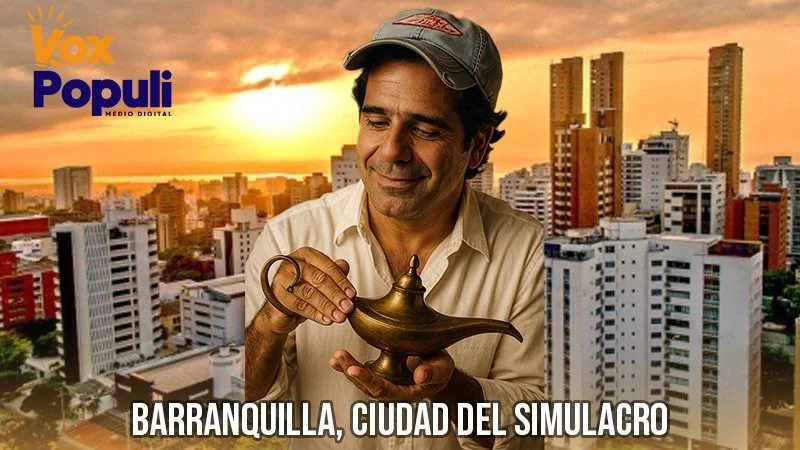

*Alejandro Char Chaljub, es un auténtico Aladino con su lámpara mágica. Los Char construyeron la ciudad simulacro, Parece pero no es.*

**Alejandro Char Chaljub**, es un auténtico Aladino con su lámpara mágica. En 2010 se la tiró de popular, como si fuera coleto de barrio, y ganó la alcaldía de Barranquilla por primera vez. **Su desarrollo en estos cuatro períodos administrativo es un espejismo de ciudad sostenible**. ¿Sabes por qué nuestra querida Curramba ahora es la ciudad simulacro?

Casi todas las acciones administrativas son maquilladas por estrategas de la propaganda oficial. Su amanuense [Jaime Pumarejo](/articulos/publicaciones/otras-publicaciones?item=billete-y-autobombo-como-se-silencia-a-la-prensa-critica-en-barranquil), el anterior alcalde, se gastaba **S94 millones diarios para publicidad**. Char, se gasta un poco más para la **ciudad simulacro**.

En realidad, su padre **Fuad Char** le regaló la ciudad como premio de consolación, porque venía de fracasar como ingeniero constructor (el siniestro de **Campo Alegre**) y contratista del Estado como socio de los primos **Nule**. Basta frotar su lámpara para que sus deseos se les hagan realidad.

Por ejemplo, si desea tener el primer lugar en las encuestas, Alex frota su lámpara... y ¡Puf! **Guarumo―Ecoanalítica** le cumple su deseo precisamente en la víspera del Foro OCDE. Tradicionalmente la encuesta la presentan a final de junio, este año la encuestadora la retrasó 15 días. ¿Coincidencia?

## Desviación del poder

El alcalde **Alejandro Char Chaljub** encuadra en una desviación de poder y simulación institucional cuando hizo de Barranquilla la ciudad simulacro. Utilizó el cargo para beneficiar a las empresas y negocios de su familia y de políticos corruptos. Esto lo señala el **numeral 6 del artículo 54 de la Ley 1952** de 2019:

> _“Haber utilizado el cargo para obtener provecho personal o de un tercero.”_

Su actuación se ajusta a la **desviación de poder**, cuando el servidor público actúa con fines distintos a los que justifican su investidura. **Es** **desviación de poder**, cuando el servidor público actúa con fines distintos a los que justifican su investidura.

## Foro OCDE

Este 8 de julio es un día histórico para la ciudad simulacro, porque el alcalde de lo decretó. Pero no para la Barranquilla del **86%**, incluso, que tienen una opinión favorable de su administración, entre **157 barranquilleros consultados**, según la ficha técnica de **Guarumo―Ecoanalítica**. En la encuesta de **Invamer** del 17 de junio, Char obtuvo 71 por ciento de **200 consultados**.

Las cadenas radiales, los medios noticiosos regionales y nacionales, y la redes sociales, tienen como tendencia hoy a **Barranquilla, Alex Char y el Foro de OCDE**. Mientras en su cuenta de X exhibe el trofeo del primer lugar de Guarumo que publica El Tiempo, los medios resaltan el magno evento poniendo a Barranquilla de **ejemplo mundial de desarrollo local**.

https://twitter.com/AlejandroChar/status/1942192640465818041

Ellos piensan que construyen una nueva historia para Barranquilla. En verdad que sí. La Barranquilla de los años 50 y 60 fue abruptamente tomada por los comerciantes y políticos emergentes de los años 70, entre ellos los Char. La mayoría de ellos ligados al narcotráfico y el contrabando.

El alcalde dijo hoy:

> «Barranquilleros, ¿están listos para que del 8 al 11 de julio escribamos juntos una nueva historia para la ciudad? Nos llena de orgullo poder mostrarle al mundo lo que somos: una ciudad que le apuesta al crecimiento de su gente, a la transformación de sus espacios y a la inclusión como un impulso de desarrollo».

Según la cadena Caracol, la elección de **Barranquilla como sede**[**, reconoce su destacada transformación urbana, ambiental**](/articulos/2025/07/04/tenemos-capacidad-para-albergar-en-hoteles-a-mas-de-16000-personas-cotelco-sobre-foro-de-la-ocde/) **y social, impulsada por iniciativas como el Gran Malecón, la recuperación de la Ciénaga de Mallorquín**, programas de inclusión educativa, entre otros.

## Ciudad simulacro

El modelo urbano desarrollista de Barranquilla la hace una ciudad simulacro. Una ciudad fachada, pero por dentro la gente experimenta una angustia para vivir. El rebusque es la única oportunidad que tiene el 51% de los trabajadores que salen a trabajar por el _pan de cada día_.

Los Char también maquillan las estadísticas en forma impúdica. Reportan informes en todos los aspectos a programas de seguimientos como _Barranquilla cómo vamos_. Este tipo de entidades no analiza críticamente los informes recibidos de las administraciones de la ciudad. Son una especie de notaría que dan fe pública de la gestión informada oficialmente. O sea, le dan un revestimiento de verdad a sus informes de desarrollo social.

## Crisis social

¿Cuál es la transformación social de Barranquilla?  Según el último informe de [Barranquilla Cómo Vamos](/articulos/es/web/grupo-prensa/w/informe-de-barranquilla-como-vamos-senala-avances-en-reduccion-de-pobreza-pero-desafios-en-empleo-y-seguridad), la cobertura en niveles como transición (70,6 %) y **educación media (58,4 %)** sigue siendo insuficiente. En cuanto a los resultados de las **pruebas Saber 11**, las instituciones públicas registraron una leve mejora. Pero siguen por debajo del promedio nacional. La matrícula sigue disminuyendo a pesar del crecimiento poblacional. En el primer año de Alex Char, **hay 5 mil niños menos en el sistema educativo distrital**.  

¿Para donde se fueron esos _pelaos_? Para la **ciudad simulacro** no existe nada negativo. Pero, muchos de ellos constituyen el caldo de cultivo para ser una de las ciudades más inseguras del país. Parte de ellos, siendo todavía niños, son entrenados para el robo, la extorsión y el sicariato.

La drogadicción infantil creció. Cada día consumen estupefacientes a más temprana edad. La población en el grupo de **12 a 17 años** presenta el mayor porcentaje de abuso o dependencia con un **58,0%**, seguido en este aspecto por el grupo de 18 a 24 años con un **50,4%** (Observatorio de Drogas de Colombia). La extorsión creció 800% que  obligó el cierre de 200 negocios en estos casi dos años. _La vacuna_ la pagan muchos comerciantes, también vendedores ambulantes, hasta el vendedor de tinto de los mercados públicos.

## No tienen plata para lo social

No tienen plata para lo social pero sí para el cemento. Muchas de las obras faraónicas quedan sin apropiación social. O son víctimas de la corrupción, como la Calle 30, La Cordialidad, la Circunvalar, el Mega Tanque 7 de abril, el Museo de Arte Moderno. Ahora proyectan el **Malecon** del Sur para echarle más cemento al denominado **Arroyo de Rebolo**.

Dicen atender a la infancia, pero desde que el Distrito tiene un convenio con el ICBF para atender la primera infancia, las trabajadoras no reciben remuneración adecuada y justas prestaciones sociales. Por tanto, los niños no reciben un servicio pleno, como dicen. Su manejo tiene un alto nivel de corrupción. Presuntamente esos convenios los administran los Char conjuntamente con los Torres y los Pulgar.

Sin embargo, **VoxPopuli Digital** escuchó a las trabajadoras de los Centros de Desarrollo Infantil (CDI) que opera el Distrito de Barranquilla y manifiestan que no les pagan desde el mes de marzo.  

¿Por qué no les pagan? El Distrito de los Char arrastra un **déficit de caja, que en 2024 ascendió a $426.300 millones**, equivalentes a **19,8%** de los ingresos fiscales. Esto representa un riesgo para la liquidez del Distrito y su sostenibilidad financiera a corto plazo, según la agencia Fitch. Pero, como ellos son expertos en maquillaje, la mayoría de los datos fiscales de Barranquilla son retocados con la complicidad de instancias del ministerio de Hacienda y Crédito Público.

## La ciudad simulacro paga más impuesto

La ciudad simulacro, del disfraz y de los mejores carnavales del Caribe, soporta todo. Parece que la mayoría de los barranquilleros viven adormecidos por los triunfos o derrotas del Junior. También hacen parte de la simulación, del simulacro y del disfraz.

Los Char disimulan que trabajan por el bien de todos, mientras su arcas particulares se llenan, las de los ciudadanos se vacían con las altas tarifas de los impuestos distritales o de los servicios públicos. Necesitan aumentar los impuestos para que le den más crédito con el fin de saquear la ciudad real, la Barranquilla que trabaja con entusiasmo todos los días, la que paga esos impuestos y esos caros servicios públicos.

## Se profundizará la crisis financiera

Los Char ya no tendrán a **Ana Lucía Villa** como Directora General de Apoyo Fiscal (DAF) del Ministerio de Hacienda de Colombia. La DAF es la entidad encargada de brindar apoyo técnico y financiero a las entidades territoriales (departamentos, distritos y municipios).

La Villa **―**apodada la "Dama de hierro"**―**, porque era dura con las pequeñas alcaldías que caían en ley 550, pero flexible con los grandes entes territoriales. Presuntamente, le hacía asesoría ilegal para que maquillaran sus cifras financieras y así poder tener el respaldo crediticio del ministerio de Hacienda y Crédito Público.

Ello es tan cierto que recientemente el ministerio se negó extender certificaciones a **Barranquilla** para respaldar los créditos que **tomará por $2,9 billones con la banca internacional para financiar el plan de desarrollo de** Alejandro Char. [La Fitch](/articulos/research/es/international-public-finance/fitch-affirms-barranquilla-idrs-at-bb-reviews-outlook-to-positive-from-stable-16-05-2025) comprobó que en 2024, Barranquilla no desembolsó los montos que había pronosticado para el pago de su deuda porque el ministerio de Hacienda presentó más requisitos para su registro.

## El milagro de la ciudad simulacro

Como se dijo, el milagro de la «prosperidad al debe» de la ciudad simulacro, tiene dos razones: aumento de las tarifas de los impuestos y de los servicios públicos y el crédito a largo plazo con el respaldo de la nación que hace el 50% de las transferencias al Distrito.

No obstante, esa situación ya la advirtió la Fitch:

> «Esto está impulsado por la creciente recaudación de ingresos tributarios derivados de aumentos en las tarifas del impuesto de industria y comercio (ICA) y el desempeño fuerte del impuesto predial unificado (IPU). Si Barranquilla puede mantener las tarifas de ICA en sus niveles actuales, sus métricas del perfil financiero mejorarían, y la menor dependencia de las transferencias nacionales, podría justificar una reevaluación del FCR de solidez de ingresos a 'Rango Medio', resultando en una comparación favorable frente a pares con calificaciones más altas.» ([Fitch Revisa la Perspectiva de las Calificaciones ‘AA(col)’ y ‘BB’ de Barranquilla a Positiva](/articulos/research/es/international-public-finance/fitch-affirms-barranquilla-idrs-at-bb-reviews-outlook-to-positive-from-stable-16-05-2025)).

 Entonces, tenemos que la clave del supuesto desarrollo de Barranquilla fue aumentar los impuestos (Impuesto de Industria y Comercio y el Impuesto predial Unificado) a los barranquilleros. Al mismo tiempo, endeudar a la ciudad hasta donde puede estirar su capacidad de pago. Hoy, Barranquilla es una ciudad sobre endeudada. Vive una “prosperidad al debe”. El cemento que se constuye está fiado. L**a deuda _per cápita_ es de $2,2 millones por persona**. 

## **¿El Foro de la OCDE y la ciudad simulacro?**

Casi todo es propaganda en la **ciudad simulacro**. Es el caso típico de una simulación institucional. En realidad, es una ciudad insostenible ambiental, humana y financieramente. Sin embargo, hace 15 años **Alex Char** pidió un deseo, frotó su lámpara mágica y... ¡Pus! hoy la presentará como **modelo de Desarrollo Local** en este Foro OCDE, que teóricamente reúne a 38 países del mundo.

El foro es un evento internacional organizado **por el Centro para el Emprendimiento, las PYMES, las Regiones y las Ciudades de la OCDE**. Es un espacio de encuentro entre líderes globales, responsables de políticas públicas. También de representantes del sector privado, la sociedad civil y la academia, que comparten experiencias y buenas prácticas para **transformar territorios de forma inclusiva y sostenible**.

El Foro de Desarrollo Local de la OCDE se celebrará en Barranquilla esta semana y reunirá a más de 3.000 delegados de al menos 60 países, dice la Oficina de prensa de la alcaldía. Es la primera vez que este evento se lleva a cabo fuera del continente europeo. La alcaldía dice:

"La elección de [**Barranquilla reconoce su destacada transformación urbana, ambiental**](/articulos/2025/07/04/tenemos-capacidad-para-albergar-en-hoteles-a-mas-de-16000-personas-cotelco-sobre-foro-de-la-ocde/) **y social, impulsada por iniciativas como el Gran Malecón, la recuperación de la Ciénaga de Mallorquín**, programas de inclusión educativa, 

Señores foristas del OCDE, bienvenidos a la ciudad simulacro que vive una "prosperidad al debe" para financiar sus obras faraónicas que no tienen una apropiación social para la ciudad real, la Barranquilla de mis abuelos, del 96% que deben trabajar diariamente para llevar el pan a sus casas.