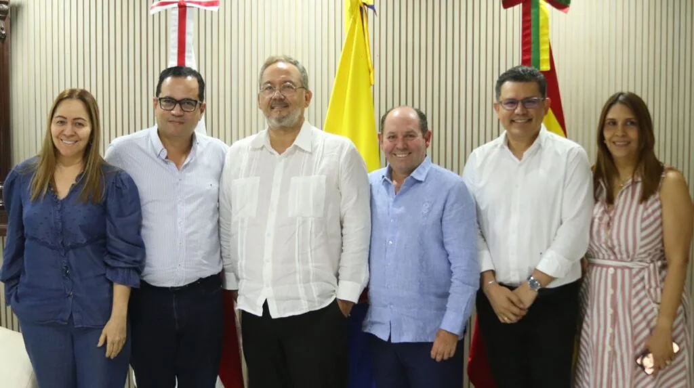
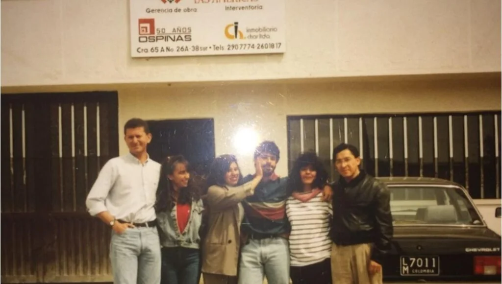
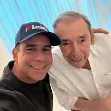

*¿Char con certificado chimbo evade paternidad?*

**«¡Que todo el peso de la ley le caiga!»**, fue la expresión de **Alejandro Char** cuando capturaron al presunto sicario que asesinó a una humilde cajera en el barrio La Paz. **Esa misma expresión es una bofetada contra él mismo**. Siendo la primera autoridad civil y policiva de Barranquilla ¿Char con certificado chimbo evade paternidad y orden judicial para el examen ADN?

Lo peor: ¿Alex Char falsearía la realidad con un certificado aparentemente chimbo de la **Clínica Centro S.A**. donde supuestamente estuvo internado con hidratación y antibióticos? Por medio de su apoderado, le dijo al juez que no podía asistir al análisis de la muestra, porque estaba incapacitado. Probablemente tenía diarrea. Le prescribieron antibióticos e hidratación por 5 días.

¿Te interesa? [¿El primogénito negado de Alex Char? (I)](/articulos/el-primogenito-negado-de-alex-char-i/)

## ¿Char con certificado chimbo?

*¿Char con certificado chimbo? Posesión del exgerente de la Clínica Centro S.A. como gerente de la ESE Hospitalaria del Atlántico UNA, Pablo Alberto de la Cruz Gómez, quien aparece en el centro con guayabera blanca. Cortesía prensa gobernación.*

¿Alejandro Char llegaría a una bajeza moral y ética blandiendo un certificado chimbo para evadir su responsabilidad paterna? ¿Por qué la Clínica Centro y no una clínica que corresponde a su estrato social y económico donde? Como periodista de investigación fuimos a la Clínica Centro S.A., no tenían idea de esa certificación. Lo pude constatar personalmente el martes 22 de julio a las 11:30 de la mañana.

La Clínica Centro S.A. de Barranquilla fue fundada por los **hermanos Pérez Campanella, médicos radiólogos**. En 2006, la clínica se transformó de Clínica Centro Ltda. a Clínica Centro S.A. Hasta hace poco su gerente general era el actual gerente de la ESE Hospitalaria del Atlántico UNA, **Pablo Alberto de la Cruz Gómez**. Se ha desempeñado como asesor en la clínica San Martín, auditor de cuentas en Liberty Seguros, médico de urgencias, médico en el área de Salud Ocupacional, jefe de Facturación y jefe de Urgencias de la clínica Los Andes de la **ESE José Prudencio Padilla** del extinto Seguro Social y gerente de la Clínica Centro, cargo que ocupó un día antes de su posesión en UNA en presencia del gobernador **Eduardo Verano de la Rosa**.

La Clínica Centro hace parte de La Red Integrada de Servicios de Salud (MiRed). Es el modelo de negocios creado por la familia Char para manejar los recursos de la salud del Distrito y de la gobernación de Bolívar. En este caso, el Distrito de Barranquilla aparentemente es el mayor accionista de MiRed compuesta por una red de 39 unidades de atención, incluyendo 28 Puntos de Atención en Salud Oportuna (PASO) y 9 Centros de Atención Médica Integral Oportuna (CAMINO). Además de dos hospitales de alta complejidad. Esta red, que opera como una Empresa Social del Estado (ESE) de economía mixta, busca ofrecer servicios de salud de baja, mediana y alta complejidad, georreferenciados para facilitar el acceso a la población. 

Te interesa? [¿Última oportunidad del alcalde Char para prueba ADN? (III)](/articulos/ultima-oportunidad-del-alcalde-char-para-prueba-adn/)

## Alcapone & Char

El gran empresario del emporio del alcohol de los años 30 en los Estados Unidos, Alfonso Capone, el popular Alcapone, no cayó por sus masacres y el contrabando de licor, sino porque su contabilidad no se ajustaba con la realidad. Es decir, falseó los ingresos y egresos. Fue condenado y acabó su carrera delincuencial.

El poder de los Char se podría caer si en Barranquilla la Fiscalía y los jueces procesaran al alcalde, **Alejandro Char Chaljud**, por presunta falsedad. Lo gravísimo: Estaría incurso en fraude procesal en el caso de la demanda por paternidad.

Por esa razón, es obligación del **Juez 1 de Familia del Circuito de Bogotá**, **Álvaro Jesús Guerrero García**, hacer cumplir su orden judicial. Esta sería la prueba reina que verificaría si es o no padre irresponsable que le negó todos los derechos fundamentales a su hijo por más de 33 años. (Óigase bien 33 años) ¿Puede un mal padre ser el mejor alcalde de Colombia? ¿¡Imposible!? Pero también el juez debe examinar si el demandado le mintió con una certificación que falseó la realidad para hacer fraude procesal. Es decir, puede ser auténtica la certificación, pero su contenido falseado.

https://twitter.com/AlejandroChar/status/1948026507701436487

## El análisis de Lucio

https://youtu.be/gl8tzLatrJo?feature=shared

Aquí te propongo varios interrogantes que tratan de despejar la conducta del alcalde de Barranquilla, Alejandro Char Chaljub, sobre su negativa a hacerse la prueba ADN

## La confesión

*¿Char con certificado chimbo evade paternidad? Aquí aparece con la madre de Steven Castellanos. Detrás, la fachada de la inmobiliaria Char Ltda donde trabajaba Diana Magali Ramos Saavedra.*

Como lo relatamos en exclusiva esta historia desde la primera entrega de **VoxPopuli Digital** \[[¿El primogénito negado de Alex Char? (I)](/articulos/el-primogenito-negado-de-alex-char-i/)\], el joven **Steven Castellanos Ramos** (33 años) instauró una demanda de paternidad apenas hace un año para establecer si el alcalde de Barranquilla, **Alejandro Char Chaljub**, es su padre.

Esa decisión la tomó después que su madre, **Diana Magali Ramos Saavedra**, le confesó que era el primogénito de Alex. El primer nieto de **Fuad Char** y **Adela Chaljub de Char**. Por simple lógica, esta condición debería ser motivo de orgullo y tomado como una bendición. Pero para el mejor alcalde Alex Char es motivo de rechazo

Desde entonces, **Steven Castellanos hizo todo los intentos por establecer comunicación con su supuesto padre.** Pero todo fue en vano, Portazos iban, portazos venían. No le quedó otro camino que la demanda judicial.

## La prueba ADN

De manera que dicha demanda cursa en el **Juzgado 1 de Familia del Circuito de Bogotá**. El despacho judicial ordenó una prueba ADN para comprobar la paternidad del joven, lo cual es un derecho fundamental. Si la prueba genética coincide con el ADN de Char, seguramente el juzgado la tendrá como prueba reina para definir **la paternidad de Alex Char**.

Entonces, Steven llevaría el apellido Char, se le condenaría a su padre biológico a pagar con indexación la inasistencia alimentaria, sus estudio, su asistencia sanitaria y todos los gasto que un hijo demanda hasta los 26 años. Siempre y cuando Steven demuestre que siguió estudiando hasta esa edad.

Además, el juez declararía los derechos herenciales de Steven. Como primogénito, tendría derecho a una parte del patrimonio de su padre y de lo que heredó de sus abuelos **Fuad Char y Adela Chaljub**.

**Próxima entrega**. El terror de Alex Char. ¿Por qué tiene tanto miedo de hacerse ese test? ¿Por qué negó todo lo demandado?