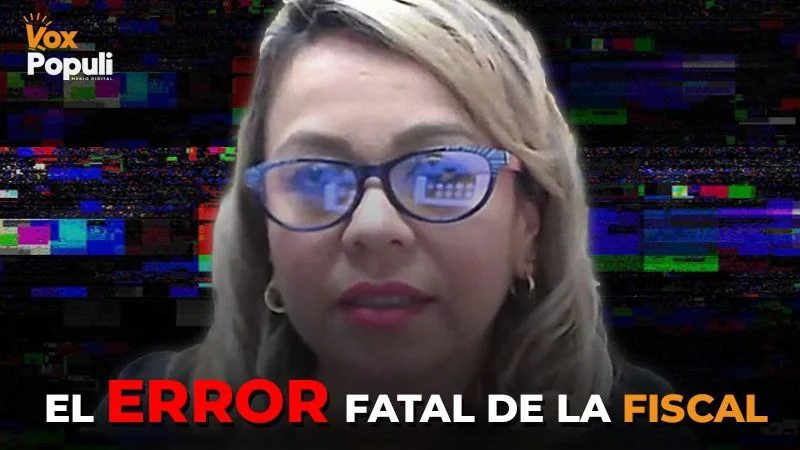
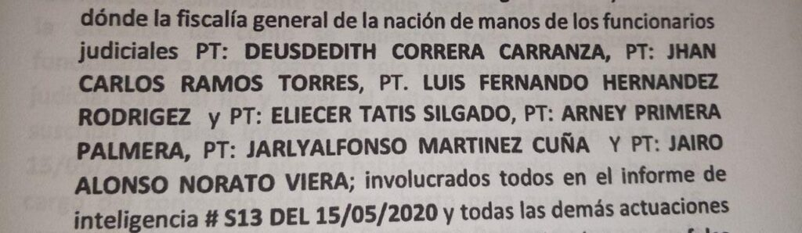
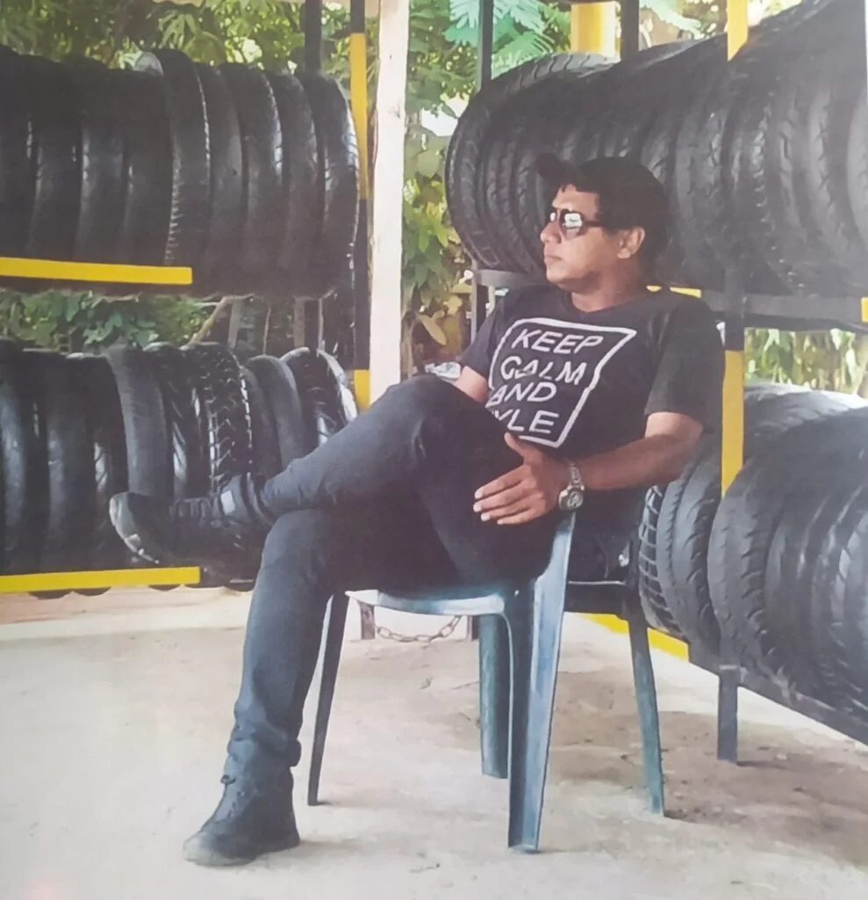
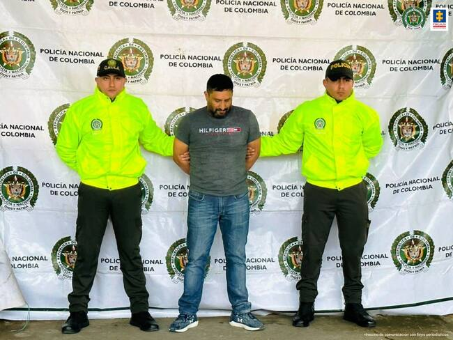
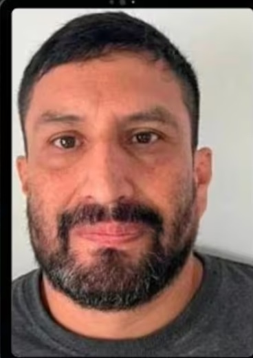
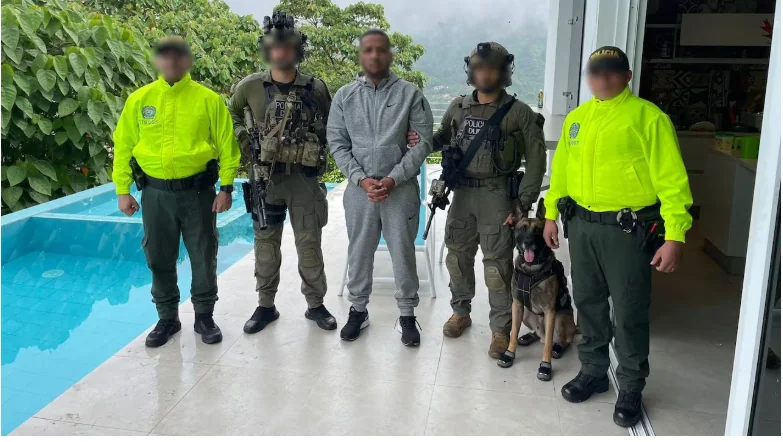

*Narly Tatiana Patiño Pascuas con su perrito preferido.*

El «pequeño error****_»_**** de la fiscal 15 **Especializada de Cartagena, Narly Tatiana Patiño Pascuas**, se produjo cuando con su varita mágica (¡plin!) convirtió a **José Nibardo Marín**, alias ****_«_el Abogado_»_****, en un **_«_mafioso invisible_»_**. El año pasado lo descuartizaron **Los Pachenca** por haber desaparecido un cargamento de droga en Santa Marta. **El Clan del Golfo** lo había sentenciado a muerte junto al **«Paty Paty»**, porque se habían tumbado dos toneladas de cocaína de unos poderosos narcos en el puerto de Cartagena. Pero, la fiscal en vez de corregir ese «pequeño error****_»_****, ingenua o dolosamente, lo siguió tapando.

Esa conducta, tal vez prevaricadora, produjo daño moral y material al comerciante **Álvaro José Barrios Díaz**, a quien hicieron pasar como si fuera alias ****_«_el Abogado_»_****. El tiempo que duró en La Picota fue el mismo que el mafioso andaba libre sin que nadie lo buscara. Supuestamente estaba preso. Con la captura y posterior extradición de Babalao, el jefe financiero en el Caribe, se desató una guerra sangrienta que produjo **1.039 homicidios**. Además, la exportación de **más de una tonelada de cocaína** en el período 2021―2023. Esta información la entregó la **Sijin** cuando capturó al sanguinario mafioso.

*El «pequeño error» de la fiscal que incentivó la guerra mafiosa en Cartagena.*

Lo paradójico de esta historia fue el asesinato (7 de febrero 2025) del subintendente de la policía **Francisco Javier Bertel Pérez**. El investigador de la Dirección de Investigación Criminal e Interpol (**Dijin**), conocía sus andanzas y de sus conexiones. Sus compañeros de la Seccional de Investigación Criminal (**Sijin**) de Cartagena que trabajan con la Fiscal 15 Especializada, también sabían los pasos criminales del **_«_mafioso invisible_»_**. Junto a alias **«Paty Paty»**, creó la estructura ilegal llamada **La Heroica** responsable de gran parte de esos asesinatos.

Con el informe de inteligencia **No S13 del 15** de junio de 2020 de **Deudedith Correa Carranza** se abrió el proceso No **130016001129201800136** bajo la dirección de **Pedro Diaz Pacheco**, Fiscal Primero Único Especializado del Gaula contra **Álvaro José Barrios Díaz**.

*Estos son los investigadores que deben investigar porque son parte del «pequeño error» de la fiscal. Esto aparece en el expediente.*

Pero cuando entró la fiscal No 15 sufrió varias rupturas. Entre ellas las 1100160000002021026770 y 110016099144202100015.

¿Te puede interesar? [¿Fiscalía entregó el puerto a la mafia? (I)](/articulos/fiscalia-entrego-el-puerto-a-la-mafia-i/)

## Comerciante guajiro, el sacrificado

*Álvaro José Barrios Díaz, el comerciante guajiro víctima del «pequeño error» de la fiscal Patiño Pascuas.*

Llama la atención que a Bertel Pérez lo habían solicitado como testigo en el juicio que se le seguiría al comerciante guajiro, **Álvaro José Barrios Díaz**. La fiscal **Patiño Pascuas**, con esa misma varita mágica, (¡plin!) transformó al comerciante en alias ****_«_el Abogado_»_****.

De manera que, la negligencia o la impudicia de la fiscal, mandó al inocente a La Picota donde duró año y medio y al verdadero mafioso ****_«_****lo dejaron sano****_»_**** hasta cuando lo capturaron y pusieron en libertad. Luego lo asesinaron sus antiguos compinches. Con la dudosa conducta de la fiscal, le dieron _patente de corso_ para seguir matando en la guerra que desató contra otras estructuras criminales que se disputan las rentas ilegales, en especial, la exportación de cocaína.

****_«_****El pequeño error****_»_**** de la fiscal se develó cuando en marzo del 2023, la Fiscalía General de la Nación y la Dijin lo capturaron en El Meta. Lo curioso, la Fiscalía, en vez de separar a Patiño Pascuas y procesarla por las denuncias que instauraron contra ella, continuó en el proceso. Sin embargo, deberá responder a las mismas autoridades por su actuación errática que incentivó la guerra mafiosa en Cartagena. Una guerra que ―como se dijo arriba― **produjo 1.039 homicidios en forma directa o indirecta**.

¿Te interesa? [La venganza de «Paty-Paty» contra «los Salsas Mexicanos»](/articulos/la-venganza-de-paty-paty-contra-los-salsas-mexicanos/)

## Lo extraño

Pero, lo extraño es que Patiño Pascuas, pese al «pequeño error****_»_****, **se mantiene al frente de una de las fiscalías esenciales para combatir las organizaciones mafiosas** que se disputan el control del puerto local para la exportación ilegal de cocaína.

Le corresponderán a las autoridades competentes investigar si son errores o actuaciones dolosas. Puesto que en la práctica favorecieron a un segmento de esa delincuencia organizada, la estructura La Heroica de alias ****_«_el Abogado_»_****. Una organización que se enfrentó a la estructura **Los Robledo** de Medellín que vino a conquistar mercado en Cartagena. De igual manera, los **Salsa Mexicanos** que, en el Valle del Cauca, se unieron con el **Cartel de Jalisco Nueva Generación**.

¿Te interesa? [Guerra Clan del Golfo Vs Salsas. Asesinato de «el Nalga»](/articulos/guerra-clan-del-golfo-vs-salsas-asesinato-de-el-nalga-cercano-a-chawala/)

## ****_«_****El pequeño error****_»_**** de la fiscal

*José Nibardo Marín (alias «El abogado», «Top», «Jota Indio» cuando fue capturado el 23 de octubre de 2023. (Policía Nacional)*

****_«_****El pequeño error****_»_**** de la fiscal fue copiar el expediente del mafioso **José Nibardo Marín** (alias ****_«_el abogado_»_****_,_ **_«_**Top_»_, _«_Jota Indio_»_**** _o_ ****_«_Don José_»_****) y sembrarlo a **Álvaro José Barrios Díaz**. Es un comerciante capturado en el 2021 por pedido del **Fiscal Primero Único Especializado del Gaula de Cartagena**, **Pedro Diaz Pacheco**. La Fiscalía y la Policía lo presentaron como alias ****_«_el abogado_»_**** sin serlo. La captura se produjo gracias al informe de inteligencia firmado por **Deudedith Correa Carranza**, subintendente de la Policía.

¿Por qué aparece Barrios Díaz en ese complot de los mismos investigadores y de la Fiscalía? Por una sola razón, fue un comerciante que promovió la seguridad ciudadana contra la extorsión, ya que el Gaula no estaba cumpliendo con su papel.

En 2013 presentó una denuncia ante el Gaula. Después los delincuentes lo volvieron a llamar y le dijeron que debían pagar el doble por haber denunciado. Díaz Barrios se negó.

En 2017, presentó otra denuncia ante presidencia de la República en Bogotá contra agentes del Gaula. Denunciaba su relación con el grupo armado Los Paisas, que luego se integró al Clan del Golfo. Se removieron a varios miembros del Gaula y se abrió investigación sobre su presunta complicidad con la mafia. Entre el año 2016 al 218 se produjeron muchos casos de comerciantes asesinados. Ellos se negaron a pagar la extorsión a Los paisas y luego al Clan El Golfo.

Supuestamente la estructura de Los paisas tenían infiltrado al Gaula en el 2013. Por esa razón, Díaz Barrios denunció al comandante del Gaula, capitán de policía **Howard Andrés Sierra Meza**.

¿Te interesa? [Los «peces gordos» no bailan champeta: ¡Sábado sangriento!](/articulos/los-peces-gordos-no-bailan-champeta-sabado-sangriento/)

## La fiscal está mal ubicada

La fiscal Patiño Pascuas está mal ubicada en este proceso. Al parecer, actuó para favorecer al jefe mafioso. Pese a sus crímenes, José Nibardo Marín siguió delinquiendo sin que las autoridades lo persiguieran en Cartagena. Estaba protegido con ese salvavidas que le brindó la Fiscal. Esta tesis se desprende de varios hechos que cuestionan su dudosa actuación durante el período 2021―2023 para combatir el crimen organizado.

La conducta errática de la fiscalía contribuyó a la consolidación de la estructura criminal **La Heroica** derivada del Clan del Golfo. Se aprovechó un vacío de poder creado por la falta de coordinación de la Fiscalía Seccional, la alcaldía de Cartagena en manos de William Dau y la MECAR.

*José Nibardo Marín y a su esposa Saudi Karina Cotes*

En el período señalado, como es recurrente en ella, no persiguió al verdadero mafioso líder de esta estructura criminal, alias **_«_**Top_»_****, que estaba en guerra contras estructuras criminales. Persiguió al comerciante guajiro que le sembraron el expediente de ese **jefe mafioso**.

**Los Pachenca**, que opera en la Sierra Nevada de Santa Marta asesinaron a **José Nibardo Marín** y a su esposa **Saudi Karina Cotes**. Sus cadáveres los descuartizaron con motosierra y depositaron en sendos sacos de café y arrojados en una vía que conduce de **Palomino a Mingueo**, zona rural de Dibulla. El macabro hallazgo lo hicieron campesinos de la zona el **23 de octubre de 2024**.

## La Heroica

*Armando Elías Buelvas Sepúlveda, alias «Paty Paty», en Manizales, cuando fue capturado en diciembre 2022.*

De acuerdo con información de inteligencia, La Heroica la creó **José Nibardo Marín**_, alias_ ****_«_El abogado_»_****_,_ **_«_**Top_»_, _«_Jota Indio_»_**** _o_ ****_«_Don José_»_****, y **Armando Elías Buelvas Sepúlveda**, alias **«Paty Paty»**_._ El primero lo asesinaron los Pachenca en el 2024. El segundo, lo capturaron en Caldas en diciembre de 2023, cuando huía de una muerte segura en Cartagena, porque estaba sentenciado por el Clan del Golfo. La MECAR lo presentó el 2 de enero de 2023.

 Para la policía, **José Nibardo Marín** sería el responsable directo de más de **una tonelada de cocaína incautada entre 2019 y 2023**, en cuatro procedimientos distintos. Cuando lo capturaron, la Dijin dijo que era el custodio de **140 kilogramos de cocaína d**ecomisados **en una bodega de la terminal marítima de Cartagena**.

Su captura de produjo **en una acción conjunta de la Fiscalía y la DIJIN de la Policía Nacional en Castilla La Nueva (Meta)**, donde presuntamente llegó a ocultarse tras enterarse de la orden judicial que pesaba en su contra. En los registros figuraba como **desmovilizado del Bloque Mineros de las extintas Autodefensas Unidas de Colombia (AUC)** y luego, **en en 2012**, se enroló en el **‘Clan del Golfo’**.

## Si la justicia no actúa

Cuando la justicia no actúa de manera efectiva, o lo hace de forma deficiente, es un caldo de cultivo para que las organizaciones criminales se consoliden y operen libremente con su poder mafioso. Esto sucedió con la dudosa actuación de la controvertida fiscal. Su presunta **actuación omisiva y prevaricadora** incentivó la guerra de las mafias por el control del puerto de Cartagena.

Además, el vacío de poder y la falta de articulación de la Fiscalía con la alcaldía de Cartagena y de la policía durante los 4 años de gobierno de William Dau, también contribuyó al incremento de la inseguridad ciudadana en el principal puerto del país.

Espere la próxima entrega: ¿Qué pasó con la muerte del subintendente Bertel Pérez?