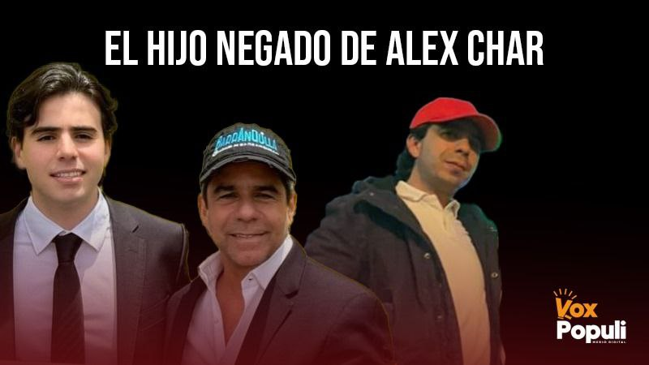
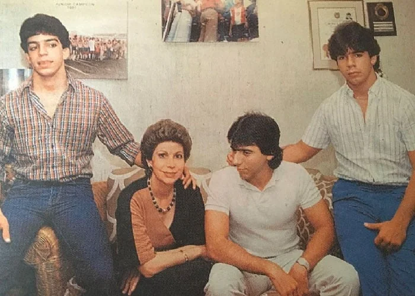
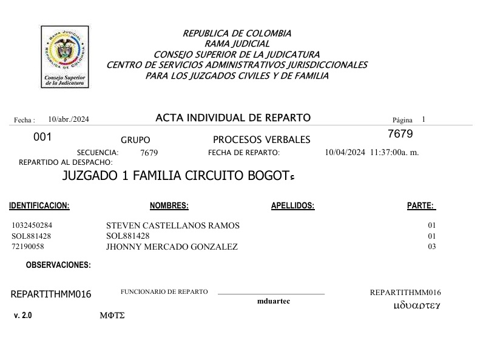
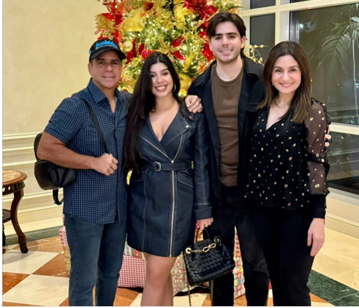

*¡Adivinen! ¿Quién es el hijo negado? ¿El de adelante o el de atrás?*

En el Caribe decimos: **«_Hijo negado, sale pintado_»**. Esta frase refleja la ironía de la vida para el primer alcalde de Colombia, **Alejandro Char Chaljub**. Muy a pesar del fuerte rechazo recibido por **Steven Castellanos Ramos** —el protagonista de esta historia— cuando buscó a su presunto padre, la conexión biológica y la herencia genética de los **Char Chaljub** se manifiestan de manera evidente en su fisonomía. ¡La misma cara!

En la primera entrega de esta historia, dimos a conocer sobre la negativa del alcalde de Barranquilla a realizarse la prueba ADN ordenada por el **Juzgado 1 de Familia del Circulo de Bogotá**. Le mintió al juez a través de su abogado diciendo que tenía una incapacidad de tres días. Probablemente tenía una diarrea producida por el miedo de que su primogénito sea el hijo negado hace 33 años. Pero, el 6 de junio lo vimos orondo, al parecer, bebiendo y festejando en el estadio Metropolitano. Estaba presenciando el partido de la selección de fútbol de Colombia frente a su similar del Perú.

¿Te interesa? [¿El primogénito negado de Alex Char? (I)](/articulos/el-primogenito-negado-de-alex-char-i/)

## Si Adela viviera

*Estos son los vástagos de Adela Chaljub con Fuad Char. Compare el mentón y la nariz de esos pelaos con los de Steven, el hijo negado. (Cortesía).*

Si la mamá del hijo negado se lo hubiese llevado a **Adela Chaljub de Char** antes de que ella muriera, seguramente Steven hoy fuera un miembro destacado de la familia Char. Ella hubiese hablado con su hijo para llamarlo al orden y que reconociera la paternidad negada al niño de entonces que tenía dos años. Las abuelas _tienen el palito_ _mágico_ —mejor que una prueba de ADN— para detectar la genética de sus nietos o nietas. Pero, **Adela murió el 3 de julio de 1994 en Jacksonville, Estados Unidos, sin conocer a su presunto, primer nieto**.

Eso lo afirmo, porque en mis tiempos de bisoño periodista en Barranquilla, tuve la oportunidad de conocer y reconocer a **Adela Chaljub de Char** como la Primera Dama del Atlántico. Era la esposa del gobernador de entonces, **Fuad Char Abdala**. Ella, una señora de bien. Bondadosa. Solidaria. Entregada a la causa social. Esto me gustó. **Como periodista y director del primer noticiero popular de RCN en Barranquilla**, la acompañé varias veces a Santa Lucía y los municipios del Canal del Dique que produjo 200 mil damnificados en 1987.  **La Cruz Roja** la resaltó como **Señora Barranquilla** en 1987. L**a Sociedad de Mejoras Públicas** de la ciudad le dio la **Medalla Cívica**.

Esa era Adelita de Char. Pero, 31 años después de su muerte, las cosas son distintas en el seno de la familia Char Chaljub. Se olvidaron de su legado ético, moral y familiar. Solo el **dios dinero** prima en sus relaciones frías de la política y de la economía. Lo social, es una añadidura para controlar a las masas.

¿Te interesa? [“Alejandro Char construye tu felicidad” en Campo Alegre](/articulos/alejandro-char-construye-tu-felicidad-en-campo-alegre/)

## La prueba ADN

*Así fue el reparto de la demanda de filiación en 2024.*

Si la mamá de Alejandro Char no está, la prueba ADN serviría para que los Char Chaljub descarten o reciban al nuevo miembro. El hijo negado. Un hijo condenado al olvido por durante casi 34 años. Allí lo mantuvieron escondido, desde que la madre de Steven le dijera a su padre biológico de que estaba embarazada.

Ya se cumplió un año desde que Steven conoció la verdad de la confesión de su propia madre. Desde ese día, como buen psicólogo, (el muchacho se hizo profesional con mucho trabajo) quiso enfrentar la realidad conociendo cara a cara a quien lo engendró.

El hijo negado duró dos semanas en Barranquilla detrás de su padre biológico. Cada puerta que tocaba, apenas lo veían, le daban el portazo en su larga nariz propia de los Char Chaljub. Entonces, tomó la decisión de que la demanda de filiación continuara. La esperanza era conocerlo _face to face_ en el mismo momento de la prueba genética. La oportunidad la tenía el día del test ADN.

¿Te interesa? [“Alejandro Char construye tu felicidad” en Campo Alegre](/articulos/alejandro-char-construye-tu-felicidad-en-campo-alegre/)

## 34 años después

*Alejandro Char con sus hijos, al lado de Katya Nule, exreina del Carnaval de Barranquilla. Celebrando otra navidad (2024) sin su primogénito, el hijo negado. (Instagram).*

La fecha fijada por el juez de familia era el **4 de junio de 2025**. Los nervios de él y de su madre se excitaban cada hora que se acercaba ese día. La expectativa. Las emociones. La ansiedad. El entusiasmo mezclado con el miedo, apresaban la mente de madre e hijo. Para ella, la espera era larga de 34 años desde el último día que lo vio. Para el hijo negado era de un año, pero parecía 100 años.

¿Cómo es verse, 34 años después, madre y padre que vivieron un amor furtivo en 1991? Para **Diana Magali Ramos Saavedra**, la mamá de Steven, era desprenderse de un pesado piano en su espalda. **Un piano que había cargado como una cruz desde que Alejandro Char la dejó embarazada y esperanzada.** Ella se le quedó esperando en el centro comercial Las Américas, en Bogotá, donde la citó para resolver el tema de su embarazo.

No obstante, para el alcalde de Barranquilla, **Alejandro Char Chaljub**, la expectativa lo pudo enfermar, a juzgar por lo dicho de su abogado ante el juez de familia. Hidratación por 5 días. Antibióticos. Reposo. Incapacidad de 3 días. _La cagadera fue muy grande_, dirían en Barranquilla.

**«_Hijo negado, sale pintado_»**. Sin equívocos, este dicho se cumple con el hijo negado de Alex Char. No hay la menor duda razonable para no creer que **el mentón de Steven es de los Char Chaljub**. Si no alteran la prueba genética de **Alejandro**, seguramente la familia Char tendrá un psicólogo para que dirija las terapias mentales que necesitan sus miembros.

[SECUENCIA 7679](/pdfs/SECUENCIA-7679.pdf)[Descargar](/pdfs/SECUENCIA-7679.pdf)