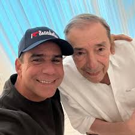

*¿Última oportunidad del alcalde Char para prueba ADN?*

**Alex Char Chaljud** ahora tiene la última oportunidad para hacerse el test ADN. Como se informó en la primera entrega, el alcalde de Barranquilla **eludió el pasado 4 de junio**, por tercera vez y en forma deliberada, presentarse ante Medicina Legal para la prueba genética ordenada por el **Juzgado 1 de Familia del Circuito de Bogotá**.

Sin embargo, el juez le dio esta última oportunidad a Alex Char para que cumpla con la orden judicial. O, en su defecto, esta conducta remisa la consideraría una prueba en su contra. Por ende, declararía la paternidad con respecto a **Steven Castellanos**, el demandante.

En otras palabras, la última oportunidad de Alex Char, como lo conocen en general, para demostrar que no es el padre de Stevenson. Y si lo es, reconocerlo ante la justicia, la Constitución y la Ley. Su decisión ahora es clave para que el juez no se vea en la penosa orden de conducirlo a Medicina Legal de Bogotá. Esta semana es de expectativa. O, finalmente, el togado preferiría asumir en sentencia la paternidad del alcalde de Barranquilla.

¿Te interesa? [Hijo negado del alcalde de Barranquilla salió pintado (II)](/articulos/hijo-negado-de-alex-char-salio-pintado-ii/)

## Alex Char y Mark Twin

*Negar la paternidad es negarle la dignidad humana al hijo. Es la última oportunidad para Alex Char.*

¿Alex Char es el mejor alcalde de Colombia? ¿Hasta dónde llegó la degradación de los políticos en Colombia y, en especial, en Barranquilla? A Curramba la convirtieron en cuna de la corrupción moderna de la política colombiana. Si no eres capaz de reconocer a tus hijos, eres capaz de todo.

¿Te interesa? [El «pequeño error» de la fiscal que incentivó la guerra mafiosa en Cartagena (II)](/articulos/el-pequeno-error-de-la-fiscal-que-incentivo-la-guerra-mafiosa-en-cartagena-ii/)

## **«Dos gotas de agua»**

Luego de que **VoxPopuli Digital** publicara la foto de Alejandro Char con su hijo Alejandro Junior y el hijo negado, los comentarios en redes sociales fueron dicientes. Algunos dijeron que eran **«dos gotas de agua»**. Otros se refirieron al dicho popular **«_hijo negado, sale pintado_»**. El comentario del momento en los taxis, en las salas de juego y en las esquinas de Barranquilla es **la falta de coraje de Alex Char** para enfrentar la presunta paternidad del demandante Steven Castellanos. ¿Falta de coraje? Si. No tiene la valentía para enfrentar una situación de esas características. Predica, pero no aplica cuando llama a la ciudadanía a ser responsables.

La demanda de filiación fue instaurada hace un año. Su radicación es la **No. 110013110001-2024-00300-00**. Este es un proceso legal que busca establecer o impugnar **la relación paterno-filial entre Steven Castellanos y su presunto padre Alejandro Char**. Hasta ahora, se desconoce cuál es su posición con respecto a este nuevo escándalo. Puso entre dicho su idoneidad para enfrentar esta situación que no debió llegar ante un estrado judicial.

¿Te interesa? [¿El primogénito negado de Alex Char? (I)](/articulos/el-primogenito-negado-de-alex-char-i/)

## ¿Última oportunidad?

El juez **Álvaro Jesús Guerrero García**, en auto **No 0066 del 5 de mayo de 2025**, subrayó la necesidad de darle una última oportunidad para que se presentara en Medicina Legal, pero no lo hizo. Su apoderado le dijo al juez que tenía una incapacidad de 3 días, puesto que le prescribieron hidratación, antibióticos durante 5 días. Se presume que tenía diarrea.

> **«**(...) _considera este juzgador que se hace necesaria una **última reprogramación** a fin de obtener la prueba genética, que permitirá establecer la verdadera filiación de **Steven Castellanos Ramo**s, sin embargo, esto no es óbice para que **en sentencia se analicen las conductas procesales de los extremos y las demás pruebas recaudadas.**_**»**

Con esta falta de integridad ética para afrontar una posible paternidad, estaría corriendo el riesgo de ser conducido por la policía. Se espera que un gobernante que es considerado por las encuestas tener una alta preferencia en la opinión pública local, no esperaría que un tribunal dirima este conflicto de filiación. Mucho menos eludir su responsabilidad de presentarse ante el laboratorio de genética de Medicina Legal de Bogotá.

¿Te interesa? [Barranquilla, ciudad simulacro, sede del Foro OCDE (I)](/articulos/barranquilla-ciudad-simulacro-sede-del-foro-ocde-i/)

## El buen ejemplo

*Alex y su padre Fuad Char.*

Se entendería que, como buen gobernante, debió dar ejemplo y obrar con responsabilidad y respeto por los derechos humanos. La Corte Constitucional sostiene que el **derecho a conocer el origen biológico** es parte del núcleo esencial de la **dignidad humana**.

Por esa razón, el **Código General del Proceso** establece que el juez puede presumir la paternidad si el demandado no colabora, especialmente cuando hay otras pruebas que refuercen el vínculo de filiación.

Es decir, que Alex Char obra contrario a los preceptos constitucionales y legales que amparan la dignidad humana de Steven Castellanos. El joven tiene derecho a comprobar si el alcalde de Barranquilla es su padre. En tanto con esta última oportunidad de Alex Char, tiene la oportunidad de ser un buen padre.

[066Auto08-05-2025](/pdfs/066Auto08-05-2025.pdf)[Descargar](/pdfs/066Auto08-05-2025.pdf)