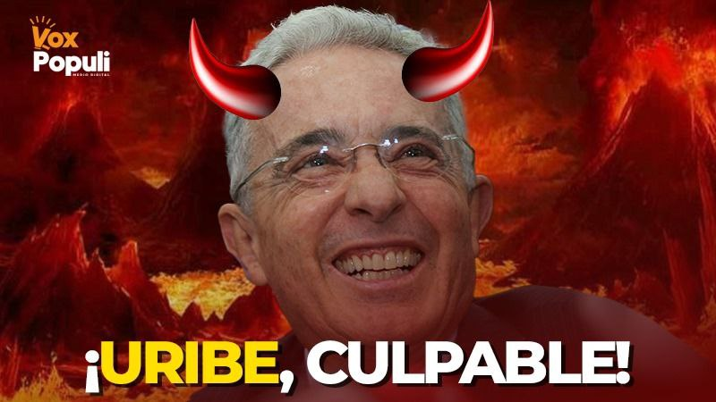
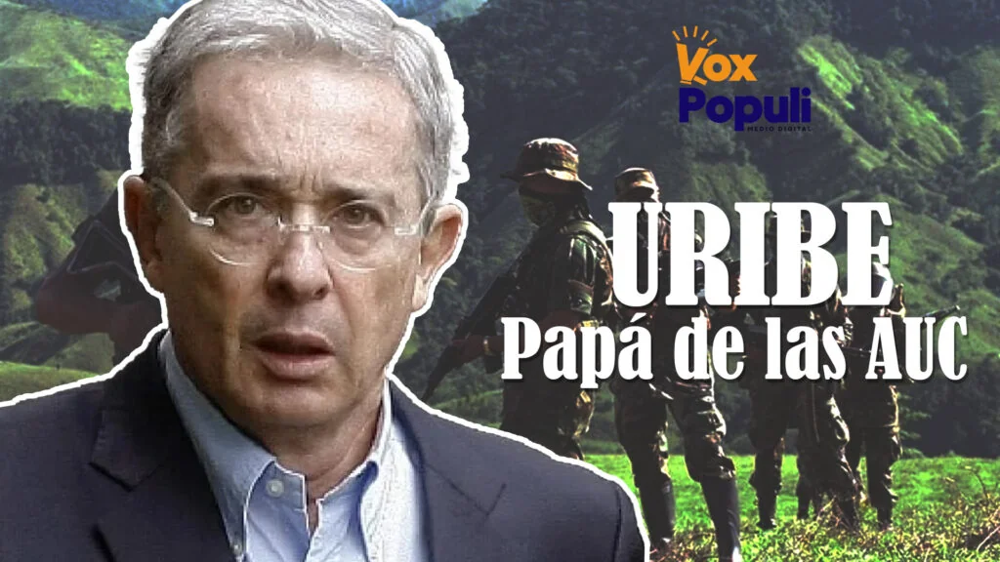

*¡Uribe, condenado! La juez no se arrodilló*

**El Juicio del Siglo habló: ¡Uribe, condenado!** ¿Será el fin de Los intocables? La juez 44 Penal del Circuito de Bogotá, **Sandra Heredia**, no se arrodilló. Por el contrario, **dignificó la justicia** al dictar sentencia condenatoria contra el _todopoderoso_ expresidente **Álvaro Uribe Vélez**. Validó el material probatorio allegado al juicio, especialmente la grabación que registró el momento en que el abogado **Diego Cadena** trató de sobornar a **Juan Guillermo Monsalve**, recluido en La Picota. En este caso, sí se cometió el delito de soborno en actuación penal y fraude procesal en una investigación por manipulación de testigos.

Ese material fue la prueba reina allegada por las víctimas ante la Corte Suprema de Justicia y luego en el proceso donde se juzgó al expresidente de la República, **Álvaro Uribe Vélez**.

La juez, la heroína. El condenado, el padre de las autodefensas. El país, expectante. El mundo político paralizado. Tiembla el establecimiento. A esta hora el desenlace de una historia que por cuatro décadas se tejió entre sombras, poder y silencios. El silencio de los muertos.

## Uribe **¿Ángel o demonio?**

*En el proceso uno de los testigos indicó que Uribe es el papá de las Autodefensas.*

La figura de Uribe divide a Colombia. La polariza. La radicaliza. Igual que el presidente Gustavo Petro. Para unos, Uribe es el salvador de la patria. Para otros, el arquitecto de una maquinaria de impunidad que todavía sangra el país.

Hoy, la balanza se inclina hacia la justicia. La juez Heredia, en un acto de valentía jurídica, rompió el cerco mediático y político que por años blindó al líder del **_neobonapartismo criollo_**.

¿Te interesa? [Álvaro Uribe Vélez ¿un triste final a lo Fujimori?](/articulos/alvaro-uribe-velez-un-triste-final-a-lo-fujimori/)

## **La génesis del juicio**

Todo comenzó en 2018, cuando la Corte Suprema archivó la denuncia de Uribe contra el senador Iván Cepeda. Lo que parecía una estrategia para silenciar voces incómodas se convirtió en el detonante de una investigación que **reveló una red de manipulación** de testigos, sobornos y fraude procesal.

El abogado Diego Cadena, pieza clave, fue el brazo ejecutor de una operación que tenía como único beneficiario al expresidente. Construir pruebas ficticiamente mediante el soborno y el fraude procesal.

## **La prueba reina** contra Uribe

Las grabaciones, testimonios y visitas a cárceles no dejaron lugar a dudas. Uribe sabía. Lo autorizó. Uribe se benefició. La Fiscalía, con la fiscal **Marlene Orjuela** al frente, presentó una tesis sólida: el expresidente actuó como determinador de delitos que socavan la credibilidad del sistema judicial.

La prueba reina fue la grabación que registró el momento cuando el abogado **Diego Cadena** trató de sobornar a **Juan Guillermo Monsalve**. La grabación la hicieron con un reloj inteligente que portaba la víctima del intento de soborno. Son grabaciones confiables que no afecta el debido proceso, dijo la juez.

La togada desestimó todos los argumentos de la defensa de Uribe que solicitó que se invalidara la grabación de Monsalve a Cadena. Las alteraciones que pudo tener no son voluntarias producto de la manipulación sino errores técnicos determinados por las condiciones de la grabación digital.

## **La prensa, ¿cómplice o testigo?**

Durante el proceso, los grandes medios guardaron silencio. Banalizaron el juicio. Ignoraron las pruebas. ¿Por qué? Porque tocar a Uribe era tocar el corazón del establecimiento. Es una muestra ineludible de que la prensa no es libre. No actúa por la verdad sino por el interés propio de sus propietarios o de quienes la poseen.

Pero hoy, la historia les exige una postura ética a los medios de comunicación para ejercer el periodismo que la sociedad necesita: informar con rigor, sin miedo, sin favores.

## **Todo tiene su final**

La condena de Uribe podría desencadenar un efecto dominó. Más de 700 compulsas de copias engavetadas podrían ver la luz. La impunidad, que ronda el 94% según cifras oficiales, podría comenzar a resquebrajarse. La juez Heredia, con su fallo, abre una grieta en el muro de los intocables.

**¿Uribe culpable? Ya no es pregunta. Es sentencia.** El país despierta. La historia se escribe. Y esta vez, la justicia no se arrodilló.