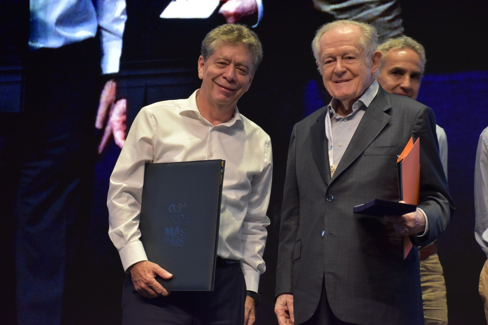
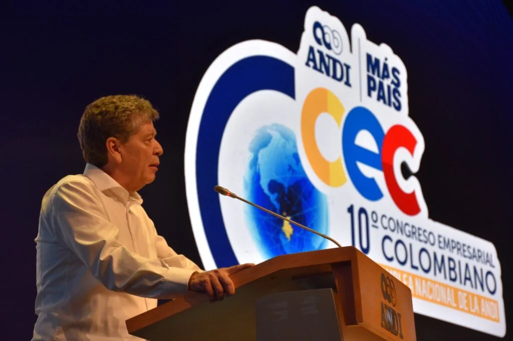

*«Pensar una Colombia en paz» con Luis Carlos Sarmiento, uno de los zares del sistema financiero colombiano. Aquí recibe la medalla al «Orden del Mérito Empresarial José Gutiérrez Gómez». Foto Andi.*

En el cierre del **Décimo Congreso Empresarial de la Andi** **2025**, su presidente, el cartagenero **Bruce Mac Master** **Rojas**, invitó a **«pensar en una Colombia en paz»**. O sea, **«el país que merece cada niño, cada joven y cada trabajador»**. El discurso que representa a los grandes conglomerados del país merece ser desmenuzado a la luz del pensamiento crítico. Un pensamiento libre de las ataduras ideológicas y polarizante que domina el debate prelectoral colombiano, incluso, atrapó a la misma Andi.

El evento realizado en Cartagena, entre el 13 y 15 de agosto de 2025, no se explicó cómo sacar adelante el país. Fue escenario de la polarización política e ideológica de derecha e izquierda. Sus principales invitados propusieron más de lo mismo, especialmente los precandidatos. ¿Puede cambiar una nación con las recetas tradicionales para la economía, la política, la educación o la seguridad? Sin duda, la respuesta es un no tajante.

## «Pensar una Colombia en paz»

¿La dirigencia empresarial y política tradicional es capaz de pensar en una Colombia en paz , democrática y próspera? Al respecto, Mac Master en su discurso dijo:

> «... debemos trabajar por oportunidades para todos donde la educación sea el motor del cambio, la justicia sea imparcial y objetiva; y la economía sirva para el bienestar colectivo.  Ese es, el país que merece cada niño, cada joven y cada trabajador.»

¿Pero qué país está construyendo el gran conglomerado económico y financiero de Colombia? Contrario a lindas palabras de Mac Master, sus jefes, hacen todo lo contrario.

## Democratizar la economía

¿Cómo «pensar una Colombia en paz» cuando la economía colombiana está atrapada entre una estructura concentrada y una promesa constitucional de libertad? **El desafío es democratizar el acceso al capital, al crédito, a la tierra y a los medios de producción.** Solo así puede emerger una economía del Ser, donde la libertad no sea privilegio sino posibilidad compartida.

El dinero fiduciario, emitido por el Banco de la República, circula principalmente en sectores financieros concentrados, no en la economía productiva. Las entidades financieras que aprovechan estas ventajas estratégicas son tres: **Banco de Colombia, Grupo Bolívar y Grupo Aval**.

Precisamente, el dueño de este grupo y megacontratista del Estado, **Luis Carlos Sarmiento Angulo**, recibió la [Orden al Mérito Empresarial “José Gutiérrez Gómez”](https://www.andi.com.co/Home/Noticia/17913-luis-carlos-sarmiento-angulo-y-jorge-ma), la máxima distinción otorgada por la Asociación Nacional de Empresarios de Colombia (ANDI). 

Mientras el capital especulativo se multiplica, el crédito productivo para pequeñas empresas y campesinos es escaso.

## La vergüenza rural

Nos debe avergonzar que como consecuencia de esa falta de libertad económica real tengamos el índice GINI de tenencia de tierra rural en Colombia **de 0.897**, uno de los más altos del mundo. OXFAM calificó a Colombia como el país más desigual de América Latina en cuanto al reparto de la tierra.

Según el Censo Nacional Agropecuario (2014), el 0.4% de las Unidades Productivas Agropecuarias (UPAs) poseen más de 500 hectáreas y ocupan el 75% del área censada. En tanto que el 73% de las UPAs tienen menos de 5 hectáreas y ocupan solo el 2.3% del área.

«Pensar una Colombia en paz» implica democratizar la economía. No solo los poderosos son los grandes emprendedores. En la pequeña, mediana y microempresa, como en el sector solidario, existen emprendedores que generan riqueza con sacrificio.

## Equilibrio social

*El discurso de cierre de Bruce Mac Master, presidente de la Andi, representa a los grandes conglomerados del país que son el poder real. Foto Andi.*

La falta de libertad económica, que va más allá de la libertad de competencia, produce desequilibrio social. La libertad es un derecho fundamental que en economía se hace vital, ya que es la base material de todos los demás derechos. Esto se convierte en un problema estructural que impide el crecimiento espectacular de la economía, profundiza la pobreza y amplía la desigualdad.

El **Décimo Congreso Empresarial**, cuya ruptura con el presidente Gustavo Petro fue la nota diciente, no abordó el tema fundamental: buscar una solución para los grandes problemas del país. Las recetas que presentaron fue más de lo mismo: recorte presupuestal, recorte de impuestos y más exenciones. Al mismo tiempo, pidieron certidumbre y más seguridad, El mandatario no asistió y tampoco lo hicieron sus ministros,

Vale la pena señalar que el Estado no puede restringir la dinámica de acumulación de capital de los grandes. Pero cuando afecta la libertad económica de los más débiles debe intervenir para garantizar el equilibrio social. Si no adoptamos soluciones estructurales, el crecimiento económico solo amplía la brecha de la desigualdad y crea las bases para que las crisis cíclicas solo afecten a los más débiles.

## Los precandidatos presidenciales

En el debate de los precandidatos presidenciales invitados por la Andi presentaron propuestas en seguridad, política fiscal y salud sin «pensar una Colombia en paz». Según Mac Master, debatieron los grandes retos en desarrollo social, económico y gobernabilidad. Pero no tocaron lo esencial: la falta de libertad económica para generar confianza inversionista, crecimiento sostenido e inclusión para el disfrute del bien común.

El Estado heredado por Gustavo Petro es una continuidad de dos siglos de legislar para los más grandes. Las leyes solo favorecen a los pocos conglomerados que dominan la economía y el sistema financiero colombiano. Esto no se lo inventó el actual mandatario.

Por el contrario, a Petro se le debe cuestionar porque en sus tres años de gobierno no hizo nada para detener la falta de libertad económica. De esta manera, favorecer la economía solidaria y popular, la economía real y aquellos que generan riquezas desde su posición marginal.

En _El inmanifiesto del Ser_ se dice:

> «La libertad económica no es la ausencia de regulación, sino la presencia de **condiciones materiales equitativas** para que todos puedan participar en la creación de riqueza. En Colombia, la concentración de propiedad impide esa libertad, al restringir el acceso a tierra, crédito, mercados y oportunidades. Democratizar la propiedad es liberar el potencial del Ser colectivo». ([Ver](/articulos/wp-admin/post.php?post=26723&action=edit))

## La seguridad

En el discurso de Cierre, Mac Master dijo:

> «No podemos permitir que el miedo marque una ruta ni que la violencia nos arrastre de nuevo a épocas oscuras, dominadas por el terrorismo, la división y la impunidad. Tenemos el derecho a exigir seguridad y tenemos el derecho a soñar con seguridad ciudadana.»

Se debe aclarar que la violencia en Colombia es una constante durante estos dos siglos. Por tanto, nunca se ha ido. La nostalgia de la Seguridad Democrática de Uribe, es una falacia. Porque los picos de crecimiento de la economía van aparejados a los niveles de violencia que se ejerció contra sectores sociales que no hacían parte del Establecimiento.

Durante la guerra contra las FARC y los otros grupos alzados en armas, hubo una alianza maldita con escuadrones de la muerte. Esta alianza instrumentalizó a las Fuerzas Armadas y al Estado contra los más débiles del conflicto armado. Recordemos que fue financiada y auspiciada, no solo por empresarios emergentes del narcotráfico, sino también por los grandes conglomerados de la economía nacional.

En la JEP se les conoce como **«terceros civiles responsables»**. Son **Los Intocables** del conflicto que hoy amasan grandes fortunas multiplicadas por el período de terror del paramilitarismo.

## Defender las reglas

El presidente de la Andi en el citado discurso de cierre, pidió:

> «Defender la democracia implica proteger sus fundamentos: el respeto por las reglas, la independencia de los poderes públicos y un marco legal legítimo, transparente y participativo.»
> 
> [Discurso de cierre de Bruce Mac Master](https://www.andi.com.co/Home/Noticia/17914-discurso-de-cierre-decimo-congreso-empr), 15 de agosto de 2025

¿Qué es la democracia? Una democracia real se caracteriza por una ciudadanía libre, activa, informada y comprometida con los asuntos públicos. Esto implica no solo votar, sino también participar en debates, audiencias públicas, veedurías ciudadanas y otros mecanismos de participación directa y control social. 

Muy a pesar de tener una de las mejores constituciones de América y del mundo, la democracia colombiana presenta desafíos como la desinformación, la polarización política, la corrupción y la falta de acceso a la justicia para todos los ciudadanos. Superar estos obstáculos es crucial para consolidar una democracia más justa y equitativa. Los empresarios no han dado muestra de aliarse para enfrentar esos desafíos.

¿Respeto por las reglas? Si las reglas las imponen los poderosos que legislan a través de sus parlamentarios ¿qué pasa con los más débiles cuando dichas reglas los empobrecen cada día más? Por ejemplo, la regla fiscal o la libre competencia entre los grandes conglomerados y la pequeña y mediana industria?