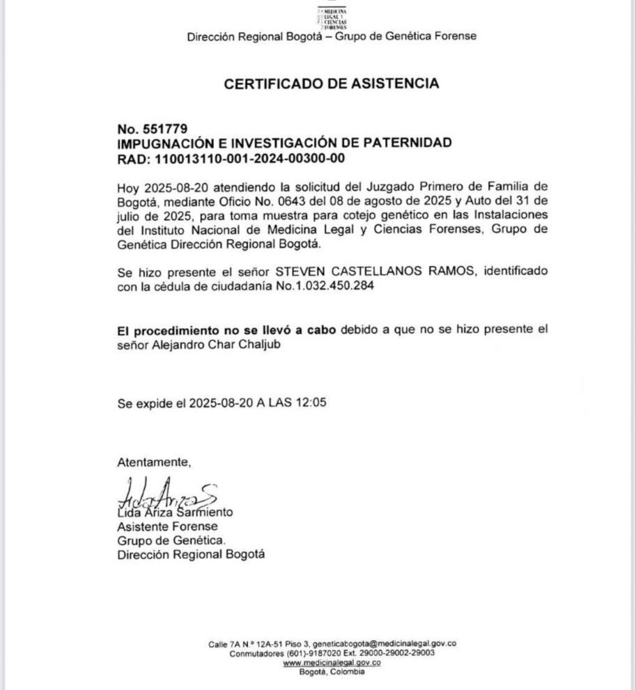

*El alcalde que se burla de la justicia. ¿A Char solo le interesan los negocios y desprecia a su parentela? Aquí en Nueva York junto a Eduardo Verano de la Rosa, gobernador del Atlántico, con la firma inversora Seabury Capital Management (SCM) y con SGI Aviation en un paso importante para endeudar más a Barranquiilla y a los barranquilleros con el pretexto de desarrollo.*

El alcalde que se burla de la justicia y de la ciudadanía. El pasado 20 de agosto de 2025 estaba todo listo en Medicina Legal de Bogotá para resolver una duda que lleva 33 años rondando como un fantasma al alcalde de Barranquilla **Alejandro Char Chaljub**: ¿Es Steven Castellanos Ramos su hijo primogénito? Pero, el flamante alcalde se burló por tercera vez de la justicia, de su presunto hijo y de la sociedad que espera una conducta congruente de su gobernante.

Ese día, el **Juzgado 1 de Familia del Circuito de Bogotá** había citado —por última vez— a Char para que se practicara la prueba de ADN. Steven llegó puntual, esperanzado. Tenía la ilusión de que al fin su padre apareciera y lo reconociera, no en palabras, sino en un resultado científico. Pero la escena fue dolorosa: Char nunca llegó. Y Steven nuevamente debió sentirse profundamente despreciado por su padre ausente.

En efecto, Alejandro Char, dejó plantada a la justicia. Y, de paso, volvió a clavarle a su presunto hijo la daga de la negación. ¿Qué autoridad moral tiene Alejandro Char para hablar contra esos padres irresponsables y ausentes que procrean nuevos seres humanos y los deja a la deriva?

¿Te interesa? [¿El primogénito negado de Alex Char? (I)](/articulos/el-primogenito-negado-de-alex-char-i/)

## El alcalde que se burla de la justicia

*El hijo negado, el de la gorra roja. El alcalde que se burla de la justicia*

La soberbia de Char se exhibió en toda su desnudez. El alcalde que se burla de la justicia, que se pasea por escenarios deportivos y se deja ver en fiestas sociales con influenciadores y futbolistas, no tuvo el mínimo decoro de presentarse en un laboratorio para cumplir con la orden de un juez de la República.

Quien lo viera en Nueva York hablando de proyectos de expansión tecnológica para el centro de mantenimiento, reparación y revisión aeronáutica en el aeropuerto **Ernesto Cortissoz**, no es capaz de vencer el miedo que expresaría su negativa a hacerse la prueba de sangre. Pareciera que solo le interesa el dinero y el poder, conducta despreciable en un verdadero padre de familia gobernante.

¿Cuál es el ejemplo que le da a los barranquilleros y a los colombianos? ¿Qué congruencia ética puede reclamar un gobernante que habla de delincuentes producto de familias disfuncionales y no es capaz de atender a la justicia familiar para que cumpla con su deber? ¿Exige respeto a la ciudadanía, pero Char es ejemplo de lo que es un padre ausente e irresponsable? Lo agravante, al despreciar a su primogénito, está despreciando su propia dignidad. ¿Esta es la verdadera catadura del mejor alcalde de Colombia?

¿Te interesa? [¿Última oportunidad del alcalde Char para prueba ADN? (III)](/articulos/ultima-oportunidad-del-alcalde-char-para-prueba-adn/)

## Un padre ausente, un político altivo

Steven lo esperaba ese 20 de agosto, como lo esperó el 4 de junio cuando también se excusó con la farsa de una incapacidad médica que, según su abogado, lo obligaba a “hidratación oral y antibióticos”. Pero apenas dos días después, el país lo vio celebrando en el estadio Metropolitano con **Juanda Caribe y Teófilo Gutiérrez**, eufórico y sonriente, como si la justicia fuese un chiste.

Este **patrón de conducta** **indecente** no es casual: es la estrategia de la dilación, la evasión sistemática y el desprecio absoluto por un deber humano y legal. El deber de padre y el deber de ciudadano.

## ¿Qué teme Alex Char?

Si Alejandro Char está seguro de no ser el padre, ¿por qué huye de la prueba que podría cerrar este capítulo de una vez por todas? Su negativa se convierte en una confesión silenciosa, en un acto de cobardía política y personal. Es una conducta despreciable en un padre que debía ser ejemplo de todos los padres de Barranquilla.

Lo que proyecta el **comportamiento remiso de Alejandro Char** es miedo, miedo puro y duro. Miedo a la verdad, miedo al espejo de la paternidad negada. Es un profundo miedo a reconocer a un primogénito que lleva más de tres décadas con sus derechos fundamentales conculcados.

¿Te interesa? [Serfinanza: ¿La lavandería del Califato Daeschariano? (I)](/articulos/serfinanza-la-lavanderia-del-califato-daeschariano-i/)

## La crisis de identidad de Steven

Mientras tanto, Steven carga sobre sus hombros la incertidumbre. La revelación tardía de su madre lo llevó a la pregunta existencial que nadie debería cargar en soledad: **¿quién es mi padre?**

El abandono de Char, su huida reiterada y su soberbia frente a la justicia no solo violentan la ley: hieren la identidad de un ser humano que reclama su genealogía, su derecho a la verdad y a la memoria familiar.

## El alcalde que se burla de la justicia y sin ética

Alejandro Char, el alcalde que se burla de la justicia, se presenta como un líder exitoso, heredero de una de las familias más poderosas de la Costa. Pero, ¿qué autoridad moral tiene para gobernar una ciudad cuando es incapaz de afrontar su propia historia íntima? Si, es su vida íntima, pero el gobernante debe ser ejemplo de la ciudadanía en lo público como en lo privado.

Al mismo tiempo, Alejandro Char, con su conducta prepotente, desprecia la institucionalidad que representa, y a la justicia que lo reclama, pero se agacha ante su inmenso poder en Barranquilla y el Atlántico. ¿No existe fiscal ni juez que se plante frente a la arrogancia del poder y del dinero?

Un alcalde que le da la espalda a la justicia y al derecho de un hijo a saber la verdad se convierte en un símbolo de lo peor de nuestra cultura política: poder sin ética, liderazgo sin moral, soberbia sin límites. Esto es lo que los periodistas éticos de Barranquilla deberían preguntarle a su alcalde. Pero no lo hacen, porque el alcalde Char también desprecia a los mismos periodistas, puesto que en en esta administración jamás ha convocado a los medios de prensa para rendir cuenta.

El caso de Steven Castellanos no es solo un proceso judicial de filiación. Es el espejo roto de un gobernante que, con su conducta, desvela la contradicción entre la fachada de poder y la fragilidad ética de su vida privada.