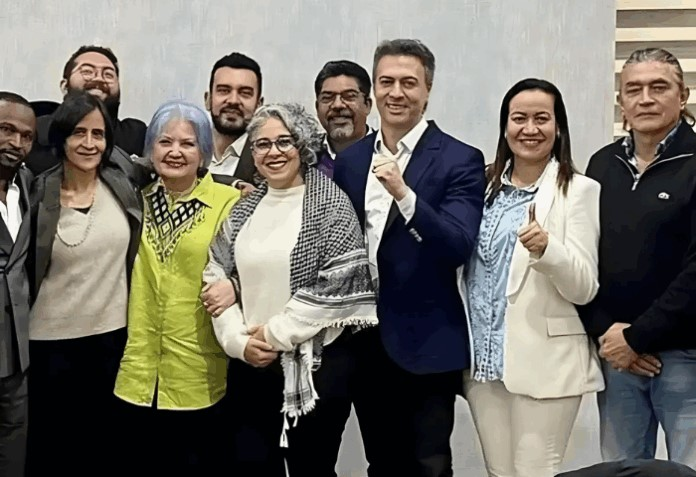

*A consulta popular del Pacto Histórico Daniel Quintero, exalcalde de Medellín; Carolina Corcho, exministra de Salud; e Iván Cepeda, senador del Polo.*

El Pacto Histórico volvió a demostrar que, a la hora de tomar decisiones estratégicas, su margen de autonomía es limitado. Para zanjar la discusión sobre el mecanismo de elección del candidato presidencial, con solo dos líneas de 13 palabras en X, su red social preferida, **el presidente Gustavo Petro impuso la consulta popular en su coalición de gobierno**.

De esa manera, el debate no tuvo una consecuencia democrática. Porque los órganos de dirección de la coalición quedaron completamente relegados ante la autoridad presidencial.

El jefe de Estado, a través de un mensaje en X, zanjó la controversia: **sí habrá consulta el próximo 26 de octubre**. Con ello, dejó en claro que el derrotero de la principal fuerza de izquierda del país se sigue definiendo desde la **Casa de Nariño**. Esto demuestra que no existen espacios propios de deliberación del movimiento.

/articulos/petrogustavo/status/1971568363060302123

¿Te interesa? [Petro propone el «ejército de salvación» para liberar a Gaza](/articulos/petro-convoca-a-voluntarios-colombianos-para-combatir-en-gaza/)

### Bajo la sombra de Petro

*El Pacto Histórico sin rumbo propio, Petro impuso la consulta.*

No solo Petro impuso la consulta sino que también hizo que todos se plegaran a su designio. De un abanico amplio de aspirantes y fuertes choques internos, quedaron en competencia tres figuras: Daniel Quintero, exalcalde de Medellín; Carolina Corcho, exministra de Salud; e Iván Cepeda, senador del Pacto Histórico.

Asimismo, la llamada “izquierda pura” del movimiento había intentado bajarse de la consulta, temiendo que Quintero resultara favorecido en las urnas. Sin embargo, la orden presidencial de mantener el mecanismo alteró los cálculos: la contienda seguirá adelante, aunque bajo la percepción de que fue Petro, y no el Pacto, quien definió las reglas del juego.

### Cepeda, la carta frente a Quintero

En reacción, varios sectores de izquierda cerraron filas en torno a **Iván Cepeda** para enfrentar a Quintero, a quien acusan de representar intereses ajenos al ideario del progresismo. Se habla de un **“todo o nada”** frente a un exalcalde señalado de tener apoyos de maquinaria política, acusación que él niega categóricamente.

En paralelo, los tres precandidatos iniciarán 30 días de campaña intensa en busca de respaldo popular, mientras Petro parece tener un objetivo adicional: mostrar que el petrismo conserva fuerza electoral y que aún puede encaminar a la izquierda hacia un nuevo triunfo en la Casa de Nariño.

### Renuncias y fracturas

*Gustavo Bolívar renunció a su precandidatura. Petro impuso la consulta.*

La imposición de la consulta también derivó en renuncias significativas. **Gustavo Bolívar, María José Pizarro y Susana Muhamad** declinaron sus aspiraciones presidenciales. Bolívar fue enfático:

> “Mi coherencia está por encima de cualquier ambición política. No puedo apoyar a un imputado por corrupción, que en dos meses se sentará en el banquillo de los acusados”, dijo en alusión a Quintero.

Bolívar anunció su respaldo a Cepeda, a quien calificó como un hombre “decente” y prometió trabajar en su campaña “con grandeza y con mucho amor”.

### Un pacto sin pacto

El episodio deja al descubierto la fragilidad interna del Pacto Histórico: un movimiento que, en teoría, agrupa múltiples expresiones de la izquierda, pero que en la práctica sigue subordinado a la voz del presidente. La consulta, lejos de fortalecer la autonomía política del bloque, refuerza la percepción de que las decisiones cruciales no se toman colectivamente, sino bajo la tutela de Petro.