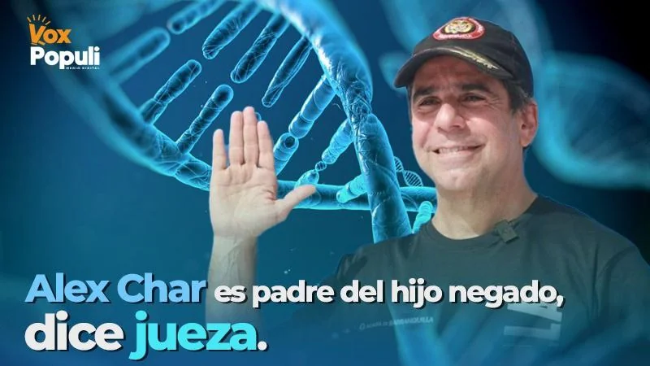
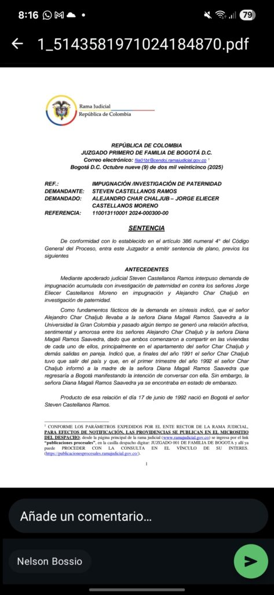
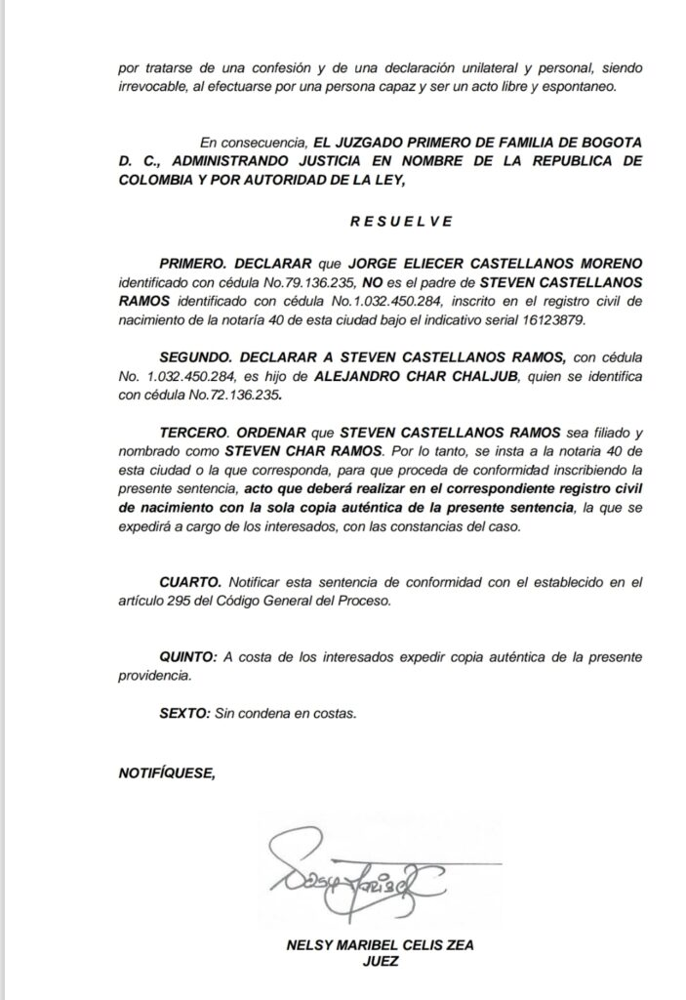

*Alex Char es padre del hijo negado, según jueza (VI)*

En este mes de octubre vale la pena analizar el medioevo concepto de «pureza racial» de la familia Char Abdala a partir de la decisión judicial que consideró que **Alex Char es padre del hijo negado.** Si él lo quiere, el joven llevará el apellido Char para toda su vida. A pesar de **mentir una y otra vez** ante el juez para negar la **primogenitura de Steven** y de engañar mediante estratagema a la parte demandante y al juzgado, **finalmente el fallo judicial fue en su contra**.

¿**Steven Char Ramos**, primogénito de **Alex Char**, tendrá los mismos privilegios de los hijos de Char concebidos en su matrimonio con [Katia Nule](/articulos/katianule/?hl=es)? ¿Sufrirá el mismo trato de discriminación y marginación que azotó a **[Farid Char Ahumada](http://El muerto al hoyo, los Char Yidi quieren quedarse con más de $80 mil millones, la herencia de Farid Char \(IV\))**, hijo de **Farid Char Abdala** y sobrino de **Fuad Char Abdala**, que lo llevó al sufrimiento por una adicción a las sustancias alucinógenas y finalmente a su triste muerte? Si te quedas hasta el final, encontrarás una aproximada respuesta de esta penosa noticia del mejor alcalde del país, **Alejandro Char Chaljub**.

Este hecho, aparentemente trivial, descubre el comportamiento público y privado de la familia más poderosa de la región Caribe y, en especial, del líder político considerado por las encuestas como el burgomaestre más aceptado de Colombia. **Es una derrota judicial de valor ontológico incalculable**, porque es una reflexión sobre la existencia del Ser. Una derrota a la conducta cuestionable de los Char que está marcada por el clasismo, la soberbia y la hipocresía que se acrecienta con el dinero y el poder político.

## El espejo moral

Por ende, representa el espejo moral de **Alex Char Chaljub** que trasciende el ámbito de su privacidad. No se trata solo de un conflicto legal sino de un síntoma de su manera de concebir el poder y las relaciones humanas: **el mismo patrón de ocultamiento y manipulación que caracteriza su gestión política y empresarial.**

La reciente decisión del **Juzgado Primero de Familia del Circuito de Bogotá**, que declaró la paternidad de Char sobre el joven **Steven Castellanos Ramos**, no solo pone fin a más de tres décadas de negación. La élite costeña, adicta al poder y aferrada a sus privilegios, exhibe ante la opinión pública su verdadera estructura mental por orden judicial. Se trata de una lógica ancestral de linaje: Una noción de ‘pureza racial’ de clase y un profundo desprecio contra los que nacen fuera de su círculo dorado.

## Habló la juez

Ante la insistencia del abogado, que representa al hijo negado de **Alejandro Char Chaljub**, para que se cumpla la ley, la juez **Nelsy Maribel Celis Zea** ordenó que Alex Char es padre del hijo negado. El fallo judicial lo radicaron con el **No 110013110001 2024-000300-00**:

> _**PRIMERO**. Declarar que que Jorge Eliécer Castellanos Moreno no es el padre de Steven Castellanos Ramos inscrito en el registro civil de nacimiento de la notaría 40 de esta ciudad bajo el indicativo serial 16123879.  
> **SEGUNDO**. Declarar a Steven Castellanos Ramos hijo de ALEJANDRO CHAR CHALJUB, quien se identifica con cédula No.72.136.235.  
> **TERCERO**. Ordenar que Steven Castellanos Ramos sea filiado y nombrado como **Steven Char Ramos**. Por lo tanto, se insta a la notaria 40 de esta ciudad o la que corresponda, para que proceda de conformidad inscribiendo la presente sentencia, acto que deberá realizar en el correspondiente registro civil de nacimiento con la sola copia auténtica de la presente sentencia, la que se expedirá a cargo de los interesados, con las constancias del caso._

### Char es padre del hijo negado

*Alex Char es padre del hijo negado*

Como reveló, en exclusiva, **_VoxPopuli.digital_** en entregas anteriores — [¿El primogénito negado de Alex Char? (I)](/articulos/el-primogenito-negado-de-alex-char-i/), _“_[_El alcalde que se burla de la justicia, de su hijo y de la sociedad”_](/articulos//¿Última oportunidad del alcalde Char para prueba ADN? \(III\))_—, el proceso de filiación se convirtió en un auténtico drama moral. Citado varias veces por el juez para practicarse la prueba de ADN, el alcalde de Barranquilla evadió sistemáticamente las diligencias judiciales mediante la mentira y la manipulación. Ni siquiera su investidura ni su aspiración a proyectarse como figura nacional lo disuadieron de incumplir con la ley y con un deber elemental de humanidad: **reconocer a su propio hijo.**

El silencio y la soberbia con la que Char maneja este caso, lo dice todo. Alejandro Char negó a Steven durante más de treinta años. El joven es hijo de una humilde trabajadora de la inmobiliaria familiar. Char la conoció en 1991, cuando era un joven ingeniero protegido por la fortuna y el apellido. Una joven que debió estudiar de noche para graduarse como ingeniera. Esa negación fue también una forma de autoafirmación clasista: no podía permitirse un hijo **«**fuera de su círculo**»**, menos aún con una mujer de origen humilde. En el fondo, el caso refleja una frontera invisible que sigue separando a las élites costeñas de la gente del común.

### ¿Por qué Char miente?

La pregunta es inevitable. ¿Por qué un hombre con tanto poder, recursos y reconocimiento social se empeña en mentir ante la justicia y en negar su propia sangre? He aquí el espejo moral de Alex Char en este contexto donde existe una crisis de moralidad pública.

Las ciencias sociales ofrecen una respuesta compleja pero reveladora. Según la **psicología social**, la **antropología** y la **sociología contemporánea**, existen razones mentales, sociales y culturales entrelazadas que explican la conducta del alcalde barranquillero: **la tendencia de ciertos grupos sociales a no emparentarse ni mezclarse con personas ajenas a su clase**.

## El espejo moral de Alex Char

*Si Alex Char es padre del hijo negado por orden judicial ¿Cómo queda moralmente frente a sus demás hijos? ¿Katia Nule, su esposa, tuvo el derecho a la verdad.*

La conducta que debe tener un mandatario nacional, regional o local debe ser congruente y coherente. La vida pública debe ser reflejo de su conducta pública. En otras palabras, Alejandro Char debe estar a la altura de lo que dice ser: el mejor alcalde de Colombia. Los hechos, lo desmienten categóricamente.

En consecuencia, el espejo moral de Alex Char reflejó su verdadera catadura en este caso específico. Char es padre del hijo negado y debe reconocer la primogenitura de Steven, quien desde hoy se llamará: **Steven Char Ramos**. Para entender lo esencial de este hecho, lo explicaré desde una perspectiva sociológica, antropológica y mental. Apelaremos a nuestro concepto del Ser expuesto en **[El Inmanifiesto del Ser](https://lagrancolombia.info/)**. Pero, principalmente para tener un acercamiento de la verdad verdadera, sin sesgo político o ideológico.

#### 1\. La dictadura del ego

Desde la perspectiva del razonamiento del Ser, la conducta de Char Chaljub está dominada por el **Ego**, esa máscara social orientada por el deseo que busca reconocimiento, poder y control. En lugar de actuar desde la conciencia —que libera al ser humano del miedo al juicio social—, el Ego impone la dictadura del prestigio y la apariencia.

El resultado es un ser fragmentado, esclavizado, que vive pendiente de su imagen y rehúye todo lo que pueda manchar su «honor». En el caso de Char, ese Ego clasista, segregacionista, lo llevó a negar un vínculo biológico porque no encajaba en el **relato de pureza familiar** que protege su apellido y su dinastía política.

#### 2\. El sesgo endogrupal y la obsesión por la pureza de clase

La **psicología social** denomina _sesgo endogrupal_ a la tendencia humana de favorecer a los que percibimos como parte de «nuestro grupo» y excluir a los demás. En las élites económicas, ese sesgo se convierte en un principio de supervivencia simbólica: casarse, relacionarse o tener descendencia fuera del círculo de privilegio amenaza la cohesión y el control del grupo.

En otras palabras, negar al hijo es también una forma de preservar el clan. La sangre del poder no puede «mezclarse» con la plebe. Esa lógica feudal, disfrazada de modernidad, sigue viva en las estructuras familiares de los grupos empresariales y políticos del Caribe. El hecho de que Alex Char hable con desfachatez, luzca gorra deportiva, jean y tenis para hacerse popular, es simplemente una fachada de su verdadera esencia tosca y hostil que se mostró contra la dignidad de su propio primogénito. ¿Qué se espera de los demás? El _sesgo endogrupal_ lo refleja cuando solo muestra una foto fachada de su familia como un flash de una armonía familiar inexistente.

#### 3\. La reproducción social: el mandato de Bourdieu

El sociólogo francés **Pierre Bourdieu** explicó que las clases dominantes tienden a reproducirse a sí mismas a través del control del **capital económico, cultural y simbólico**. La familia es su principal instrumento de conservación: se elige pareja dentro del mismo estrato, se educa a los hijos en colegios de élite, se cierran los círculos sociales y se estigmatiza a quienes provienen «de abajo», como lo hace Alex Char.

Así, el caso Char no es una anomalía, sino una manifestación más del sistema de **reproducción de clase** que domina en la Costa Caribe desde tiempos coloniales. En esa lógica, reconocer a Steven Castellanos —hijo de una empleada— habría roto el equilibrio del capital simbólico familiar, introduciendo una «mancha» en el árbol genealógico de los Char Chaljub.

### La herencia del clasismo caribeño

En las ciudades caribeñas, el apellido aún pesa más que la ley. El origen sirio libanés de la familia Char —integrada a la élite económica barranquillera desde los años 70, coincidente con la **«bonanza marimbera»**— es acompañado por una estrategia de ascenso social basada en la política, los negocios y el control mediático. Sin embargo, esa élite conserva una profunda ansiedad por distinguirse del resto de la sociedad.

El clasismo, en este contexto, no es solo una actitud, sino un mecanismo de poder. Define quién merece respeto, quién es **«**gente bien**»** y quién debe permanecer en los márgenes. Al negar a su hijo, Char reproduce inconscientemente ese modelo: el del señor que decide quién pertenece y quién no.

La tragedia es doble. Al joven Steven no solo lo negó su padre, sino también por una sociedad que normaliza la impunidad moral de los poderosos. La justicia actúa tarde, y la prensa local —dependiente de los mismos poderes— se enmudece. Los medios de comunicación noticiosos guardan silencio cómplice o trivializa el hecho.

### La farsa del liderazgo moral

Alejandro Char ha construido su imagen pública sobre la narrativa del “alcalde cercano”, el que baila en las calles y se abraza con el pueblo. Pero detrás de esa máscara populista, se esconde un patrón psicológico de control y negación: el mismo que lo lleva a ocultar, mentir y manipular los hechos cuando estos amenazan su imagen.

El **embuste como método de gobierno** no surge de la nada: es la extensión del autoengaño personal. Quien miente en su vida íntima difícilmente puede ser transparente en la vida pública. Y en el caso de Char, el desprecio hacia el hijo que negó es también desprecio hacia el ciudadano común al que dice representar.

### Un espejo de la sociedad

La historia del hijo negado de Char no es solo una anécdota de alcoba, es un espejo de la cultura política colombiana. Es el lugar común en una sociedad hipócrita dominada por el Ego, que solo vive de apariencia. Una sociedad que trivializa lo esencial y reduce a la mínima expresión la esencia humana. Muestra cómo los políticos y las élites utilizan la mentira como estrategia de supervivencia y cómo la sociedad tolera esa impostura con resignación. ¿Cómo se explica que Alejandro Char tenga el 80% de aceptación en las encuestas? ¿Barranquilla tiene los ojos cerrados?

Negar al hijo es negar la verdad, negar la humanidad compartida. Es la metáfora más cruda del sistema que gobierna: una minoría que se mira al espejo y solo reconoce su propio reflejo, incapaz de ver al otro como igual.

¿Por qué una ciudad liberal como Barranquilla se dejó manipular de esta élite moralmente decadente? ¿Será que la sociedad está alienada por la información sesgada, los carnavales, el Junior y la Selección Colombia? Los periodistas íntegros e independientes de Barranquilla están llamados a romper este dominio monolítico de la familia Char. Si los periodistas cambiamos, cambia el periodismo, dice el periodista polaco [**Ryszard Kapuscinsky**](/articulos/es/recursos/relatorias/ryszard-kapuscinski-reporteros-del-tercer-mundo#:~:text=El%20peligro%20de%20esta%20profesi%C3%B3n,%C3%BAnica%20gu%C3%ADa%2C%20no%20hay%20otra.). Yo agrego, si el periodista cambia, cambia la gente, cambia la sociedad.

El juez ya habló con su decisión de otorgar la paternidad de Alejandro Char de Steven. Ahora tendrá el apellido Char. ¿Tendrá los mismos privilegios de los hijos de Char concebidos en su matrimonio con [Katia Nule](/articulos/katianule/?hl=es)? La justicia humana, al menos esta vez, hizo su parte. Falta que la justicia social y moral también despierte.

El espejo moral de **Alex Char Chaljub** está representado en este hecho. Un caso cerrado, por ahora.