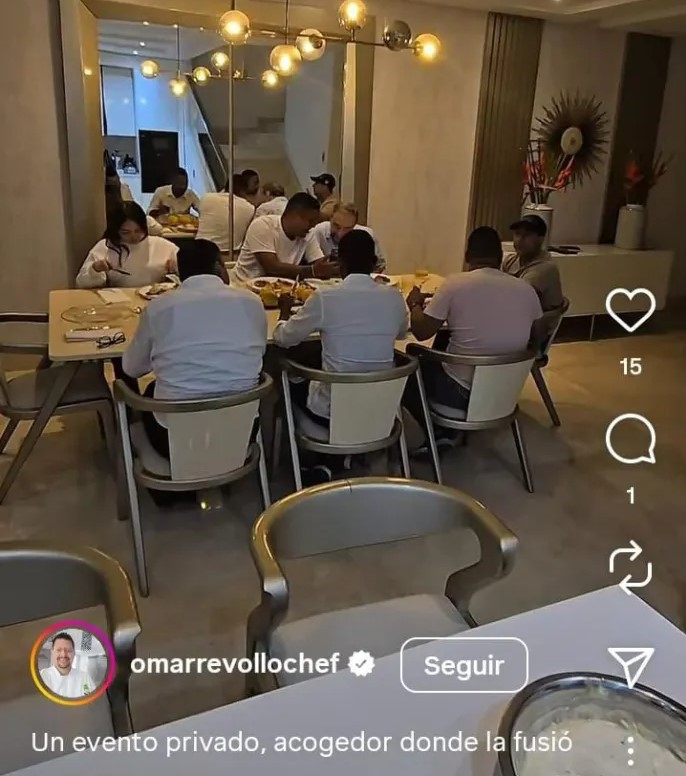
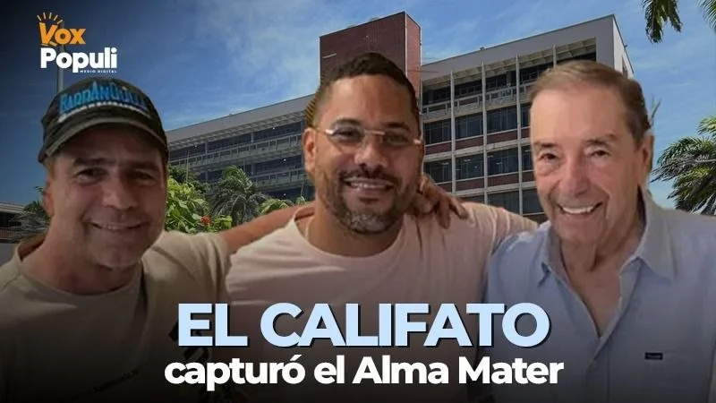

*Conozca los consejeros que vendieron la autonomía universitaria por un plato de lentejas. Lo peor, entre ellos los representantes de estudiantes y egresados.*

En el corazón político del Caribe, donde el poder se cocina a fuego lento y los favores se sirven en bandeja, **la Universidad del Atlántico** volvió a ser el plato fuerte. A espaldas de la comunidad académica, lejos de la deliberación pública y del mérito, cinco consejeros del Consejo Superior participaron del crimen político que compró la **autonomía universitaria.** Alrededor de ellos, dos figuras centrales del poder local: **Fuad Char Abdala**, patriarca del clan, y su hijo, **Alejandro Char**, alcalde de Barranquilla. En el Centro de esa compra: **Álvaro Leyton Barrios Torres**, el recien elegido rector, beneficiario de ese crimen que fue un festín.

Ese almuerzo —que varias fuentes confirman y cuyas fotografías circularon ampliamente en redes sociales— no fue un acto social. Fue **la escena del crimen político** con el que se torció la elección del rector de la Universidad del Atlántico. Allí se alinearon los votos que consagraron a **Álvaro Leyton Barrios**, un candidato sin mérito académico válido, pero con la bendición de los dos cabecillas del clan que hoy ejercen un control total sobre la vida institucional, contractual y administrativa del alma mater.

## **El festín del poder**

*El festín presidido por el patriarca Fuad Char. En la punta de la mesa, el alcalde Alejandro Char. Alrededor de la.mesa los.consejeros comprados: Angelly Diaz Cordero, Abraham Scool Gonzalez, Miguel Caro y Manuel Fernández Ariza.*

La imagen de los consejeros degustando un plato de lenteja —metáfora bíblica de la renuncia de su libertad por un beneficio inmediato— se volvió símbolo del deterioro ético del órgano que debería defender la autonomía universitaria. Pero aquí no hubo metáfora: el plato fue literal, cocinado con el toque sirio—libanés que caracteriza al chef Revollo y al gusto del clan Char. El crimen estaba cocinado.

En esa mesa se sentaron, según se puede apreciar en la imagen difundida por **Omar Revollo**, quien luego eliminó pero quedó la captura de pantalla:

*   **Abraham Scool González**, representante de los egresados.
*   **Angelly Díaz** **Cordero**, representante de los estudiantes.
*   **Manuel Fernández Ariza**, delegado de la Cámara de Comercio.
*   **Miguel Caro**, representante de las directivas universitarias.

Cuatro de los 5 que votaron posteriormente por Leyton Barrios Torres. Con **Eduardo Verano**, el gobernador, hicieron la mayoría decisoria del Consejo Superior, compuesto por nueve miembros. Estos servidores públicos tenían la responsabilidad de evaluar a los cinco candidatos que se presentaron al proceso de elección: académicos con trayectoria, propuestas de modernización, y también el rector saliente, que buscaba continuar su gestión. Pero el almuerzo alteró el equilibrio. Los cuatro consejeros que pasaron por el Revollo votaron en bloque por el mismo nombre: **Leyton Barrios**.

¿A estos consejeros se les puede revocar el mandato por vender la autonomía universitaria? ¿El Chef Revollo volverá a ser teatro de un nuevo crimen de la corrupción política? ¿Quién puede pagar sus caros y finos menús? ¿Los corruptos? ¿Los narcos?

## **El plan funcionó a la perfección**

Ese voto amarrado no solo fracturó el proceso democrático. Lo vació de sentido. La elección se convirtió en un trámite coreografiado desde el poder del dinero y de la política local. **La pelea democrática era una farsa,** Solo cuatro de los cinco candidatos tenían posibilidad de ser elegidos, no por su méritos sino por sus influencias para torcer la voluntad de la mayoria del Consejo Superior. Ellos son: **Danilo Hernández Rodríguez**, con 6.345,56 votos, **Álvaro González**, con 3.996,73 votos, **Leyton Barrios** con 3.496,07 votos, **Wilson Quimbayo**, con 3.349,57 votos.

De suyo, Hernández Rodriguez era el mejor posicionado por la consulta que se hizo a la usanza politiquera. Así se desdibujó la democracia y la autonomía universitaria. Tenía el respaldo de **Arturo Char**.

La segunda opción era González. Su respaldo era problemático: **Eduardo Pulgar**, el ex senador condenado por corrupción a la justicia.

La tercera opción era Leyton Barrios. Pero su respaldo era todopoderoso: Fuad y Alejandro Char.

El cuarto candidato mejor posicionado era Wilson Quimbayo. Su respaldo también era todopoderoso: **el ministro del Interior Armando Benedetti y su aliado Euclides Torres**.

La última opción fue **Alcides Padilla** con 967 votos que recibió en la consulta. No tuvo respaldo politiquero y quizás era la mejor alternativa. ¿Por que no funcionó la democracia con la mejor propuesta? Necesitaríamos hacer un análisis más profundo.

El poder político externo y el dinero de los poderosos, convirtieron en un teatro el proceso de elección del rector de la Universidad del Atlántico. Un proceso que ya tenía final escrito.

La comunidad universitaria esperaba un debate serio: revisión de hojas de vida, análisis de propuestas, discusión sobre los desafíos de la universidad. Nada de eso ocurrió. Lo que sí hubo fue un almuerzo discreto, pero perfectamente calculado para consolidar la captura. Las fotos filtradas mostraban sonrisas, brindis y camaradería. Nada más elocuente: los consejeros no estaban siendo presionados, estaban **celebrando** el concierto para delinquir que consumaron el dia de la sesion del Consejo Superior que designó a Leyton Barrios, _made in_ El Guamo.

## **La universidad como botín**

Lo que ocurrió en ese almuerzo es la confirmación de un fenómeno que **VoxPopuli Digital** viene advirtiendo desde hace 25 años: **la Universidad del Atlántico dejó de ser un centro académico para convertirse en un botín político**. El clan Char avanzó sobre ella con la misma estrategia con la que ha copado el Junior, aeropuerto, la **Triple A**, el estadio Metropolitano, los hospitales, el carnaval, el corredor de cargas y las empresas públicas del distrito. Todos son tomas a través de negocios turbios como el agua de Bocas de Cenizas.

Los consejeros que debían ser garantes de la transparencia terminaron convertidos en convidados de piedra del poder económico y político más dominante del Caribe colombiano. Allí sellaron su verdadera catadura de servirles y esclavos del poder. Son esclavos por naturaleza, como bien lo caracterizó Aristóteles.

Los **esclavos por naturaleza** son incapaces de gobernarse a sí mismos. Por tanto, están destinados a servir a los que sí tienen la capacidad de gobernarse. Pero a diferencia de lo que pensó Aristóteles para justificar la esclavitud, este espíritu de servilismo es adquirido y dotado por la hegemonía dominante, a la manera cómo lo explica **Antonio Gramsci**. Esos consejeros son unos servirles del poder dominante, incapaces de rebelarse de los políticos que detentan el poder. Porque no están centrados en el Ser sino en el tener. No es una opinión, es el razonamiento lógico y objetivo de las pruebas que se presentan de este crimen político que podria traducirse en un **concierto para delinquir**. ¿Quienes son los determinadores? Los que están detrás de esos candidatos.

## **¿Y ahora quién responde por la autonomía?**

La elección de Leyton Barrios no es solo un episodio más. Es un mensaje claro: la autonomía universitaria está herida de muerte. ¿Está muerta? Los estudiantes quedaron sin representación real. Los egresados fueron usados como adorno legitimador. Y los gremios empresariales (Cámara de Comercio) validaron, una vez más, el pacto de poder que domina a Barranquilla: el **Califato Daeschariano**. Curioso, los Daes son los amos y señores de la Cámara de Comercio de Barranquilla que también la capturaron con trampa.

La comunidad universitaria tiene derecho a exigir explicaciones. A pedir las actas, los registros de votación, las comunicaciones previas y posteriores a ese almuerzo. A saber qué se negoció, qué se ofreció y qué se prometió.

Porque la universidad pública no se negocia en un restaurante. Se defiende en las aulas, en los laboratorios y en la conciencia de quienes, alguna vez, juraron protegerla.

Eduardo Verano, gobernador, Abraham González, (representante egresados), Angelly Díaz (representante de estudiantes) Manuel Fernández Ariza (representante cámara de comercio) y Miguel Caro (directivas de la Universidad hicieron parte de este concierto para delinquir. Este informe será presentado como denuncia penal contra los consejeros y los candidatos. Por supuesto, contra los hombres de atrás de este crimen político.