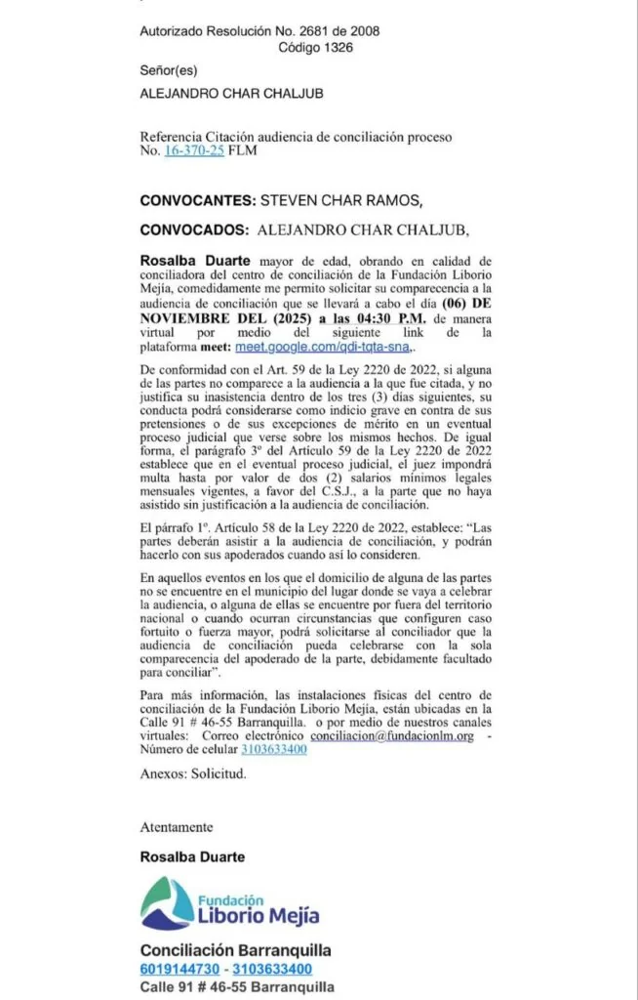

*La soberbia de Alejandro Char lo hace un sociópata ante su hijo.*

La soberbia de **Alejandro Char** fue evidente. Dejó esperando a Steven Char Ramos este 6 de noviembre en el **Centro de Conciliación Liborio Mejía** de Barranquilla. Como aquel día remoto, hace 33 años, cuando su madre **Diana Ramos** lo esperó con el alma hecha trizas, justo después de confesarle que llevaba su destino palpitando en el vientre.

El individuo exhibe un patrón constante de desprecio por los derechos de los demás, incluso por los de su propio hijo. Manipula, miente y utiliza el poder de las redes sociales como escenario de su engaño. No siente culpa; se escuda en el silencio cómplice de los medios que lo glorifican. Carece de empatía, actúa con impulsividad, irresponsabilidad y una arrogancia calculada que disfraza con un encanto superficial. ¿De quién hablo? ¿De un sociópata anónimo?

¡No! Hablo del hombre que muchos llaman _el mejor alcalde de Colombia_. Hablo de **Alejandro Char Chaljub**, el mandatario de la cuarta ciudad más grande del país.

## La reflexión

Entonces, como ahora, el silencio fue testigo en un frustrado acto de conciliación entre padre e hijo. La espera se volvió ritual. Y la ausencia, sentencia por encima de la decencia.

La reflexión de este acto de negación es la siguiente:

Cada barranquillero, especialmente las mujeres y jóvenes, debe pensar la actuación de su gobernante. Si Alejandro Char no le cumple a su primogénito que lo invitó humildemente a conciliar después de demostrar su filiación paterna ¿cómo le va a cumplir a una ciudad adormecida por sus obras suntuosas y un desarrollo humano deplorable y el silencio cómplice de los medios de comunicación?

## La soberbia de Alejandro Char

*No conciliación de Char*

**Alejandro Char Chaljub**, alcalde de Barranquilla, volvió a quedarse en silencio. No asistió. La cita, que incluso se habilitó en modalidad virtual para facilitar su participación, fue ignorada con la misma frialdad con la que, según Steven, lo ha hecho toda la vida. Lo dejó esperando como hace 33 años cuando su madre lo esperó en el centro comercial de Las Américas de Bogotá.

Esa ausencia no fue solo la de un hombre que elude una diligencia jurídica. Fue la ausencia simbólica de un padre que, pese a la evidencia judicial que reconoció la filiación, sigue negando a su primogénito. Una ausencia que duele más que cualquier sentencia.

**VoxPopuli Digital**, que reveló en exclusiva desde junio de 2025 la demanda de filiación instaurada por **Steven Char Ramos**, reconstruye hoy este nuevo capítulo que no solo habla de un conflicto familiar, sino de una forma de ejercer el poder: **el del hombre que se siente por encima de todo, incluso de su propia sangre.**

### **El hijo que pidió diálogo**

*Los dos hijos de Alejandro Char: el primogénito Steven y el junior, Alejandro.*

El 22 de octubre, Steven Char Ramos —ya con el fallo judicial que certifica su filiación— actuó con nobleza. No buscó venganza, ni exhibición mediática. Envió un escrito formal al **Centro de Conciliación**, solicitando una audiencia **extrajudicial en derecho** para dialogar con su padre, con la esperanza de un encuentro que nunca llegó.

No fue una citación para pelear. Fue una invitación para sanar. Un intento de acercamiento que, más allá del trámite legal, era un gesto humano: el de un hijo que, pese al abandono y al rechazo, aún guardaba la esperanza de ser escuchado.

Pero Alejandro Char, con su habitual arrogancia de caudillo político, decidió no presentarse. No hubo excusa válida. No hubo palabra. Solo el eco de un silencio que ensordece.

### **La soberbia de un poder hereditario**

En Barranquilla, la familia Char ha construido un imperio político que ha sabido confundir el liderazgo con la omnipotencia. En su cosmovisión, las decisiones se toman sin consultar, las verdades se imponen y los afectos se administran como contratos.

La actitud del alcalde frente a su hijo no es un hecho aislado. Es la proyección íntima de su estilo de gobierno: autoritario, cerrado al diálogo, centrado en la imagen y las obras de cemento, pero vacío de empatía y de sentido humano.

Porque si un hombre no es capaz de escuchar a su propio hijo cuando lo llama a conciliar, ¿cómo puede escuchar a una ciudad que clama por equidad, transparencia y justicia social?

### **El espejo de la ciudad**

El caso de Steven Char Ramos es, en el fondo, un espejo de Barranquilla. Así como el joven buscó un reconocimiento que le fue negado durante años, miles de barranquilleros también buscan hoy que su alcalde los reconozca como ciudadanos y no como espectadores de su poder.

Las luces de la Ventana al Mundo, las avenidas recién pavimentadas y los megaparques no pueden ocultar una verdad que duele: **la ciudad crece hacia afuera, pero se vacía por dentro**. Mientras se inauguran obras suntuosas, aumentan la pobreza, la desigualdad y el desempleo informal.  
La soberbia del poder se traduce en indiferencia social.

### **La justicia que viene del alma**

Steven Char Ramos logró lo que parecía imposible: que la justicia colombiana reconociera oficialmente lo que la biología ya sabía. Pero más allá del fallo, lo que buscaba era algo mucho más profundo: un abrazo, una palabra, una conversación.

Lo que recibió fue silencio.

Esa actitud del alcalde no solo lo retrata como un hombre que evade su responsabilidad paterna; también lo desnuda como un líder incapaz de asumir los conflictos con humildad. Se transforma en un sociópata

La política, cuando se deshumaniza, se convierte en espectáculo. Y la soberbia, cuando se vuelve costumbre, termina devorando el alma de las instituciones.

### **Barranquilla merece un padre que escuche**

En las calles de Barranquilla, muchos aún justifican su comportamiento bajo el argumento del éxito político. Pero el verdadero liderazgo no se mide por las obras, sino por la capacidad de escuchar.  
Un alcalde que ignora el llamado de su propio hijo no solo le falla a su familia: le falla a su pueblo.

Este caso no es una anécdota privada. Es una alerta moral. Nos recuerda que detrás del brillo del poder puede esconderse la miseria más profunda: la incapacidad de reconocer al otro como igual.

### **Llamado a la conciencia barranquillera**

Barranquilla necesita despertar. No puede seguir aplaudiendo la arrogancia ni la indiferencia. Si la sociedad justifica que un líder no asuma su responsabilidad humana, ¿qué se puede esperar de su responsabilidad pública?

La ciudad debe exigirle a su alcalde la misma coherencia que se espera de cualquier padre. Que rinda cuentas, que escuche, que repare. Porque la justicia social comienza en el hogar.

Y si **Alejandro Char Chaljub** no es capaz de reconciliarse con su propio hijo, difícilmente podrá reconciliarse con un pueblo que, poco a poco, empieza a perderle la fe.

**VoxPopuli Digital**  
_Periodismo que incomoda al poder. Con la verdad, por encima de la impunidad._ **Cualquiera puede usar nuestra información, solo pedimos que citen la fuente.**

## NO CONCILIACIÓN

[CONSTANCIA 1 NOVIEMBRE 6](/wp-content/uploads/2025/11/CONSTANCIA-1-NOVIEMBRE-6.pdf)[Descargar](/wp-content/uploads/2025/11/CONSTANCIA-1-NOVIEMBRE-6.pdf)