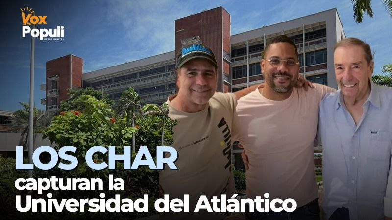
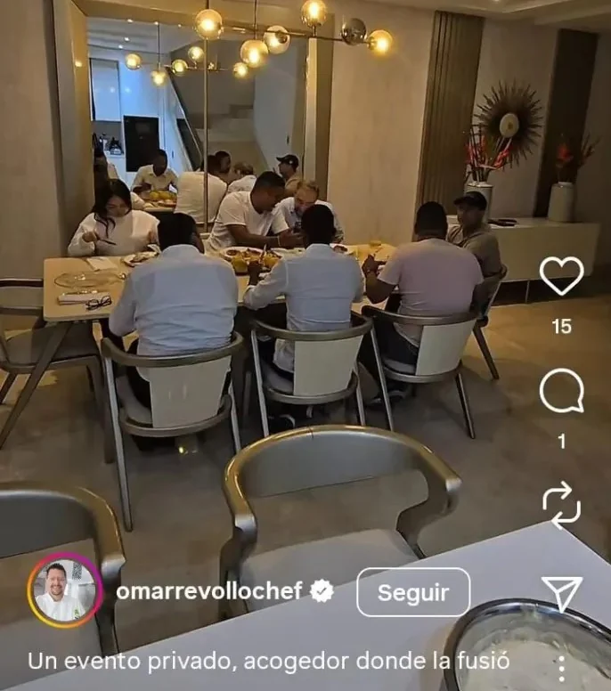

*Los Char consolidan captura de Uniatlántico. Como si fuera un sanduche, Leyton Barrios, entre el alcalde Alejandro Char y el patriarca Fuad Char Abdala celebraron la captura donde el chef Revollo de Barranquilla.*

La **Universidad del Atlántico (Unitlántico)**, orgullo académico del Caribe, terminó convertida en un **jugoso botín político**, administrado por los clanes que la manejan como si fuera **una Supertienda Olímpica**. En lugar de defender su autonomía, los cinco consejeros que votaron por **Álvaro Leyton Barrios Torres** para la rectoría, **vendieron la universidad por un plato de lentejas (¡literal!) donde el chef Revollo**. De esta manera, los Char consolidaron captura .

Así, colonizaron el alma mater con sus redes de poder, que hoy la gobiernan a punta de almuerzos, favores, **votos amarrados** y dinero, mucho dinero. Antes de que esto sucediera, la universidad fue escenario de un despiadado ataque de la macabra alianza entre empresarios, el Gaula, el Das y el paramilitarismo de «Jorge 40» con el apoyo de ciertos directivos que fueron cómplices de estas muertes. Este hecho está bien documentado en Justicia y Paz, en la JEP con los procesos de David Char y Álvaro Asthon. Pero, no ha pasado nada.

## Los Char consolidaron captura de Uniatlántico

La reciente elección de **Álvaro Leyton Barrios Torres** como rector, a todas luces tramposa, es la última muestra de esa captura institucional. Detrás de su nombramiento se oculta un entramado de influencias y manipulaciones que aseguran la estabilidad del **Califato Daeschariano** que tiene dos familias de origen sirio libanés en un poder monopólico: Char y Daes. Poder que se multiplicó con el triunfo paramilitar y del narcotráfico.

Con el **fallo del juez Tercero Administrativo del Circuito de Barranquilla, Edgardo Manuel Atencio Royero**, quien declaró **improcedente** la tutela contra esa designación, se apagó la esperanza para detener que los Char consolidaran la captura de Uniatlántico. Se da por descontado que en segunda instancia el Tribunal Administrativo del Atlántico confirmaría dicho fallo. Desgraciamente, no hay esperanza de rectificar el curso de los acontecimientos.

¿Te puede interesar? [Al recto(r) Prasca le gusta el chiquito](/articulos/a-prasca-rector-de-ua-le-gusta-el-chiquito-y-es-rey-de-burla-de-las-redes-sociales-piden-su-destitucion-ya/)

## **El poder de los Char sobre la academia**

Los Char consolidaron captura de Uniatlántico no en forma pacífica. La historia se repite. Después de un control directo de los uribistas, herederos de los paramilitares que se la tomaron a sangre y fuego en un período sangriento entre 1997 y 2002, se consolidó ese poder. En **2017** lograron imponer como rector a **Carlos Prasca**, un académico sin mayor respaldo en la comunidad universitaria, pero con la bendición política de **Fuad y Alejandro Char**.

Aquel nombramiento se consiguió mediante un **voto aparentemente fraudulento**, emitido nada menos que por **Álvaro Leyton Barrios**. Este individuo es el mismo que hoy es designado rector en un proceso también controversial desde el punto de vista de transparencia y legal.

## Prasca, el socio de Leyton

Recordemos que por Prasca votaron el representante de la Presidencia, la ministra de Educación **Yaneth Giha**. También el representante de los gremios **César Lorduy** (hoy magistrado saliente del CNE); **Álvaro Leyton Barrios Torres** y **Eduardo Verano de la Rosa**, gobernador ayer como hoy. Todos ellos son unos vendidos, sin excepción alguna. No actuaron conforme a la ética y al bien general.

En ese entonces, **VoxPopuli Digital** denunció el montaje, con pruebas que demostraban cómo se había manipulado la votación del Consejo Superior para garantizar la elección de Prasca. El propio **Leyton Barrios** —hoy beneficiario del nuevo fraude— amenazó públicamente con **demandar por injuria y calumnia** a este medio y a su director, **Edison Lucio Torres**, pero **nunca se atrevió a hacerlo**.

Sabía que las pruebas existían y que el presunto fraude había quedado documentado.

> “Los poderosos no demandan cuando saben que la verdad los condena.”

Lo ocurrido en 2017 no fue un episodio aislado: fue **el ensayo general** del control político que hoy asfixia la autonomía universitaria. Desde entonces, la Universidad del Atlántico se convirtió en **pieza estratégica del proyecto hegemónico de los Char**: un feudo académico útil para consolidar poder, repartir contratos, y asegurar obediencia política bajo el disfraz del mérito.

## Así torcieron a los consejeros

*Allí están, esos son lo que venden su autonomía: Los cinco consejeros que se vendieron por un plato de lentejas donde el chef Revollo.*

El **Consejo Superior Universitario**, encargado de la elección, está integrado por **Manuel Fernández** (gremios), **Wendell Archibold** (profesores), **Guillermo Rodríguez** (exrectores), **Miguel Caro** (directivas académicas), **Melissa Obregón** (delegada presidencial), **Abraham González** (egresados), **Angely Cordero** (estudiantes) y **Juan Carlos Bolívar** (Ministerio de Educación).

De esos ocho, **cinco no resistieron un almuerzo con Fuad y Alejandro Char en el restaurante del chef Revollo**. Fueron, casualmente, **los mismos que levantaron la mano por Leyton Barrios**, quien también disfrutó las mieles proporcionada por el clan Char con el chef Revollo. Los otros 4 no están exentos de cadenas de esclavitud. Las tienen con Arturo Char, Euclides Torres y Armando Benedetti.

> “El poder no se impone con argumentos, sino con invitaciones exclusivas a comer de las migajas del poder.”

## El fallo y el principio de precaución

Con el fallo de tutela No 08-001-33-33-003-2025- 00253-00, el juez **Atencio Royero** redujo el **debido proceso administrativo** a una verificación formal de documentos. No analizó su contenido ni sus contradicciones, pese a las pruebas de que las certificaciones laborales de Leyton, aportadas en la etapa indicada, eran **falsas o inconsistentes**. Estos documentos fueron avalados por el **Comité de Acreditación** que de ninguna manera analizó y verificó su veracidad. En este punto el juez debió declarar la nulidad de todo lo actuado a partir de la verificación de los documentos o instarlo a que lo hiciera.

El juez debió tener en cuenta la **Sentencia C-614 de 2009**, donde la Corte Constitucional estableció que **la experiencia docente debe acreditarse mediante vínculos formales y verificables**.

En ese caso pudo aplicar el **principio de precaución** que, ante la duda razonable, el juez actúe para evitar un **perjuicio irremediable**. En este caso, bajo su autonomía, debió exhortar al Consejo Superior a abstenerse de tomar decisiones definitivas mientras persistiera la controversia.

O también ordenar la suspensión provisional de la sesión de designación del rector (como lo solicitaban los accionantes), hasta que se resolviera la verificación de requisitos. De igual manera, solicitar pruebas adicionales o requerir al Ministerio de Educación un pronunciamiento urgente sobre la validez de las certificaciones.

## La autonomía universitaria no existe

El caso Leyton no es un hecho aislado. Es el síntoma de una enfermedad más profunda: **la colonización de la educación pública por el poder político y económico de Barranquilla**. Hoy, la Universidad del Atlántico no decide su rumbo por mérito ni por debate académico, sino por **órdenes que bajan desde los salones privados donde se reparten los cargos.**

Ahorita se bajará la marea cuando le den cabida en la comilona a los que ahora se oponen a Leyton Barrios. Ellos también querrán seguir disfrutando las mieles del poder. Tras bambalinas están **Arturo Char** (¡quien lo creyera!) y la alianza nefasta de **Euclides Torres** y **Armando Benedetti**. Es decir, que gane quien ganare, la perra seguiría con el mismo lazo para atar la autonomía a los designios de los poderosos.

Cada rector nombrado por conveniencia política **degrada la educación como derecho y la transforma en botín**.

> «Cuando la universidad se arrodilla, la sociedad se condena.»

El artículo 1 de la **Carta de las Naciones Unidas** consagra el derecho de los pueblos a su **autodeterminación**. Ese principio vale también para las universidades: **sin autonomía real, no hay conocimiento libre ni nación posible.** Formaremos ciudadanos para la obediencia del poder dominante.

## Llamado a la conciencia

En el Inmanifiesto del Ser proponemos una educación consciente centrada en los principios integrales de la raza humana. Una educación para formar seres humanos libres de cualquier ideología.

La comunidad académica, los estudiantes, los docentes y los egresados de la Universidad del Atlántico tienen hoy una tarea inaplazable:  
**recuperar la universidad de las manos del poder político**.  
Porque mientras los Char y sus aliados la traten como una Supertienda Olímpica, **la educación pública seguirá siendo la víctima favorita de la corrupción y la impunidad.**

> «Ni la academia ni la justicia pueden seguir siendo feudos de la mafia política.»  
> — _VoxPopuli Digital_

**Próxima entrega**: Estos son los que vendieron la autonomía

## La tutela que negó el amparo al debido proceso

[tuela\_udea-2025- 00253 fallo](tuela_udea-2025-00253-fallo.pdf)[Descargar](tuela_udea-2025-00253-fallo.pdf)