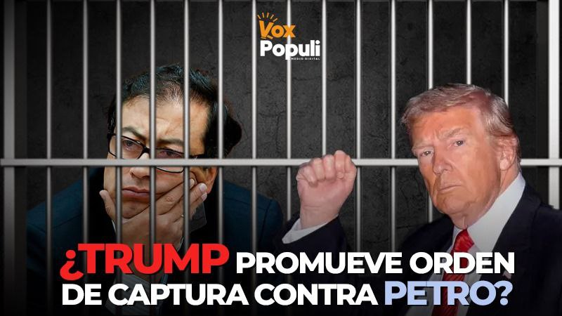
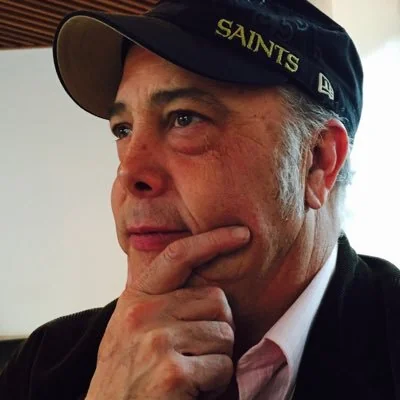

El mar Caribe vuelve a convertirse en escenario de una batalla silenciosa. ¿Trump quiere a Gustavo Petro «preso o muerto»? Mientras existen fuertes rumores sobre la existencia de una orden de captura contra el presidente colombiano, bajo el pretexto de operaciones antidrogas, la Armada de Estados Unidos reporta ataques contra supuestas embarcaciones cerca de los puertos de Colombia y Venezuela. Entre tanto, el portaaviones **USS Gerald R. Ford**, símbolo del poder naval estadounidense, se posiciona estratégicamente frente al litoral surcontinental caribeño.

Lo que parece una operación rutinaria es, en realidad, el **inicio de un nuevo ciclo de guerra híbrida** en la región que amerita una respuesta diplomática y la cohesión del país nacional alrededor del derecho fundamental a la autodeterminaciones de los pueblos. No se trata de una defensa a Petro sino a la soberanía de Colombia. A diferencia de las guerras convencionales, esta no se libra con tanques ni misiles. Trump la está haciendo con **operaciones psicológicas, sanciones económicas, manipulación digital y presión diplomática**.

El objetivo: **doblegar la voluntad política de los gobiernos soberanos del Sur**, entre ellos el de **Gustavo Petro**, cuya voz incomodó al imperio de Trump. La defensa del pueblo palestino y del multilateralismo global irritó profundamente a la administración republicana.

## El zarpazo de Trump en el Caribe

https://youtu.be/aodQyzeRPGI

El análisis de Lucio Torres.

### **La autodeterminación de los pueblos**

En el centro de este conflicto está un principio que la **Carta de las Naciones Unidas** consagra como sagrado:

> «El derecho de los pueblos a decidir libremente su destino sin injerencias externas.»

Sin embargo, las acciones recientes de Estados Unidos en el Caribe y las amenazas diplomáticas contra Colombia evidencian una **ruptura abierta de ese principio**. La **ONU**, en sus comunicados más recientes, ha recordado que **ningún Estado puede usar la fuerza, ni directa ni indirectamente, para alterar el sistema político de otro**.

Pese a ello, la “**Doctrina Trump para América Latina**”, filtrada esta semana, es un plan que contempla —según fuentes del Senado estadounidense— el uso de **presión financiera, campañas de desinformación y maniobras militares disuasivas** para “restaurar el orden hemisférico”. En otras palabras, para forzar a gobiernos soberanos a alinearse con Washington.

La **solidaridad de la ONU** con el respeto al derecho internacional contrasta con la actitud **extra-sumarial y coercitiva** que Trump intenta imponer fuera de toda institucionalidad global. Es el retorno del viejo imperialismo revestido de nuevas tecnologías y pretextos morales.

### ******Petro** «preso o muerto»****

En los corredores diplomáticos de Washington y Nueva York circula un **rumor tan inquietante como creíble**: Donald Trump, molesto por la participación de Petro en el mitin de Nueva York a favor de Palestina —donde instó a los soldados estadounidenses a no obedecer órdenes injustas contra pueblos hermanos— desató su furia contra el mandatario colombiano. Lo quiere capturado como al mismo Nicolás Maduro.

El discurso de Petro que fue muy audaz al metérsele en el rancho al imperio, el ala dura del trumpismo lo interpretó como una incitación a la rebelión militar. También fue util izado para justificar la intensificación de **operaciones de presión híbrida** contra el gobierno colombiano. Esto puede dar lugar a ****«****preocupaciones de seguridad» sobre la integridad del presidente Petro, ante la posibilidad de que actores radicalizados **interpreten literalmente las palabras de Trump como una licencia para eliminarlo**.

El rumor de que **Trump quiere **a Gustavo Petro** «preso o muerto»** circula entre diplomáticos latinoamericanos acreditados ante la ONU. Nadie lo confirma oficialmente, pero todos lo mencionan en voz baja. Especialmente, luego del incidente diplomático donde el senador cercano a Trump, **Bernie Moreno**, exhibía el documento "La Doctrina Trump" con una fotografía de los presidentes Petro y Maduro vestidos de naranja a la usanza de los presos norteamericanos. En la historia reciente de América Latina, los rumores de Washington han sido preludio de tragedias políticas.

### **¿Amenaza simbólica**?

El desplazamiento del **Gerald Ford** hacia el Caribe no es un acto casual. Un portaaviones no se mueve sin propósito estratégico: su sola presencia envía un mensaje. En este caso, **el mensaje es disuasivo y político**. Es una advertencia dirigida a Caracas y a Bogotá, justo cuando ambos gobiernos sudamericanos se acercan diplomáticamente.

Los ataques reportados a lanchas “narco” en aguas caribeñas funcionan como **escenificación de legitimidad militar**, una forma de justificar la presencia bélica ante la opinión pública norteamericana. Pero detrás de esa narrativa se oculta una **acción** **psicológica** orientada a proyectar miedo e incertidumbre sobre los gobiernos que desafían la hegemonía de Estados Unidos en la región.

### **La guerra híbrida**

Lo que está en curso contra Petro no es un enfrentamiento militar directo, sino una **guerra híbrida estructurada**. Los elementos están claros:

1.  **Ataques financieros:** su inclusión en la **Lista Clinton**, que implicaría el bloqueo de todas las operaciones económicas asociadas al mandatario y su familia.
2.  **Operaciones mediáticas:** campañas digitales basadas en inteligencia artificial que muestran a Petro como prisionero de EE. UU.
3.  **Acoso judicial y diplomático:** filtraciones sobre supuestas investigaciones en cortes estadounidenses.
4.  **Presión militar disuasiva:** la movilización del Gerald Ford como acto de intimidación simbólica.

Aparentemente el objetivo no es invadir, sino **asfixiar política, económica y moralmente**. Se busca forzar al gobierno colombiano a ceder ante Washington o caer bajo el peso de su propio aislamiento.

### **El llamado de la historia**

Ante la escalada, Petro respondió desde la diplomacia. Llamó a consultas a su embajador en Washington, **Daniel García-Peña**. Denunció públicamente las injerencias y elevó su discurso en defensa del **Sur global**. Su postura encarna un principio esencial del derecho internacional: el **respeto a la soberanía nacional**.

La pregunta que queda en el aire es si la comunidad internacional —y en especial la ONU— **respaldará de forma efectiva** este derecho, o si se limitará a declaraciones retóricas mientras las potencias actúan al margen de toda legalidad.

Porque si algo revela esta nueva guerra híbrida es que el colonialismo no ha muerto: **solo ha cambiado de forma**. Y el Caribe, otra vez, se convierte en el escenario donde el mundo observa si América Latina seguirá siendo **una región subordinada**, o si finalmente hará valer su **derecho a existir sin permiso**.