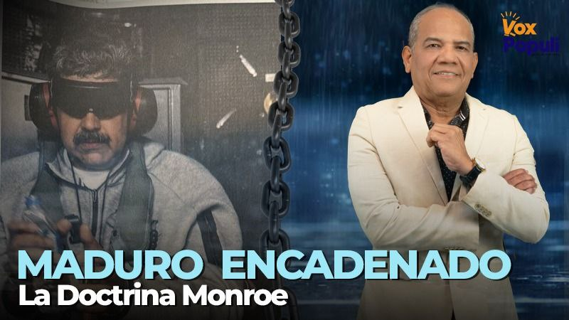

*Maduro encadenado*

Con **Maduro encadenado** anunciado por **Donald Trump** el 3 de enero de 2026, América Latina entra en un renovado **concepto del enclave territorial norteamericano** como forma de dominio colonial. No solo vimos una intervención militar directa en Venezuela sino que también asistimos al entierro definitivo de cualquier simulacro de respeto estadounidense por **la autodeterminación de los pueblos**. Esto es clave para entender el tipo de intervención que el imperio asumirá en los próximos años.

Doscientos trece años después de la Doctrina Monroe, el presidente de Estados Unidos proclamó que su gobierno la «superó». **Dijo que fortaleció el poder norteamericano en su región**. No fue un lapsus verbal. Fue una confesión de hegemonía imperial sobre nuestros territorios. Ya no es el concepto de neocolonialismo disfrazado de falsas democracias locales o de mandatarios relativamente libres para asumir políticas internas. Ahora solo quiere enclaves territoriales para reafirmar su poder unilateral.

¿Te interesa?: [¿Trump irá por Petro o por el control geopolítico de Sudamérica? (II)](/articulos/maduro-encadenado-el-trofeo-de-la-doctrina-monroe/)

## Falsas motivaciones

Trump justificó la intervención afirmando que Venezuela albergaba «adversarios extranjeros», adquiría «armas ofensivas amenazantes» y que esas armas «fueron usadas anoche». Acto seguido, sentenció que tales acciones violaban principios históricos de la política exterior estadounidense.

El mensaje fue claro: no se violó el derecho internacional, se violó la autoridad de Estados Unidos. Y eso, para Washington, es imperdonable. La captura de Maduro, por tanto, es una acción punitiva. O sea, de castigo a la dictadura burocrática. Se arroga el derecho de castigar a cualquiera que no haga parte de su sistema dominante.

## Maduro encadenado: La fragilidad del régimen

Maduro encadenado refleja la fragilidad del régimen. Su esquema de seguridad estaba compuesto exclusivamente por agentes cubanos. Un contrasentido, porque si la dictadura burocrática está sostenida por el petróleo y la fuerzas militares, ¿qué o quién falló? ¿Con quién estaba conectados los cubanos? ¿Con **Miguel Díaz-Canel Bermúdez**, presidente de Cuba, o **Vladimir Padrino**, ministro de Defensa de Venezuela?

Si la dictadura burocrática chavista es sostenida por las fuerzas militares, ¿cómo es posible que la seguridad de Maduro estuviese a cargo de los cubanos? La participación de los militares en el manejo del petróleo ha sido estratégica durante el régimen chavista.

No obstante, todos los militares que estuvieron al frente de su manejo terminaron condenados por su propio Ego de desear más allá de las convicciones políticas o partidistas. El único de ellos que no era de carrera militar fue **Tareck El Aissami**, pero su ministerio estaba rodeados por altos oficiales de la GNB. Todos, sin excepción, devinieron en corrupción.

Por eso, el **Ministro del Poder Popular de Petróleo** y, por ende PDVSA, hoy está en mano del ala civilista, la vicepresidenta y eventual presidente de Venezuela, **Delcy Rodríguez**. ¿Esto tuvo algo que ver para que la unidad Delta de los invasores no tuvieran oposición de la FGN?

Marco Rubio, en reciente entrevista a _Meet the Press de NBC_, dijo:

> «Fueron cubanos los que custodiaban a Maduro. No estaba custodiado por guardaespaldas venezolanos. Tenía guardaespaldas cubanos. En cuanto a su inteligencia interna —quién espía a quién internamente para asegurarse de que no haya traidores— todos esos son cubanos».

## La Dictadura del Ego

Sin embargo, el debate no puede reducirse a una reacción automática de rechazo a la intervención sin una reflexión más profunda. Venezuela, al igual que Cuba y Nicaragua, padece una **dictadura burocrática** que degeneró la democracia, secuestró el Estado y sustituyó la soberanía popular por una maquinaria administrativa autoritaria, clientelar y represiva. Así quedó reducida la Revolución Bolivariana y el concepto de Socialismo del Siglo XXI. Negar esta realidad es tan irracional como justificar esta invasión extranjera.

Aquí emerge la falsa dicotomía que paraliza el pensamiento político latinoamericano. **O se acepta la intervención imperial, o se acepta la dictadura burocrática**. Esa trampa del pensamiento binario dominante es funcional tanto a Washington como a las élites autoritarias locales. Para romperla, es necesario elevar el análisis a un plano más profundo, como lo propongo en _El Inmanifiesto del Ser_, donde surge una tercera visión que se contrapone a las dos narrativas. Allí me refiero a la **Dictadura del Ego**.

La Dictadura del Ego no se define por una ideología específica ni por una bandera nacional. Se define por la absolutización del poder, por la incapacidad de reconocer límites éticos, por la convicción de que el propio interés —personal, corporativo, partidista o geopolítico— está por encima del ser humano. Es el ego convertido en sistema.

Desde esta perspectiva, la pregunta clave no es si es peor la invasión o la dictadura burocrática. No. La pregunta que un ser humano consciente debe hacerse es esta:

**¿Cuál Dictadura del Ego resulta más destructiva para el pueblo venezolano: la del aparato imperial norteamericano o la del régimen chavista enquistado en el Estado?**

## Dos caras y una sola dictadura

La Dictadura del Ego que dirige hoy el sistema norteamericano se expresa en la convicción de que Estados Unidos tiene el derecho moral y político de decidir quién gobierna, quién cae y quién sobrevive en América Latina. Trump lo dijo sin ambigüedades: su administración está “reafirmando el poder estadounidense”. No habló de pueblos, habló de poder. No habló de derechos ni de pobreza, ni migración. Habló de intereses nacionales. Esta Dictadura del Ego opera a escala global, instrumentaliza el derecho, relativiza la legalidad internacional y reduce la soberanía ajena a una variable estratégica.

Por su parte, la dictadura burocrática chavista encarna otra forma de Dictadura del Ego: la de una élite política que se arrogó la representación eterna del pueblo, vació de contenido la democracia participativa y convirtió al Estado en un fin en sí mismo. En nombre de una revolución petrificada, anuló la crítica, persiguió la disidencia y confundió lealtad con obediencia. Su ego no es expansionista, pero sí asfixiante: gobierna contra su propio pueblo mientras dice hacerlo por él.

La dictadura chavista, encarnada en un grupo de personas que desdibujaron los principios fundantes de la revolución bolivariana, es dominada por un Ego tan deshumano como los invasores.

Ambas dictaduras del Ego comparten un rasgo esencial: **ninguna coloca al ser humano en el centro**. Una lo sacrifica en nombre de la seguridad hemisférica; la otra, en nombre de la estabilidad del régimen. Una bombardea; la otra reprime y produce hambre a su propio pueblo. Una impone desde afuera; la otra oprime desde adentro. El resultado, en términos concretos para el pueblo venezolano, es el mismo: desposesión, empobrecimiento, miedo y pérdida de soberanía real.

## Rechazo al intervencionismo

Por eso, ningún patriota latinoamericano puede aceptar la intervención estadounidense aunque tenga como pretexto la caída de Maduro. Pero tampoco puede romantizar ni justificar la **dictadura burocrática chavista** en nombre del antiimperialismo. Ambas posturas nacen del mismo dolor: subordinan la dignidad humana a un ego de poder o económico.

El verdadero patriotismo latinoamericano no consiste en elegir entre dos dominadores, sino en **negarles legitimidad a ambos**. Defender la soberanía no es defender a los burócratas del autoritarismo; es defender el derecho de los pueblos a transformar sus realidades sin tutelas ni ocupaciones. Denunciar la dictadura no es abrirle la puerta a los marines; es exigir democracia desde una ética del ser, no del poder o del deseo de tener.

**La Revolución del Ser**

La Doctrina Trump inaugura una nueva fase del viejo imperialismo. Ahora busca enclaves territoriales para afianzar su poder ultramarino, confirmando que América Latina solo es su patio trasero. La dictadura burocrática chavista es una traición a las promesas emancipadoras. Entre ambas, **la Dictadura del Ego se revela como el enemigo común** de los venezolanos y de la humanidad . Superarla no será obra de invasiones ni evocando caudillos eternos o de profetas salvadores. ¡No! Todo será posible si en nosotros se produce una revolución más profunda: **la revolución del Ser**, donde el poder deje de ser un fin y vuelva a ser un servicio al prójimo.

Porque cuando el Ego gobierna —ya sea desde Washington o desde Caracas— los pueblos siempre pierden. Y América Latina ya ha perdido demasiado desde que la Doctrina Monroe empezó su Era depredadora con la toma de Panamá (19903) y la invasión de Wilson (1916) a territorio mexicano.